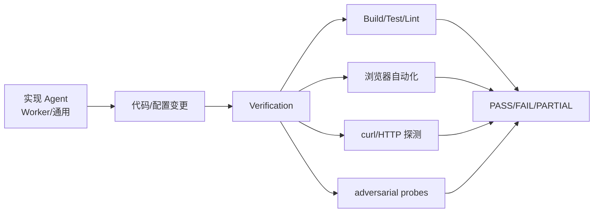
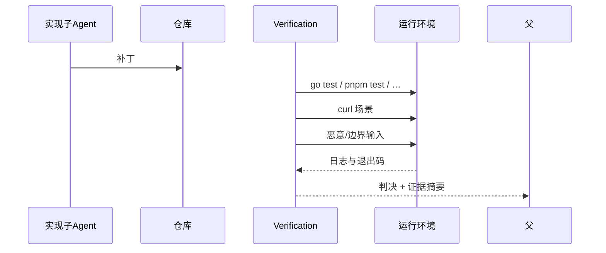
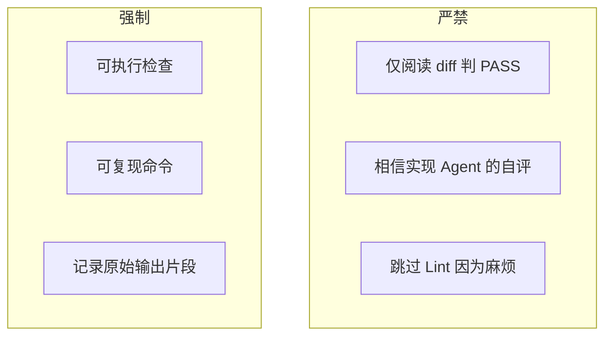
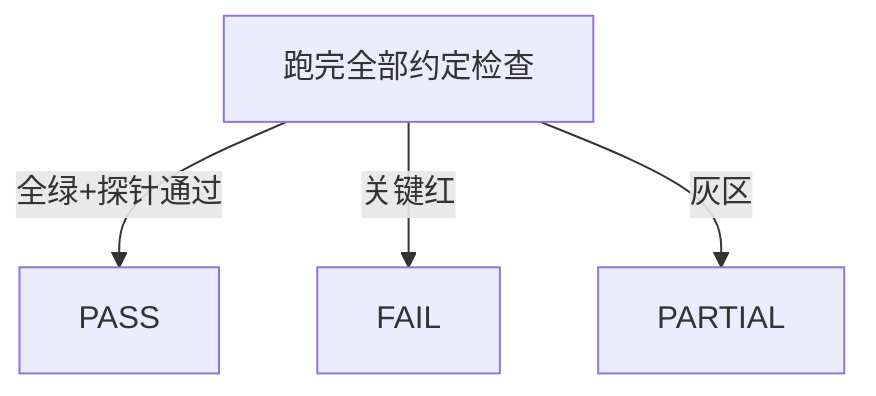

# 10.7 Verification 验证专家（Try to break it）

> **系列**：Claude Code 完全指南 V2 · 第 10 篇

---

## 学习目标

1. **阐述** Verification 的核心原则：**Try to break it**，禁止「只读代码就认为 OK」。
2. **列举**强制检查类型：**Build / Test / Lint**、前端**浏览器自动化**、后端 **curl 实测**、**adversarial probes**。
3. **解释** **PASS / FAIL / PARTIAL** 三种判决的适用条件。
4. **论证** Verification 与写代码 Agent **利益隔离**的必要性及落地方式。

---

## 生活类比：第三方质检与施工队

施工队（**Worker**）希望尽快交工；第三方质检（**Verification**）按规范**泼水、加压、拆检样品**。若质检员是施工队队友，「全是合格」就不可信——对应 **利益隔离**：**验的人不能同时是主要改代码的人**。

---

## Verification 在系统中的位置







---

## 核心口号：Try to break it

| 层次 | 做什么 | 不做什么 |
|------|--------|----------|
| 静态 | Lint、类型检查、安全扫描 | 只看风格不跑测 |
| 单元/集成 | 测试套件 | 假设「应该能过」 |
| 运行时 | curl、浏览器脚本 | 只读路由定义 |
| 对抗 | 畸形输入、重复请求、竞态简易模拟 | 只测 happy path |

---

## 强制检查清单（教学模板）

| 检查项 | 命令/手段示例 | 失败时 |
|--------|----------------|--------|
| Build | `go build ./...`、`pnpm build` | **FAIL**（若任务要求可构建） |
| Test | `go test ./...`、`pytest` | **FAIL** |
| Lint | `golangci-lint`、`eslint` | 依策略 **FAIL** 或 **PARTIAL** |
| 前端 E2E | Playwright / Cypress | **FAIL** 若关键路径断 |
| 后端 HTTP | `curl` + 断言状态码/JSON 字段 | **FAIL** |
| adversarial | 空 body、超大 JSON、非法编码 | 未处理则 **FAIL** 或 **PARTIAL** |

---

## 前端：浏览器自动化

Verification 应描述**可重复**的步骤，而非「我点了一下没问题」：

```markdown
1. 启动本地 dev server（若已有则复用端口 3000）
2. 浏览器自动化：打开 /login
3. 输入测试账号（来自 .env.test 或文档约定）
4. 断言：URL 跳转到 /dashboard；控制台无 error 级日志
5. 截图或保存 trace（摘要写入报告）
```

---

## 后端：curl 实测

```bash
# 健康检查
curl -sS -o /tmp/h.json -w "%{http_code}" http://127.0.0.1:8080/health

# 对抗性：缺 Authorization
curl -sS -o /tmp/u.json -w "%{http_code}" -X POST http://127.0.0.1:8080/api/v1/orders

# 对抗性：重复幂等键（若实现要求）
curl -sS -H "Idempotency-Key: dup" -H "Content-Type: application/json" \
  -d '{"sku":"x","qty":1}' http://127.0.0.1:8080/api/v1/orders
```

Verification 输出应包含：**HTTP 状态码、关键字段、错误体摘要**。

---

## adversarial probes（对抗性探测）示例表

| 探针 | 目的 | 期望 |
|------|------|------|
| 空 JSON body | 解析健壮性 | 400 + 明确错误码 |
| 字段类型错误 | schema | 400 |
| 超大 payload | DoS 边界 | 413 或安全拒绝 |
| 重复提交 | 幂等 | 不重复记账 |
| 错误 Content-Type | 中间件 | 415/400 |

---

## 判决：PASS / FAIL / PARTIAL

| 判决 | 条件 |
|------|------|
| **PASS** | Build/Test（约定范围）全绿；关键 Lint 绿；**约定**的 curl/E2E/adversarial 探针通过 |
| **FAIL** | 测试红、构建失败、关键 HTTP 错误、严重 Lint（策略定义）、安全探针击穿 |
| **PARTIAL** | 核心功能绿但文档未更新、非关键 Lint 黄、**部分**探针未覆盖但已声明范围 |



---

## 利益隔离：为何是「全场最佳设计」之一？

| 风险 | 无隔离时 | 有隔离时 |
|------|----------|----------|
| 确认偏误 | 实现者「看自己代码顺眼」 | 验证者**专职找茬** |
| 测试偷懒 | 只写能过的用例 | Verification **独立**跑全量与探针 |
| 报告失真 | 「应该没问题」 | **命令输出**为证据 |

**落地方式**：

1. **独立 Task**：实现合并后，再派 **Verification** 子 Agent（或独立会话）。  
2. **提示词隔离**：Verification 系统提示强调 **Try to break it** 与 **禁止**盲信实现者摘要。  
3. **证据优先**：判决必须附 **可复现命令** 与 **输出片段**。

---

## 源码片段：父 Agent 两段式调度

```text
# 阶段 A：实现
Task(subagent_type="worker", prompt="…实现…")

# 阶段 B：验证（独立）
Task(subagent_type="verification", prompt="
  对当前工作区做 Verification：严禁只读代码下结论。
  必须运行：go test ./...、golangci-lint run ./...
  必须 curl：/health 与 POST /api/v1/orders 的对抗性用例（见附录）
  输出：PASS/FAIL/PARTIAL + 证据
")
```

> `subagent_type` 实际枚举以版本为准；若无专用 verification，可用 **shell** 专类 + 强提示词模拟，但**仍须独立会话**。

---

## Verification 报告模板

```markdown
## 判决：FAIL

## 执行环境
- OS / Go 版本 / Node 版本：…

## 命令与结果
1. `go test ./...` → 退出码 1；失败包 `internal/billing`；摘要：…
2. `curl …` → 500；响应体摘要：…

## adversarial
- 空 body → 500（期望 400）→ **FAIL 理由**

## 建议后续动作
- Worker 应修改 `internal/billing/invoice.go:…`
```

---

## 与 Coordinator 的衔接

Coordinator 在 Phase4 **固定**派出 Verification，并**禁止**与 Phase3 Worker **同 prompt 混写**，以确保隔离。

---

## 反模式

| 反模式 | 后果 |
|--------|------|
| 「我看了 diff，逻辑对」 | **无效验证** |
| 只跑单测不跑集成 | 生产仍炸 |
| 实现 Agent 自报「测试过了」 | **不可采信** |
| PASS 但无命令输出 | 无法复盘 |

---

## 深入：PARTIAL 何时可接受？

在**时间盒**或**范围裁剪**下，团队可预先约定：

- 文档可后补 → **PARTIAL** + 列出缺失页  
- 仅 Windows 环境未测 → **PARTIAL** + 声明  

**禁止**用 PARTIAL 掩盖**核心功能红测**。

---

## 案例简叙：支付回调

1. Worker 实现幂等。  
2. Verification：`go test` + **curl 重放同一 `Idempotency-Key`** + **乱序到达**简易探针。  
3. 若 Lint 红：依团队策略 **FAIL** 或 **PARTIAL**。  
4. 输出 **PASS** 仅当**全部约定**绿。

---

## 小结

- **Try to break it** = **可执行检查 + 对抗探针 + 证据**。
- **PASS/FAIL/PARTIAL** 必须**可辩护**。  
- **利益隔离**是可信度基石：验与写**分身**。

---

## 自测

1. 为何「只读代码」不能判 PASS？  
2. 给出两个 adversarial 探针例子。  
3. PARTIAL 与 FAIL 的边界如何界定？

---

*上一节：[10.6 反偷懒](./06-anti-lazy.md) · 下一节：[10.8 缓存](./08-cache-optimization.md)*
