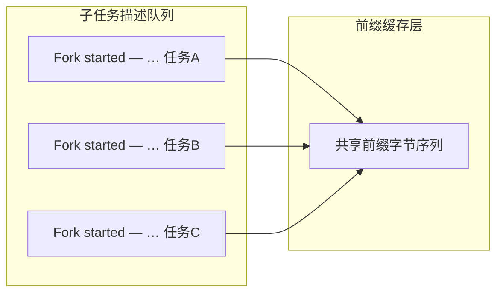
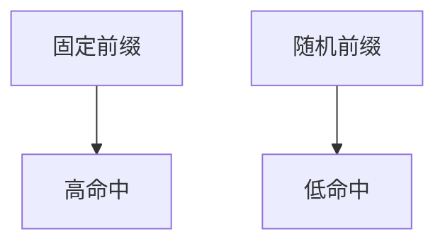
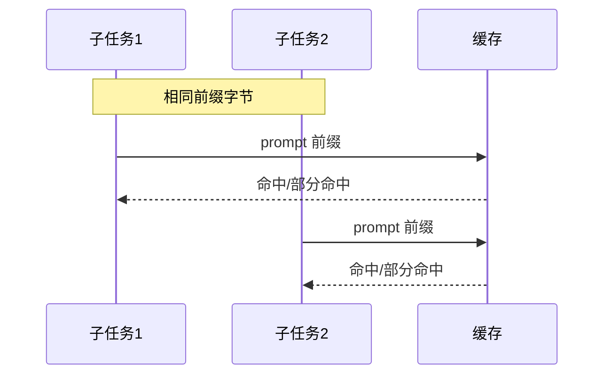

# 10.8 子 Agent 缓存优化（Fork 前缀匹配）

> **系列**：Claude Code 完全指南 V2 · 第 10 篇

---

## 学习目标

1. **说明**为何所有 Fork 任务应使用**统一前缀** `Fork started — processing in background`。
2. **解释**「字节级前缀匹配」如何提升**缓存命中**（KV 缓存 / 前缀复用）。
3. **设计**在 `description` 与系统模板中**稳定前缀 + 可变后缀**的命名习惯。
4. **规避**因寒暄语随机化导致的**缓存碎片化**。

---

## 生活类比：统一报工口令

工厂班组向调度台报到时，若每人用不同口头禅：「开工了老铁」「俺来了」「Go」——调度系统**难以批量识别**。若统一喊「**Fork started — processing in background**：{具体任务}」，前一半完全重复，**自动分拣与缓存预热**都更便宜。推理侧同理：**前缀一致**才好「白嫖」缓存。

---

## 前缀匹配直观图







---

## 推荐格式

```text
Fork started — processing in background: {3-5 词或短句描述具体子任务}
```

| 部分 | 是否固定 | 作用 |
|------|----------|------|
| `Fork started — processing in background` | **固定** | 前缀匹配、用户可见状态一致 |
| `:` 后短描述 | **可变** | 区分任务语义 |

---

## 反例：导致缓存碎片

```text
[BG] 搜索 auth …
后台：搜索 auth …
(Subagent) auth search …
🔧 正在 fork：auth
```

以上**首字节即不同**，前缀层难以合并。

---

## 在 Task 调用中的位置

```json
{
  "tool": "Task",
  "subagent_type": "worker",
  "description": "Fork started — processing in background: 修改 invoice 空指针",
  "prompt": "…详细工单…"
}
```

| 字段 | 缓存相关性 |
|------|------------|
| `description` | 常出现在子会话首条或元数据，**高相关** |
| `prompt` 首段 | 若模板统一前缀，**同样有益** |

建议在 **prompt 顶部**也重复一行相同前缀（若产品不 dedupe）：

```markdown
Fork started — processing in background: 修改 invoice 空指针

（以下正文…）
```

---

## 源码片段：批量派工模板

```markdown
Coordinator 批量 Phase1：

- Task 1 description: Fork started — processing in background: 搜 services/payment
- Task 2 description: Fork started — processing in background: 搜 pkg/retry
- Task 3 description: Fork started — processing in background: Explore 列 deploy 清单
```

---

## 与模型路由的关系（概念）

部分部署会对 **首 token 分布**做 **KV cache** 复用：

| 实践 | 效果 |
|------|------|
| 统一系统提示 | 前缀稳定 |
| 统一 Fork 前缀 | 用户/工具注入段稳定 |
| 统一语言（中/英） | 减少 tokenizer 差异 |

---

## 监控与 A/B（团队向）

| 指标 | 说明 |
|------|------|
| 子任务平均首包延迟 | 前缀优化后期望下降 |
| 重复前缀任务占比 | 应接近 100% |
| 成本/token | 间接指标 |

---

## 边界：前缀不是万能药

| 限制 | 说明 |
|------|------|
| 后缀极长且迥异 | 仅前缀段复用 |
| 模型/版本切换 | tokenizer 与缓存策略可能变 |
| 隐私与合规 | 勿把密钥写进 description |

---

## 与防递归、消息路由的协同

- **防递归（10.9）**：前缀统一**不**意味着可嵌套 Task；仍**扁平**派工。  
- **消息路由（10.10）**：返回结构固定 + 前缀固定，父 Agent **解析成本**更低。

---

## 反模式表

| 反模式 | 后果 |
|--------|------|
| 每条任务换 emoji 前缀 | 命中差 |
| 把长 JSON 放在前缀前 | 前缀被污染 |
| 仅人眼可读、机器不稳定的文案 | 无法批量脚本化 |

---

## 案例：Phase1 三并行

**前**：三个 description 分别以「任务1」「帮我」「search」开头 → 缓存三路。  
**后**：统一 `Fork started — processing in background:` → **共享前缀**。

---

## 进阶：与「蒸馏返回」的衔接

子 Agent 返回父 Agent 时，若**首段摘要**也采用相同前缀族（例如 `Fork completed — summary:`），部分栈可对**输出侧**做类似优化——具体以服务商实现为准。教学重点是：**结构化 + 可预测的起始 token** 总优于随机散文。

| 阶段 | 推荐起始样式 |
|------|----------------|
| 启动 | `Fork started — processing in background:` |
| 结束 | `Summary —` 或固定 JSON 键序 |

---

## 小结

- **统一前缀** `Fork started — processing in background` 利用**字节级前缀匹配**提升缓存命中。  
- **description + prompt 顶部**保持一致习惯。  
- 避免**碎片化寒暄**。

---

## 自测

1. 写出正确与错误各一条 description。  
2. 前缀固定、后缀可变各自解决什么问题？  
3. 为何 emoji 不适合做前缀？

---

*上一节：[10.7 Verification](./07-verification-agent.md) · 下一节：[10.9 防递归](./09-anti-recursion.md)*
