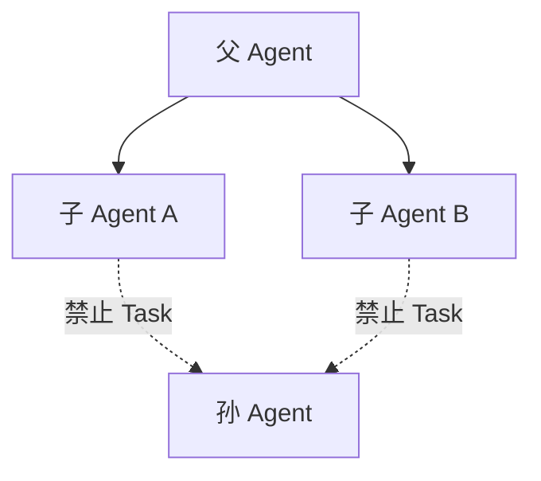
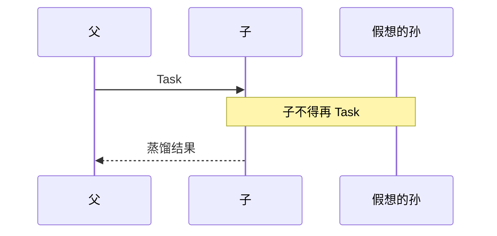
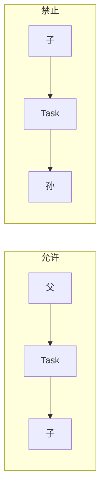
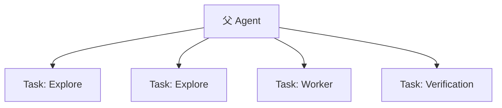
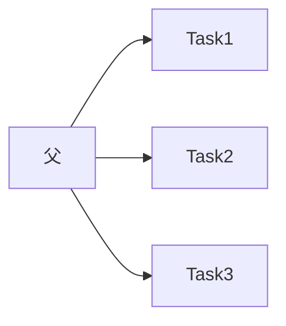

# 10.9 防无限递归（子 Agent 不得生成子 Agent）

> **系列**：Claude Code 完全指南 V2 · 第 10 篇

---

## 学习目标

1. **陈述**平台约束：**子 Agent 不能生成子 Agent**（无「孙 Agent」）。
2. **分析**若允许递归委派，会在**成本、责任、死锁**上产生哪些问题。
3. **掌握**扁平化拆分：由**父 Agent** 统一持有 **Task** 派发权。
4. **关联**工人意识注入（10.6）：Worker **严禁**再调用 Task。

---

## 生活类比：俄罗斯套娃式派活

若经理派组长，组长再派副组长，副组长再派「临时负责人」，最后**没人真正搬砖**，只剩**开会链**。工程上对应 **token 与 wall time 爆炸**。正确做法是：**一个调度平面**（父/Coordinator）**扁平**派工到执行面（Worker）。

---

## 递归禁令示意图







---

## 为何必须防无限递归？

| 问题 | 说明 |
|------|------|
| 成本 | 每层独立上下文，**指数级** token |
| 延迟 | 串行等待子子任务，**墙钟时间**不可控 |
| 责任 | 「谁的理解错了」在深层栈中**不可审计** |
| 死锁 | A 等 B、B 等 A 的委派环 |
| 工具风暴 | 并发工具调用在深层放大 |

---

## Task 工具是「生成子 Agent 的机制」——但仅一层

**父 Agent** 调用 **Task** → 创建 **子 Agent**。  
**子 Agent** 侧 **Task** 应被策略 **拒绝** 或 **系统提示禁止**（以实际产品为准）。

```text
正确：
  Parent --Task--> Child --tools--> done --summary--> Parent

错误：
  Parent --Task--> Child --Task--> GrandChild --> …
```

---

## 扁平化拆分模式

| 原错误思路 | 扁平替代 |
|------------|----------|
| 「子 Agent 你再派一个人搜」 | 父 Agent **直接**发第二个 Task |
| 「让孙 Agent 写测试」 | 父 Agent 派 **Verification** |
| 「子 Agent 内部再 plan」 | 父 Agent 先 **Plan** 只读，再派 **Worker** |



---

## 源码片段：系统提示层禁令（示意）

```text
You are a subagent. You MUST NOT invoke the Task tool or spawn subagents.
If the task is too large, return a structured decomposition request for the parent agent.
```

工人模板（10.6）应与此**一致**。

---

## 与 Explore/Plan 只读的关系

只读角色**更不能**通过 Task 「找帮手改文件」——否则绕过只读。递归禁令与只读共同构成**安全边界**。

---

## 误用场景与纠正

| 误用 | 纠正 |
|------|------|
| Worker prompt 写「你再开个子任务」 | 删除；改由父 Agent 拆 |
| 子 Agent 发现任务太大就 Task | 返回 `NEEDS_SPLIT` 结构化块给父 |
| Coordinator 在子会话里再当 Coordinator | **单平面**：仅父会话调度 |

---

## 边界：父 Agent 连续多次 Task 是否递归？

**否**。同一 **父上下文** 连续 `Task` 调用属于 **广度扁平**，不是深度递归。



---

## 监控与排障

| 征兆 | 可能原因 |
|------|----------|
| 极深对话标题链 | 误用多会话代替单父调度 |
| 重复搜索 | 子 Agent 无法委派，重复劳动 → 父应合并 Explore |
| 费用暴增 | 多个并行子任务无门控 |

---

## 与缓存前缀（10.8）的协同

扁平化派工使 **Fork 前缀**统计更稳定；深层递归会导致**难以批量优化**且**前缀语义混乱**。

---

## 案例

**错误**：Worker 被提示「若不确定就再 spawn explore」。  
**正确**：Worker 返回 `UNCERTAIN: 需在 pkg/foo 全量 grep`，父 Agent 再派 **Explore**。

---

## 小结

- **子 Agent 不得生成子 Agent** → **防无限递归**。
- **Task** 是子 Agent 创建机制，但应 **单层**使用。
- **父/Coordinator** 负责 **广度拆分** 与 **汇总**。

---

## 自测

1. 为何「孙 Agent」会放大成本？  
2. 子 Agent 发现任务过大时应如何响应？  
3. 父 Agent 连发 3 个 Task 是否违规？

---

## FAQ

**Q：若产品 UI 仍显示「子 Agent 启动了子 Agent」怎么办？**  
A：以**实际工具策略**为准；教学上仍应按**单层**设计工作流，并在审计日志中区分「父连续 Task」与「嵌套 Task」。

**Q：能否用「同一个会话多角色扮演」代替多 Task？**  
A：那是**单上下文技巧**，不是 **Fork**；缺少独立窗口与角色系统提示的隔离，**不等价**于子 Agent。

---

## 与六个内建角色的交叉表

| 角色 | 递归风险点 | 缓解 |
|------|------------|------|
| Worker | 想再派 Explore | 父扁平派 Explore |
| 通用 | 任务过大想分包 | 返回 `SPLIT_REQUEST` |
| Coordinator（若跑在子上下文） | 误以为可继续嵌套 | **仅父会话**持有调度权 |
| Verification | 不应再派实现者 | 只出判决与证据 |

---

## 伪代码：检测非法嵌套（概念实现）

```text
on_tool_call(agent, tool):
  if agent.depth >= 1 and tool == "Task":
    reject("subagents cannot spawn subagents")
```

真实系统可能以 **策略引擎** 或 **提示词** 实现；语义一致即可。

---

## 延伸阅读：与消息蒸馏的衔接

子 Agent 若试图用 Task 「甩锅」，会破坏 **10.10** 的星型拓扑。正确返回：

```markdown
## 需要父 Agent 代为派发的子任务
- 类型: explore
- 范围: pkg/net/
- 理由: 超出当前 token/时间盒
```

---

*上一节：[10.8 缓存](./08-cache-optimization.md) · 下一节：[10.10 消息路由](./10-message-routing.md)*
