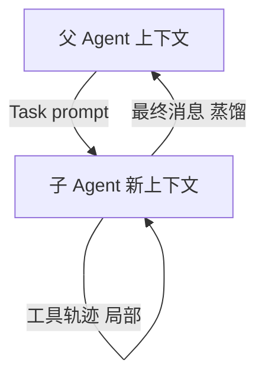
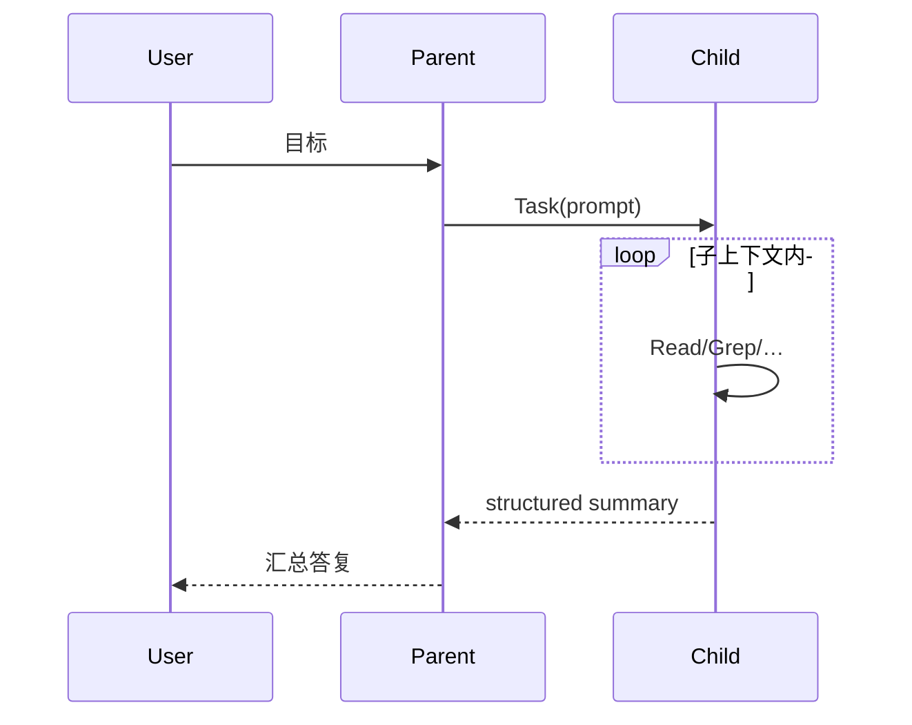
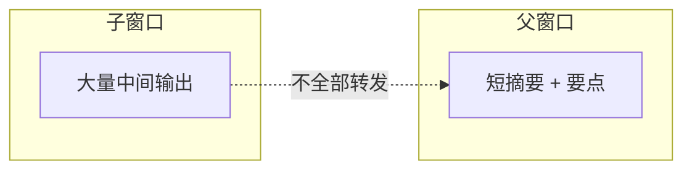
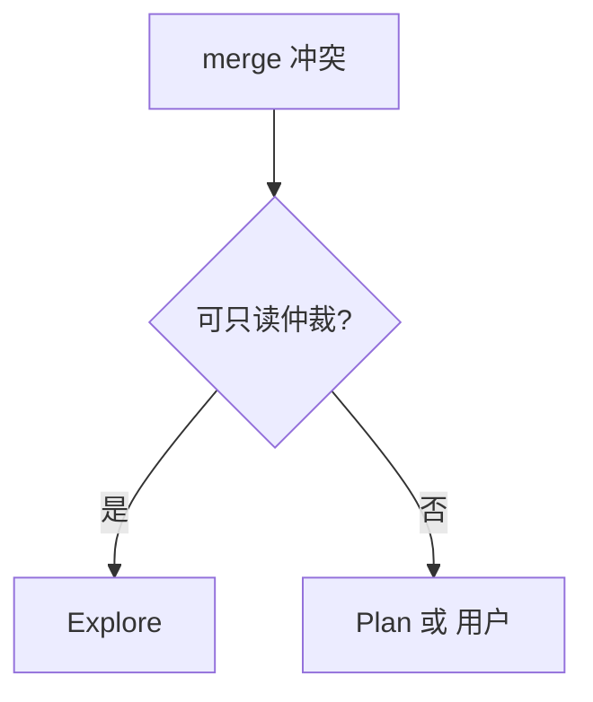

# 10.10 消息路由（父子 Agent 通信模式）

> **系列**：Claude Code 完全指南 V2 · 第 10 篇

---

## 学习目标

1. **描述**子 Agent **独立上下文窗口**与父 Agent 的关系。
2. **解释**「蒸馏结果」如何回传父 Agent 并进入**下一轮决策**。
3. **设计**结构化返回字段，便于 **Coordinator** 做 **merge**。
4. **区分**同步等待子任务与**后台**（视产品 UI）在用户感知上的差异。

---

## 生活类比：专案组与指挥部

子 Agent 像**一线专案组**：自己翻卷宗、取证、写笔录（工具调用）。指挥部（**父 Agent**）不看每一份原始复印件，只看**摘要卷**（**蒸馏结果**），再决定下一组警力派往何处。若专案组每天把全部复印件堆到指挥部，**信息流会瘫痪**——对应 **上下文爆炸**。

---

## 父子通信总览







---

## 蒸馏结果应包含什么？

| 字段（建议） | 用途 |
|--------------|------|
| `summary` | 3-8 句结论 |
| `evidence` | 关键路径/行号/命令输出片段 |
| `touched_files` | 若子 Agent 可写 |
| `commands_run` | 便于 Verification 复现 |
| `open_questions` | 需人类/父级决策 |
| `verdict` | 若子角色为 Verification：PASS/FAIL/PARTIAL |

父 Agent **不应**要求子 Agent 粘贴 **全文** `grep` 结果，除非调试需要。

---

## Task 工具与上下文隔离

**子 Agent 独立上下文窗口** 意味着：

- 子会话的 **system + 前几轮** 可能含 **角色专用提示**（Explore/Plan/Verify）。
- 父会话 **看不到** 子会话中间工具细节，除非子 Agent **主动写入**摘要。
- **返回蒸馏结果**是协议上的**必选义务**（教学规范）。

```json
{
  "child_return_shape": {
    "summary": "string",
    "evidence": ["path:line — snippet"],
    "open_questions": []
  }
}
```

---

## 路由模式表

| 模式 | 描述 | 适用 |
|------|------|------|
| 单跳 | 父 → 一子 → 回父 | 小任务 |
| 星型 | 父 → 多子并行 → 父 merge | Coordinator Phase1 |
| 链式（仍扁平） | 父依次派子，**非**子再派子 | 串行改文件 |
| 验证旁路 | 父 → 实现子 → 父 → 验证子 | 利益隔离 |

---

## 源码片段：父 Agent merge 伪代码

```text
results = []
for task in phase1_tasks:
  results.append(await Task(...))

merged_paths = dedupe(flatten(r.evidence.paths for r in results))
conflicts = detect_overlap(merged_paths)
dispatch_phase3(merged_paths, conflicts)
```

---

## UI/产品层：「Fork started — processing in background」

用户侧常看到统一前缀（10.8），提示子任务在**后台**处理；**父 Agent** 仍应在逻辑上 **await** 结果或**显式**分段汇报，避免用户以为「没反应」。

---

## 反模式

| 反模式 | 后果 |
|--------|------|
| 子 Agent 返回整屏日志 | 父上下文污染 |
| 父 Agent 不读摘要直接再派 | 重复/矛盾 |
| 把用户直接 @ 给子 Agent | 责任链混乱；应父统一对口 |
| 子 Agent 提问循环 | 违反工人意识（10.6） |

---

## 与防递归（10.9）的关系

子 Agent 若试图 **Task** 转发给「同事」，会破坏**星型路由**，形成**深度链**。正确做法是 **`NEEDS_PARENT_DISPATCH`** 结构化回报。

---

## 深入：多子 Agent 结果冲突时如何路由？

| 冲突类型 | 父 Agent 动作 |
|----------|----------------|
| 路径列表不一致 | 抽样 Read 或再派 **Explore** 仲裁 |
| 技术方案相反 | 抬升给用户或 **Plan** 只读裁决 |
| 测试结论矛盾 | **Verification** 独立跑 |



---

## 安全与隐私路由

| 注意点 | 建议 |
|--------|------|
| 密钥 | 子摘要 **脱敏** |
| 客户数据 | **最小必要**片段 |
| 日志 | **截断**与**哈希** |

---

## 案例：三路搜索合并

1. 子 A 返回 `services/a` 下 4 文件。  
2. 子 B 返回 `pkg/b` 下 2 文件。  
3. 子 C 返回 `deploy` 目录树。  
4. 父 Agent **去重** → Phase3 派 **Worker** 仅触及 **不相交**集合；相交则 **串行**（10.5）。

---

## 小结

- **子 Agent 独立上下文**；父 Agent 依赖 **蒸馏结果** 决策。  
- **结构化返回** = 可 merge、可验证、可缓存。  
- **星型路由** + **扁平 Task** = 可扩展蜂群。

---

## 自测

1. 为何不能把子 Agent 的全量工具日志都塞进父上下文？  
2. 写出你建议的五字段返回结构。  
3. 星型与链式（扁平）有何区别？

---

## 与统一 Fork 前缀的衔接（10.8）

| 环节 | 建议 |
|------|------|
| Task.description | `Fork started — processing in background: …` |
| 子 Agent 最终答复首行 | 可用固定 `Summary —` 便于父解析 |
| 日志归档 | 按 `task_id` 分文件，避免混在父会话 |

---

## 失败模式诊断表

| 症状 | 可能根因 | 修复 |
|------|----------|------|
| 父 Agent 重复问用户同样问题 | 子摘要未含 `open_questions` | 强制模板 |
| merge 后路径仍错 | evidence 无行号 | 反偷懒（10.6） |
| 用户看到乱序回复 | 多 Task 完成顺序非提交顺序 | 父侧排序再呈现 |

---

## 示例：结构化 JSON 风格摘要（可选）

若你的编排层支持 JSON mode：

```json
{
  "summary": "找到 3 处引用",
  "evidence": [
    {"path": "a.go", "lines": "10-40", "note": "调用 Foo"}
  ],
  "open_questions": []
}
```

父 Agent **parse → merge → 派下一 Task**，比散文更稳。

---

*上一节：[10.9 防递归](./09-anti-recursion.md) · 下一节：[10.11 Swarm vs Coordinator](./11-swarm-vs-coordinator.md)*
