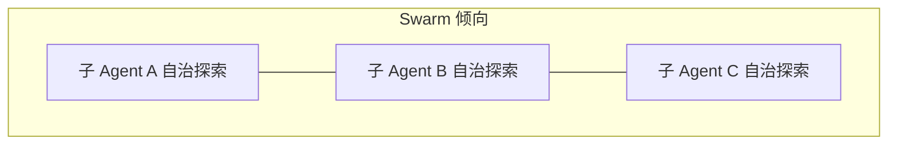
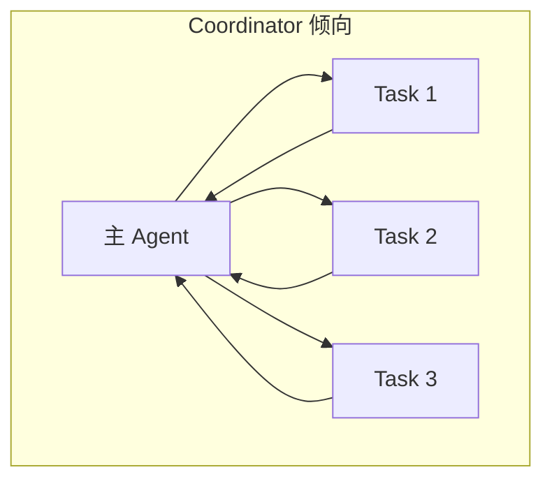
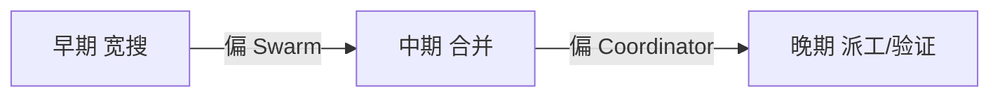
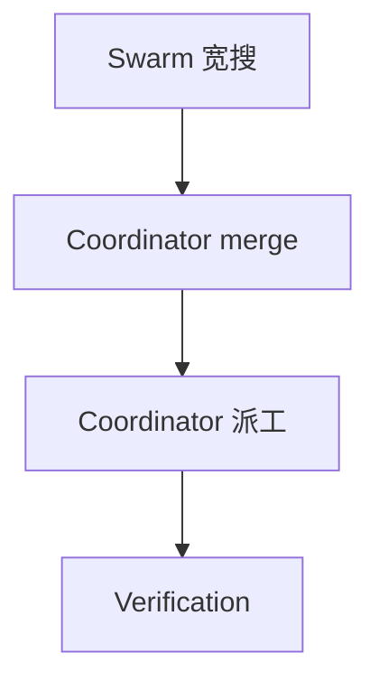
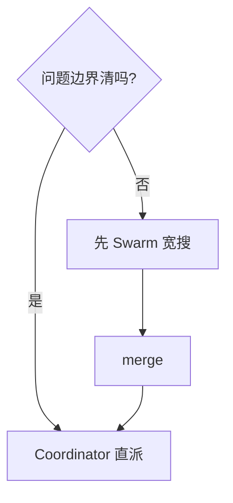
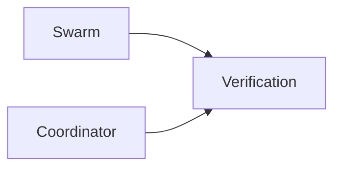

# 10.11 Swarm vs Coordinator（两种多 Agent 模式对比）

> **系列**：Claude Code 完全指南 V2 · 第 10 篇

---

## 学习目标

1. **对比** **Swarm**（蜂群/对等自治探索）与 **Coordinator**（中心调度）的适用场景。
2. **选择**在宽搜、收敛、落地、验证各阶段分别偏向哪种模式。
3. **解释**二者如何**混合**：早期 Swarm 宽搜 + 晚期 Coordinator 收口。
4. **关联**反偷懒、防递归、Verification 在两种模式下的**共性要求**。

---

## 生活类比：跳蚤市场 vs 连锁总部

**Swarm** 像**跳蚤市场**：多个摊主各自吆喝、各自发现顾客，**没有**统一麦克风，但**覆盖面大**。**Coordinator** 像**连锁总部**：分区经理听汇报、排班、决定谁先补货——**强中心**、**强阶段门**。软件里：**未知问题**常先 Swarm；**强交付**常收 Coordinator。

---

## 双模式概念图







---

## 对照总表

| 维度 | Swarm | Coordinator |
|------|-------|-------------|
| 决策中心 | **弱** / 多路并行各自为战 | **强** / 父 Agent 拍板 |
| 适用阶段 | 未知问题、**发散** | 已知路线、**收敛交付** |
| 汇总成本 | 可能高（重复） | 中等（显式 merge） |
| 冲突处理 | 事后发现 | **Phase2** 预先排序 |
| 风险 | 上下文碎片化、重复劳动 | 中心瓶颈、调度失误 |
| 与 Verification | **仍需独立** | **仍需独立** |

---

## 何时偏 Swarm？

| 场景 | 理由 |
|------|------|
| 新仓库 onboarding | 多视角快速扫 |
| 根因不明 incident | 并行假设验证（只读为主） |
| 技术调研 | 广撒网收集替代方案 |

**注意**：Swarm **不是**允许子 Agent **再派子 Agent**；仍 **扁平**（10.9）。

---

## 何时偏 Coordinator？

| 场景 | 理由 |
|------|------|
| 明确里程碑发布 | 阶段门 + 责任到人 |
| 多文件改造需**顺序** | **串行** Worker（10.5） |
| 大团队仿真 | 角色分明（Explore/Plan/Worker/Verify） |

---

## 混合模式（推荐）

```text
Phase 0：用户目标
Phase 1（Swarm 向）：3× Explore/Worker 并行宽搜
Phase 2（Coordinator）：父 merge → 锁定路径与顺序
Phase 3（Coordinator）：Worker 并行/串行修改
Phase 4（强制）：Verification 独立判决
```



---

## 与「反偷懒」的共性

无论 Swarm 还是 Coordinator，**模糊指令**都会放大无效探索：

| 模式 | 模糊指令的后果 |
|------|----------------|
| Swarm | 多子 Agent **重复跑偏** |
| Coordinator | **错误并行**浪费 |

**父 Agent** 必须在进入 Phase1 前给出**搜索边界**（目录/关键字/时间范围）。

---

## 与缓存前缀（10.8）

两种模式都应使用 **统一 Fork 前缀**；Swarm 下任务数更多，**前缀收益更大**。

---

## 与消息路由（10.10）

- **Swarm**：父 merge **负担重** → 更需要 **结构化返回**。  
- **Coordinator**：路由 **显式**，但仍依赖 **蒸馏** 质量。

---

## 案例对照

**场景**：全库「慢查询」优化。

| 模式 | 做法 |
|------|------|
| Swarm 向 | 三子分别搜 ORM、索引、日志配置 |
| Coordinator | 父合并后指定 **只改** `queries/report.sql` 与 `index migration` 顺序 |

若全程 Swarm 无收口 → 可能三人**各改一处**冲突。若全程无 Swarm → **搜索覆盖**不足。

---

## 反模式

| 反模式 | 说明 |
|--------|------|
| 假 Swarm：子 Agent 再 Task | **递归**（禁） |
| 假 Coordinator：父从不 merge | 并行失控 |
| 无 Verification | 两种模式**都**不可信 |

---

## 选型速查



---

## 小结

- **Swarm** = **发散、覆盖**；**Coordinator** = **收敛、调度**。  
- **混合**最常见：**宽搜 Swarm → 收口 Coordinator → Verification**。  
- **防递归、反偷懒、利益隔离** 两种模式**都要**。

---

## 自测

1. 何时不应使用纯 Swarm？  
2. Coordinator 的最大风险是什么？  
3. 写出一个你项目里的三阶段混合流程。

---

## 与 Verification 的「模式无关」原则

无论 Swarm 还是 Coordinator，**Verification** 都必须：

- **Try to break it**（10.7）  
- **PASS/FAIL/PARTIAL** 附**命令证据**  
- 与实现子 Agent **会话隔离**



---

## 团队规模与模式倾向（经验法则）

| 团队/context | 倾向 |
|--------------|------|
| 单人 + 超大仓 | 先 Swarm 宽搜再 Coordinator |
| 强发布火车 | Coordinator 主导 |
| 研究型 spike | Swarm 向 |

---

## 术语对照

| 口语 | 本文含义 |
|------|----------|
| 蜂群 | 多子 Agent 并行探索（**扁平**） |
| 协调器 | 强中心 merge 与派工 |
| 混合 | Swarm→Coordinator 流水线 |

---

*上一节：[10.10 消息路由](./10-message-routing.md) · 下一节：[10.12 实践](./12-practice.md)*
