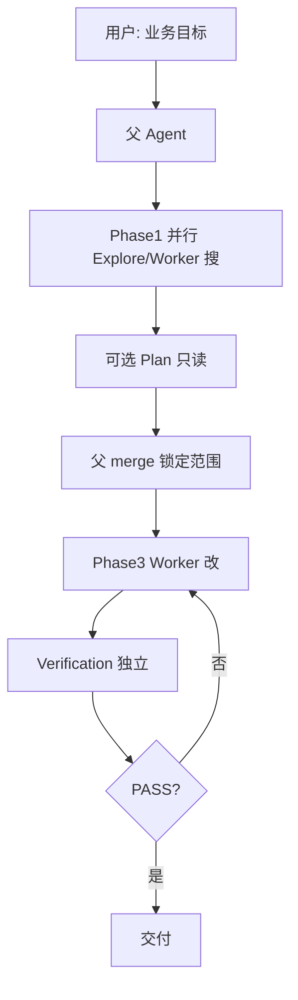
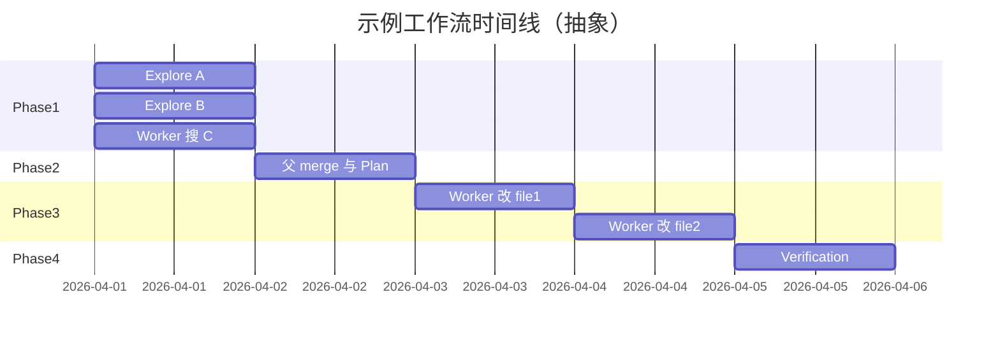

# 10.12 实践：设计多 Agent 工作流

> **系列**：Claude Code 完全指南 V2 · 第 10 篇

---

## 学习目标

1. **从零设计**一条含 **Explore / Plan / Coordinator / Worker / Verification** 的完整工作流。
2. **落地** Phase1 并行、Phase3 串行/并行决策与 **Fork 统一前缀**。
3. **写出**可执行的 Worker 工单与 Verification **探针列表**。
4. **复盘**失败模式：递归、模糊指令、无隔离验证。

---

## 生活类比：筹办婚礼

**Explore** 看场地与供应商目录；**Plan** 排出流程表；**Coordinator** 协调并行预定与串行签约；**Worker** 执行每一项采购与布置；**Verification** 像闺蜜团**挑刺**（音响测试、座位表冲突检查）——**不能**由新郎新娘自评「一切完美」。

---

## 实践总流程图






---

## 练习题 A：为「API 速率限制误伤」设计工作流

**背景**：用户报告正常流量被 429。

| 阶段 | 子 Agent | 关键动作 | description 前缀 |
|------|----------|----------|------------------|
| Phase1 | Explore ×2 | 搜 `rate`、`limit`、`429` | `Fork started — processing in background:` |
| Phase1 | Worker | 搜中间件注册点 | 同左 |
| Phase2 | 父 | 合并路径，锁定 `middleware/rate.go:??` | — |
| Phase2 | Plan（可选） | 输出两阶段修复+回滚 | 同左 |
| Phase3 | Worker | 按行号调整阈值与 bypass 规则 | 同左 |
| Phase4 | Verification | `go test` + `curl` 正常/越界流量 + adversarial | 同左 |

**Verification 探针示例**：

| 探针 | 期望 |
|------|------|
| 正常 Header | 200 |
| 超频 | 429 + `Retry-After` |
| 空 UA | 依策略 400 或 200（需文档） |

**判决**：Lint 若红 → 依团队策略 **FAIL** 或 **PARTIAL**（10.7）。

---

## 练习题 B：模板填空（请手写）

```markdown
## 用户目标
（一句话）

## Phase1 并行（3 Task）
1. description: Fork started — processing in background: _______
   subagent_type: _______
   prompt 要点: _______

2. …

3. …

## Phase2 merge 产出
- 锁定文件与行号: _______

## Phase3 Worker 工单
- 工人意识注入（粘贴 10.6 段落）: _______
- 禁止事项: _______

## Phase4 Verification
- 必跑命令: _______
- adversarial: _______
- 判决标准 PASS/FAIL/PARTIAL: _______

## 防递归自检
- [ ] 子 Agent prompt 无「再 Task」字样
```

---

## 练习题 C：找出错误工作流

下面工作流错在哪？

1. Worker prompt：「不确定就再 spawn 一个 explore。」  
2. Plan：「我会直接改 `go.mod` 升级依赖。」  
3. Verification：「我阅读了 Worker 的总结，PASS。」  
4. Phase3：两 Worker **同时**改 `config.yaml` 不同键但**同一 merge 热点**且无锁。

| 序号 | 错误类型 | 改正 |
|------|----------|------|
| 1 | 递归/委派 | 扁平 + 父派 Explore |
| 2 | 只读违反 | Worker |
| 3 | 未执行检查 | 跑命令 + 探针 |
| 4 | 冲突风险 | **串行**或单 Worker |

---

## 评分 rubric（自评用）

| 项目 | 满分标准 |
|------|----------|
| 角色覆盖 | 至少用到 Explore + Worker + Verification |
| 工单质量 | 路径+行号+期望+验收命令 |
| 并行策略 | Phase1 并行；热点文件不盲目并行 |
| 隔离 | Verification 独立 Task |
| 前缀 | 所有 Task description 统一前缀 |
| 防递归 | 明示禁止子 Task |

---

## 进阶：与 CI/CD 对齐

| 层级 | 多 Agent | CI |
|------|----------|-----|
| 本地 Verification | 快速探针 | 全量矩阵 |
| 证据格式 | Markdown 摘要 | JUnit/XML |

设计工作流时，注明：**Agent 内 Verification ⊂ CI**，避免误以为本地 PASS 等于生产免疫。

---

## 复盘清单（项目结束后）

- [ ] 是否出现 **重复搜索**？→ Phase1 提示更窄或加 Explore-only  
- [ ] 是否 **FAIL** 多？→ 反查是否 **模糊派工**  
- [ ] token 成本？→ 蒸馏是否过冗长；前缀是否统一  
- [ ] 人为介入点是否前置？→ Plan **开放问题**是否提前抛出  

---

## 参考速查链接（本篇内）

- [10.2 六角色](./02-six-agents.md)  
- [10.5 Coordinator](./05-coordinator.md)  
- [10.6 反偷懒](./06-anti-lazy.md)  
- [10.7 Verification](./07-verification-agent.md)  
- [10.8 缓存](./08-cache-optimization.md)  
- [10.9 防递归](./09-anti-recursion.md)  
- [10.10 消息路由](./10-message-routing.md)  
- [10.11 Swarm vs Coordinator](./11-swarm-vs-coordinator.md)  

---

## 小结

- 实践 = **角色 × 阶段 × 结构化协议 × 独立验证**。  
- 用 **模板** 与 **rubric** 固化习惯。  
- **混合 Swarm→Coordinator** 是默认优解。

---

## 最后一题

为你当前真实项目写一条 **Phase1 三个并行 Task** 的 `description` 行（含统一前缀），主题自选。

---

*上一节：[10.11 Swarm vs Coordinator](./11-swarm-vs-coordinator.md) · 返回：[10.1 索引](./index.md)*
