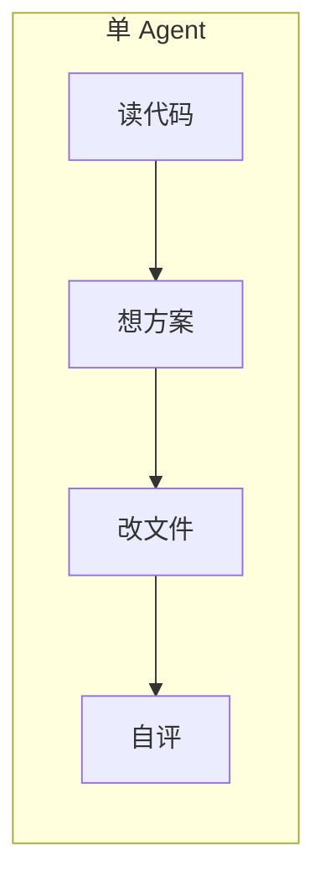
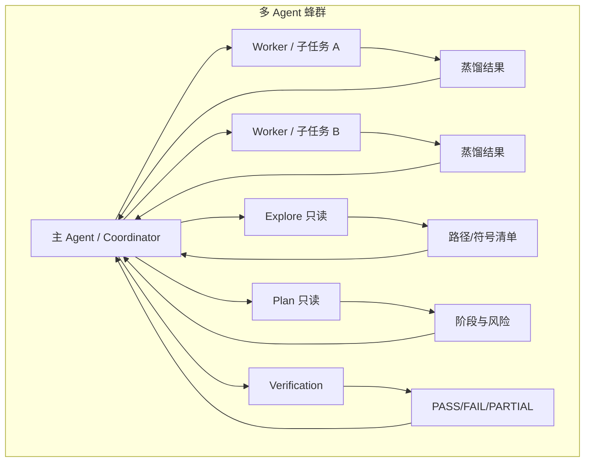
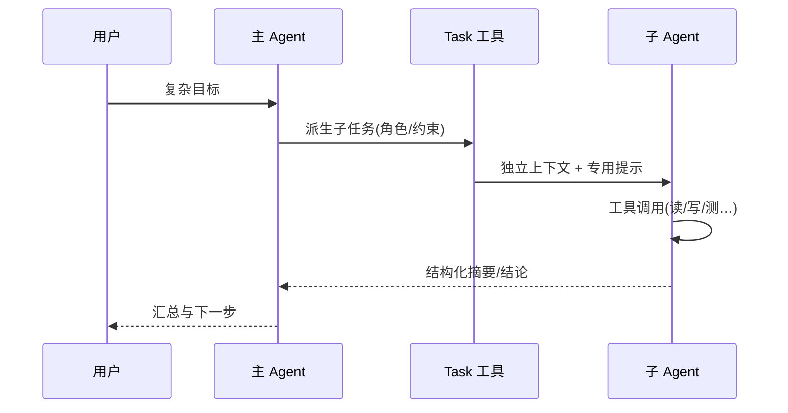
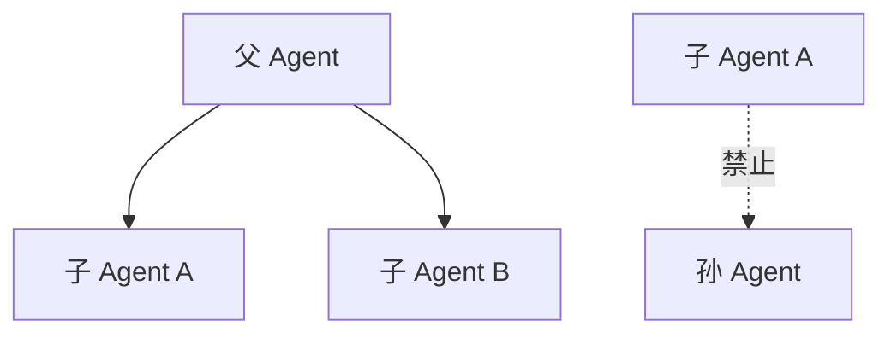
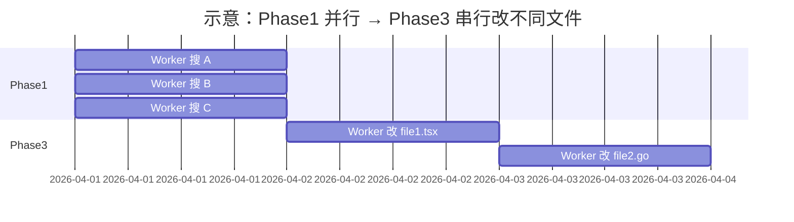

# 第 10 篇：多 Agent 系统 · 10.1 蜂群作战

> **路径**：`docs/part10-multi-agent/index.md`  
> **系列**：Claude Code 完全指南 V2

---

## 学习目标

完成本节学习后，你应该能够：

1. **解释**为何在复杂工程任务中，单一大上下文 Agent 往往不如「蜂群式」多 Agent 分工。
2. **区分**「一个人扛全场」与「项目经理 + 工人」两种心智模型，并对应到 Coordinator / Worker 等角色。
3. **说出** Claude Code 中通过 **Task 工具** 派生子 Agent 的基本机制，以及子 Agent **独立上下文**、向父 Agent **返回蒸馏结果** 的含义。
4. **建立**对后续小节（六个内建角色、只读 Explore/Plan、Verification、缓存前缀、防递归）的整体路线图。

---

## 生活类比：从「全能厨师」到「中央厨房」

想象一家餐厅在晚高峰要出两百份套餐。

- **单打独斗**：一位厨师同时接单、洗菜、切配、炒菜、摆盘——短期可能撑住，但**错误率上升、节奏混乱、无法并行**。
- **蜂群作战**：主厨（类似 **Coordinator / 主 Agent**）拆单：冷菜台、热灶、面点**并行**；需要改同一口锅里的配方时则**串行**排队，避免两人同时加盐。

软件仓库里的「改 Bug、跑测试、搜全库引用」同理：**搜索与验证可以并行**，**改同一文件**往往需要**串行**或明确分工，否则冲突与「口头交代不清」会指数级放大。

---

## 为什么需要多 Agent？

| 维度 | 单 Agent | 多 Agent（合理编排） |
|------|----------|----------------------|
| 上下文 | 所有探索、计划、实现挤在同一窗口，易被噪声淹没 | 子任务**独立窗口**，父 Agent 只收**摘要** |
| 并行度 | 本质串行思考 | 可 **Phase 并行** 多路探索（受工具与策略约束） |
| 专业度 | 同一套提示承担所有角色 | **Explore / Plan / Verify** 等**角色专用**系统提示 |
| 风险 | 「又写又评」易自我确认偏误 | **Verification** 与写代码方**利益隔离** |
| 成本与缓存 | 长对话重复多 | 统一 **Fork 前缀** 利于前缀缓存命中（见 10.8） |

---

## 从「单打独斗」到「蜂群」：心智模型切换







---

## Task 工具：生成子 Agent 的机制（概念层）

在 Claude Code 的抽象模型中，**Task 工具**是「生成子 Agent」的入口：父 Agent 不直接在自身上下文里完成所有探索，而是** Fork 出**具有**独立上下文窗口**的子 Agent；子 Agent 运行结束后，将**蒸馏后的结果**（例如文件路径列表、结论段落、测试输出摘要）返回给父 Agent 合并。

**源码/配置片段（示意）**——不同版本字段名可能略有差异，核心语义一致：

```json
{
  "tool": "Task",
  "subagent_type": "explore",
  "description": "3-5 词摘要",
  "prompt": "给子 Agent 的完整任务说明（须含具体路径/行号约束时见 10.6）",
  "readonly": true
}
```

要点：

- `subagent_type` 选择 **explore / plan / generalPurpose / shell / …** 等，决定**能力与系统提示**。
- `readonly: true` 时对应 **Explore / Plan** 一类**只读**子 Agent（详见 10.3、10.4）。
- 子 Agent **不能**再嵌套生成子 Agent（**防无限递归**，见 10.9）。

---

## 子 Agent 独立上下文与「蒸馏返回」

| 概念 | 含义 |
|------|------|
| 独立上下文 | 子 Agent 的对话与工具轨迹与父级隔离，避免父窗口被中间步骤塞爆 |
| 蒸馏结果 | 父 Agent 需要的是**决策级信息**（改哪些文件、证据链、测试是否红），而非每一次 `grep` 的原始输出 |
| 父级职责 | 合并多路子结果、解决冲突、安排串行/并行阶段 |

---

## 何时不该用多 Agent？

多 Agent 不是银弹。以下情况**优先单 Agent**或小步迭代：

- 改动范围极小（单文件数行）。
- 任务无法被拆成**可验证**的子目标（拆了就丢上下文）。
- 过度 Fork 导致**汇总成本**高于**直接动手**。

---

## 本篇路线图（第 10 篇 12 节）

| 小节 | 文件 | 主题 |
|------|------|------|
| 10.1 | `index.md` | 蜂群作战与 Task 机制总览 |
| 10.2 | `02-six-agents.md` | 六个内建角色与能力/限制表 |
| 10.3 | `03-explore-agent.md` | Explore 只读探索 |
| 10.4 | `04-plan-agent.md` | Plan 只读规划 |
| 10.5 | `05-coordinator.md` | Coordinator 调度与并行/串行 |
| 10.6 | `06-anti-lazy.md` | 反偷懒与工人意识注入 |
| 10.7 | `07-verification-agent.md` | Verification：Try to break it |
| 10.8 | `08-cache-optimization.md` | Fork 前缀与缓存 |
| 10.9 | `09-anti-recursion.md` | 防无限递归 |
| 10.10 | `10-message-routing.md` | 父子消息路由 |
| 10.11 | `11-swarm-vs-coordinator.md` | Swarm vs Coordinator |
| 10.12 | `12-practice.md` | 实践设计工作流 |

---

## 小结

- **蜂群作战**的本质是：**分工、并行、可验证、可汇总**。
- **Task 工具**负责 **Fork 子 Agent**；子 Agent 有**独立上下文**，向父 Agent 返回**蒸馏结果**。
- **主 Agent** 应像项目经理一样：**明确子任务边界**，并为 **Verification** 与实现方留出**利益隔离**空间（第 10.7 节展开）。

---

## 自测 checklist

- [ ] 能否用「中央厨房」类比解释并行与串行的取舍？
- [ ] 能否说明「独立上下文」解决了什么问题？
- [ ] 是否理解「子 Agent 不能生成子 Agent」在架构上的必要性？

---

## 深入：复杂任务中的「证据链」

蜂群模式的一个隐藏收益是：**每一类子 Agent 产出不同形态的证据**。

| 证据类型 | 典型产出者 | 父 Agent 合并时检查什么 |
|----------|------------|-------------------------|
| 存在性 | Explore | 路径是否真实、引用是否完整 |
| 可行性 | Plan | 阶段是否可执行、依赖是否闭环 |
| 正确性 | Worker | 补丁是否落在约定行号/文件 |
| 外部性 | Verification | Build/Test/Lint/HTTP 是否客观失败 |

父 Agent 若跳过某一类证据（例如只有代码 diff 没有测试），系统整体**置信度**应主动降级，并在对用户汇报时标明 **PARTIAL**（与 10.7 对齐）。

---

## 与「子 Agent 缓存」的前瞻关系（10.8 预告）

所有 Fork 任务若统一以固定前缀开头（例如 `Fork started — processing in background`），推理服务侧可对该前缀做**字节级前缀匹配**，使大量结构相似的子任务在**首 token 段**复用缓存。你在编写 `description` 或系统级模板时，应**刻意统一**该字符串，而不是每条任务换一种寒暄语。

```text
# 推荐（统一前缀，利于缓存）
Fork started — processing in background: 搜索 auth 模块中的 refresh token 用法

# 不推荐（前缀碎片化）
[子任务] 帮我看看 auth …
后台任务开始：auth …
```

---

## 防递归与组织边界（10.9 预告）

若允许「子 Agent 再派生子 Agent」，会出现：

1. **深度爆炸**：每层都复制一套工具与提示，成本不可控。
2. **责任模糊**：失败时难以判定是哪一层指令含糊。
3. **死锁风险**：循环委派「你再去派一个人看看」。

因此平台层通常**硬约束**：**子 Agent 不得再调用 Task 生成孙 Agent**。父 Agent 必须**扁平化**拆分任务。



---

## Coordinator 模式的直观结构（10.5 预告）

在 **Coordinator** 心智下，主 Agent **不急于亲自改代码**，而是：

- **Phase 1**：并行派出多只 **Worker**（或 Explore）做**只读/宽搜索**，收敛候选文件集合。
- **Phase 2**：主 Agent 根据蒸馏结果**锁定**修改列表与顺序。
- **Phase 3**：对**不同文件**可并行；对**同一热点文件**应**串行**派工，避免冲突。



---

## 「反偷懒」在总览层的含义（10.6 预告）

主 Agent 常犯的一类错误是：给子 Agent 一句「根据你的发现修 Bug」。这在工程上等于**把责任推给子上下文**，且子 Agent **没有你的全局产品约束**。正确做法是：**文件路径 + 行号范围 + 期望行为 + 复现步骤**（或测试名）。工人意识注入则强调：Fork 出的 Worker **不是经理**，**禁止再委派**、**少问多做**。

---

## Verification 为何是「全场最佳设计」之一（10.7 预告）

**Verification** 的核心口号是：**Try to break it**。它被要求：

- **严禁**「只读代码就认为 OK」。
- **强制**跑 **Build / Test / Lint**；前端可走浏览器自动化；后端可用 **curl** 实测。
- 使用 **adversarial probes**（对抗性探测）挑战边界条件。
- 输出 **PASS / FAIL / PARTIAL**，且与写代码 Agent **利益隔离**（不能互相「给面子」）。

---

## 术语速查表

| 术语 | 解释 |
|------|------|
| Fork | 通过 Task 创建子 Agent，独立上下文 |
| 蒸馏结果 | 压缩后的结论文本/结构化要点，回传父级 |
| 只读模式 | 不可创建/修改/移动文件；Bash 受限 |
| 利益隔离 | Verification 与实现方目标对立统一：找茬 vs 修码 |
| 前缀缓存 | 相同起始字节序列命中 KV 缓存，降低时延与费用 |

---

## 常见误解

**误解 1**：「子 Agent 越多越好。」  
**正解**：子 Agent 数量上升会带来**汇总与一致性**成本；应有**阶段门控**。

**误解 2**：「Explore 可以顺便改个小文件。」  
**正解**：Explore/Plan **只读**是**安全与职责**设计，不是建议项（10.3、10.4）。

**误解 3**：「Verification 看一下 diff 就行。」  
**正解**：必须以**可执行检查**为主，代码审查为辅（10.7）。

---

## 迷你案例：登录异常流量上升

1. **Phase 1（并行）**：Worker A 搜 `login` 相关路由；Worker B 搜限流中间件；Explore 列 `auth` 包目录与最近改动。
2. **Phase 2（主 Agent）**：合并路径清单，锁定 `middleware/rate_limit.go:88-120` 与 `handlers/login.go:40-55`。
3. **Phase 3（串行改不同文件或同文件排队）**：Worker1 改限流；Worker2 改 handler（若同文件则必须串行）。
4. **Verification**：跑单测 + `curl` 登录接口 +  adversarial 探测（错误密码、空 body、超大 payload）。
5. **判决**：若 Lint 红但功能绿 → **PARTIAL**，要求修复 Lint 后再 PASS。

---

## 与 Swarm 模式的对照（10.11 预告）

**Swarm** 更强调**对等与自治**的多路探索；**Coordinator** 更强调**中心化调度与阶段门**。二者可混合：早期 Swarm 宽搜，后期 Coordinator 收口。详见 `11-swarm-vs-coordinator.md`。

---

## 延伸阅读（本仓库内）

- [10.2 六个 Agent 角色图](./02-six-agents.md)
- [10.10 消息路由](./10-message-routing.md)
- [10.12 实践](./12-practice.md)

---

## 参考文献与实现提示（抽象）

以下名称随产品迭代可能调整，但语义稳定：

- **Task**：子 Agent 启动器。
- **subagent_type**：角色选择器。
- **readonly**：只读沙箱开关（Explore/Plan）。

集成到你的内部文档时，请绑定**当前版本**的 JSON Schema 或官方说明链接。

---

*下一节：[10.2 六个 Agent 角色图](./02-six-agents.md)*

