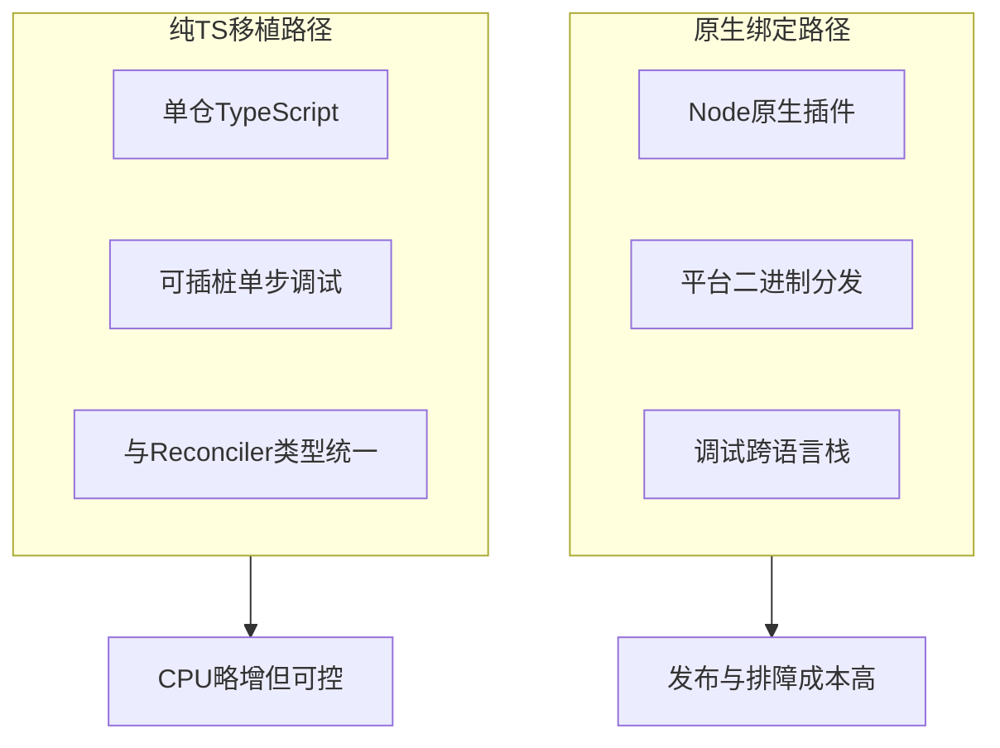
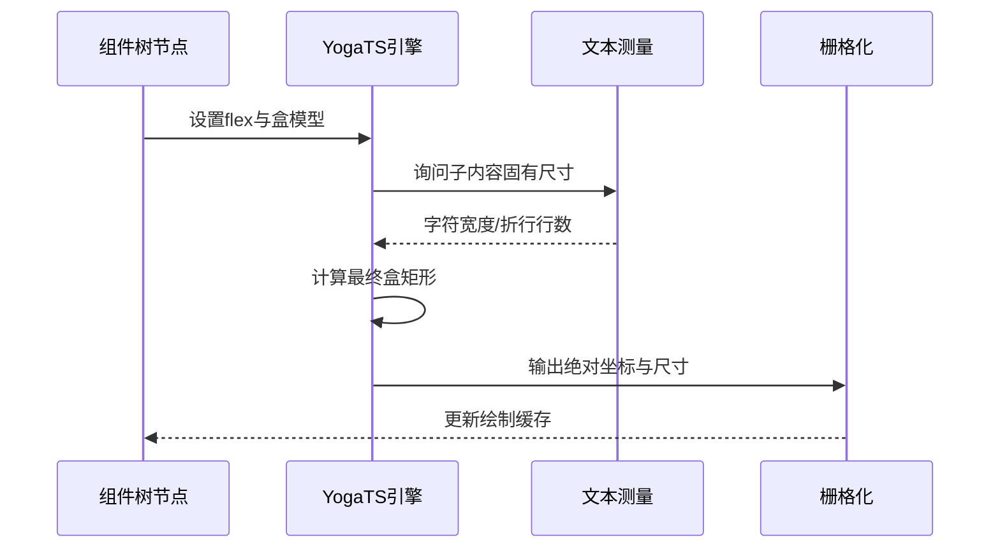
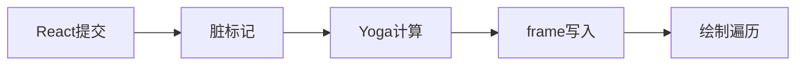

# 11.2 Yoga 布局：纯 TypeScript 中的 Flexbox

> **路径**：`docs/part11-terminal-ui/02-yoga-layout.md`  
> **系列**：Claude Code 完全指南 V2 · 第 11 篇

---

## 学习目标

完成本节学习后，你应该能够：

1. **解释** 为何在终端 UI 中引入 **Meta Yoga** 的语义，并以 **纯 TypeScript** 实现而非 C++ 绑定。
2. **列举** 已覆盖的关键能力：`flex-direction`、主轴/交叉轴对齐、`margin` 与 `padding`。
3. **对比** Web CSS 与「字符栅格」布局：像素变单元格、行高与折行约束。
4. **将** Yoga 计算结果映射到**行/列索引**，为渲染器提供确定性坐标。

---

## 生活类比：停车场划线 vs 方格纸

Web 页面像在**无限延展的停车场**：车位可以毫米级微调。终端更像**方格纸**：每个字符是一个**不可分割的格子**。

Yoga 负责在「**逻辑盒子**」层面说清：A 在 B 左边还是下面、剩余空间怎么分、外边距推开多少。渲染器再把盒子**量化**为整数列宽与行数——就像把设计图**对齐到网格**，避免「半格车」停不进去。

---

## 为什么选 Yoga 语义？

| 需求 | Yoga/Flex 模型的收益 |
|------|----------------------|
| 侧栏 + 主内容 | `flex-direction: row` + `flex-grow` 分配剩余列 |
| 顶栏固定、正文滚动 | 交叉轴对齐 + 子树独立测量 |
| 工具卡片栅格 | wrap 与 gap（若实现层支持）类语义可渐进补齐 |
| 与 React 组件树同构 | 每个组件节点挂 **layout props**，树即布局树 |

---

## 无 C++ 绑定：工程权衡



| 维度 | C++ 绑定 Yoga | 纯 TS Yoga |
|------|----------------|------------|
| 分发 | 多架构二进制 | **仅 JS/TS 产物** |
| 调试 | LLDB + JS 混合栈 | **同语言断点** |
| 性能 | 通常更快 | 终端布局规模下常**足够快** |
| 一致性 | 与上游 ABI 版本锁 | **与产品迭代同频** |

---

## 布局管线（概念）



---

## 核心属性在终端中的含义

| Yoga/CSS 概念 | 终端侧直觉 |
|---------------|------------|
| `flex-direction: row` | 子节点**横向**排列在字符列上 |
| `flex-direction: column` | 子节点**纵向**占行 |
| `justify-content` | 主轴剩余空间分配（左/中/右或顶/中/底） |
| `align-items` | 交叉轴对齐（例如多行面板在同一高度对齐） |
| `margin` | 在盒子外扩**空格或留白行** |
| `padding` | 盒子内缘与内容之间的**内边距** |

---

## 源码片段（示意 API）

以下展示 **TypeScript 侧** 可能如何声明布局 props（真实仓库字段名可能更细）：

```typescript
type FlexDirection = 'row' | 'column' | 'row-reverse' | 'column-reverse';

type TerminalBoxStyle = {
  flexDirection?: FlexDirection;
  flexGrow?: number;
  flexShrink?: number;
  flexBasis?: number | 'auto';
  justifyContent?: 'flex-start' | 'center' | 'flex-end' | 'space-between';
  alignItems?: 'stretch' | 'flex-start' | 'center' | 'flex-end';
  margin?: { top?: number; right?: number; bottom?: number; left?: number };
  padding?: { top?: number; right?: number; bottom?: number; left?: number };
};

interface LayoutNode {
  id: string;
  style: TerminalBoxStyle;
  children: LayoutNode[];
  /** 测量：给定最大宽度，返回所需行数与宽度 */
  measure: (maxWidth: number) => { width: number; height: number };
}
```

测量函数通常与 **Unicode 宽度**（全角字符）、**ANSI 脱敏后的可见宽度**、以及 **折行策略** 绑定。

---

## 与 Fiber 的协作点

Yoga **不**直接懂 React。协作方式是：

1. Reconciler 为每个宿主节点创建 **layout 影子节点**。
2. `style` 变更标记 **dirty**，在提交阶段 **自顶向下** 或 **脏路径** 重算。
3. 布局结果写入 **终端节点** 的 `frame: { x, y, w, h }`（单位：单元格）。



---

## 调试建议

| 现象 | 可能原因 | 排查方向 |
|------|----------|----------|
| 右侧被裁切 | `flexShrink` 或最大宽度过小 | 检查父链 `maxWidth` 与测量 |
| 垂直错位 | 交叉轴对齐与行高不一致 | `alignItems` 与字体/行高常量 |
| 多余空行 | `margin` 叠加或折行测量偏大 | 单节点最小高度与 padding |
| 抖动 | 每次流式更新全量布局 | 增量脏区与布局缓存 |

---

## 小结

**Yoga 语义 + 纯 TS 实现** 让终端 UI 在**不引入原生绑定**的前提下获得 **Web 级布局表达力**。关键是把 **flex-direction / 对齐 / margin / padding** 落到 **字符网格**，并与 **测量（文本折行）** 形成闭环。下一节聚焦 **自定义 React Fiber reconciler** 如何把组件树接到这套布局之上。

---

## 自测清单

1. 说出至少三种 `justify-content` 在终端宽面板中的视觉效果。
2. 解释 `margin` 与 `padding` 在「方格纸」模型中的差异。
3. 画一条从「style 变更」到「ANSI 输出」的数据路径。

---

## Flex 子项常见组合（终端侧）

| 组合 | 典型界面 |
|------|----------|
| `row` + `flex-grow` 主区域 | 左窄侧栏 + 右宽对话流 |
| `column` + `space-between` | 顶工具条 + 底状态条夹中间内容 |
| `align-items: center` | 在固定高度面板内 **垂直居中** 短文本 |
| `margin: { left: 2 }` | 与左侧边框形成 **缩进栏**（类似 IDE gutter） |

---

## 「最小可行布局树」练习

给定三栏：`Sidebar | Main | Inspector`，要求在中等宽度下 **Inspector 折到 Main 下方**，在宽屏恢复三列。用 Yoga 语义思考：

- 外容器 `flexDirection` 由 `columns` **断点**驱动。
- 各子项 `flexBasis` / `flexGrow` 的**相对关系**。

此练习帮助把 **响应式** 从 Web 直觉迁移到 **字符宽度断点**。

---

## 与 Unicode 测量的耦合点

Yoga 询问子节点「你需要多大？」时，终端文本节点必须返回 **显示宽度** 而非 **code point 数**。

| 话题 | 说明 |
|------|------|
| East Asian Width | 全角字符常占 **2 列** |
| 组合字符 | 可能 **1 列** 但多码点 |
| Emoji | 宽度因终端字体而异，常需 **保守估计** |

布局 **确定性** 来自团队内固定的 **测量表版本** 与 **降级规则**。

---

## 参考阅读（外部）

- Yoga 与 Flexbox 命名对照（理解字段即可）。
- Unicode TR11（East Asian Width）——仅深潜文本测量时必要。
