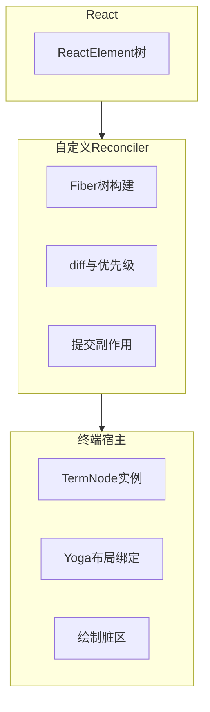
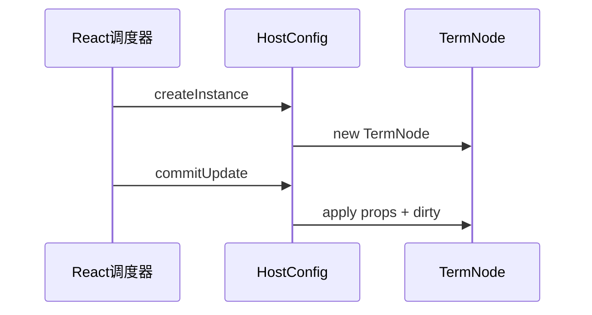

# 11.3 React Fiber：自定义协调器与「终端 DOM」

> **路径**：`docs/part11-terminal-ui/03-react-fiber.md`  
> **系列**：Claude Code 完全指南 V2 · 第 11 篇

---

## 学习目标

完成本节学习后，你应该能够：

1. **说明** 何为 **自定义 React reconciler**，以及它如何把 React 的更新语义映射到**终端宿主树**。
2. **区分** Render 阶段与 Commit 阶段在 TUI 中的职责划分。
3. **理解** Fiber 节点如何同时承载 **React 语义** 与 **终端绘制属性**。
4. **联系** 上一节 Yoga：布局计算发生在协调管线的哪一步。

---

## 生活类比：总机接线员

把 **Reconciler** 想成公司总机：

- 外线（**setState / props 变更**）不断打进来。
- 接线员（**Fiber 调度**）决定**先接哪通**、是否**挂断重拨**（中断与恢复）。
- 最后才把通话**转接到分机**（**宿主提交**：创建/更新/删除终端节点）。

若没有 Fiber 级别的控制，每次小改动都像**重播整本电话簿**——终端会闪屏、CPU 飙高、流式场景无法**增量拼接**。

---

## 自定义 reconciler 在栈中的位置



---

## 宿主方法族（概念表）

真实 `react-reconciler` 需要实现一整张 **host config**。下表是**教学用裁剪版**：

| 宿主方法 | 典型职责（终端） |
|----------|------------------|
| `createInstance` | 根据 `type` 创建 `TermNode`（文本/容器/滚动区等） |
| `createTextInstance` | 纯文本叶子 |
| `appendInitialChild` / `appendChild` | 维护子树链接 |
| `prepareUpdate` | diff props，生成 payload |
| `commitUpdate` | 把新 props 写入节点，标记绘制脏 |
| `removeChild` | 卸载子树，释放布局与缓冲 |
| `getRootHostContext` | 根上下文（主题、宽度、能力位） |



---

## 源码片段（伪 host config 骨架）

```typescript
import Reconciler from 'react-reconciler';

const HostConfig = {
  supportsMutation: true,

  createInstance(
    type: string,
    props: Record<string, unknown>,
    rootContainer: TermRoot,
    hostContext: HostCtx,
    internalHandle: unknown
  ) {
    return rootContainer.factory.createElement(type, props, hostContext);
  },

  createTextInstance(text: string, root: TermRoot, ctx: HostCtx) {
    return root.factory.createText(text, ctx);
  },

  appendChildToContainer(container: TermRoot, child: TermNode) {
    container.document.appendChild(child);
  },

  prepareUpdate(
    instance: TermNode,
    type: string,
    oldProps: Record<string, unknown>,
    newProps: Record<string, unknown>
  ) {
    return shallowDiff(oldProps, newProps);
  },

  commitUpdate(
    instance: TermNode,
    updatePayload: unknown,
    type: string,
    prev: Record<string, unknown>,
    next: Record<string, unknown>
  ) {
    instance.applyProps(next, updatePayload);
    instance.markLayoutDirty();
  },

  // ...removeChild、insertBefore、finalizeInitialChildren 等
};

export const TermRenderer = Reconciler(HostConfig);
```

---

## Fiber 与 Yoga 的衔接时机

| 阶段 | Fiber 在做什么 | Yoga 是否参与 |
|------|----------------|---------------|
| Render | 生成更新计划，可被打断 | 通常**不**做完整布局 |
| Commit | 应用 DOM（此处为 TermNode）变更 | **标记 dirty**，触发布局遍历 |
| Layout | 计算坐标与尺寸 | **Yoga 全量或增量** |
| Paint | 生成字符缓冲与 ANSI | 读取 `frame` 与样式 |

---

## 根容器与上下文

终端根容器常携带：

- **终端列宽/行高**（随窗口变化触发根更新）。
- **能力位**：真彩色、鼠标、Kitty、Unicode 宽度策略。
- **主题令牌**：暗/亮与对比度。

```typescript
type HostCtx = {
  columns: number;
  rows: number;
  capabilities: {
    trueColor: boolean;
    mouse: boolean;
    kittyKeyboard: boolean;
  };
  theme: 'dark' | 'light';
};
```

---

## 流式场景下的 Fiber 策略

流式输出时，频繁小更新若每次都 **全树 commit**，会浪费在布局与绘制上。常见优化思路：

| 策略 | 思路 |
|------|------|
| 子树隔离 | 将流式文本封在 **memo 边界** 内 |
| 批量提交 | 微任务合并多次 token 到达 |
| 脏矩形 | 仅重绘变更行的区间（与虚拟滚动协同） |

---

## 常见坑

| 症状 | 可能原因 |
|------|----------|
| 焦点丢失 | 宿主未实现 `prepareForCommit` / `resetAfterCommit` |
| 文本重复 | `textInstance` 与 `children` 双重渲染路径冲突 |
| 布局不更新 | `finalizeInitialChildren` 未触发首次 Yoga |
| 内存涨 | 卸载路径 `removeChild` 未断开环引用 |

---

## 小结

**自定义 Fiber reconciler** 是「React 组件」与「终端节点」之间的**契约层**：它把声明式 UI 变成**可增量提交**的宿主操作，并为 **Yoga 布局** 提供稳定的**节点生命周期**。下一节进入 **async generator 流式渲染**，看 Fiber 如何在「逐词到达」时保持顺滑。

---

## 与 11.2 的衔接练习

1. 标出 `commitUpdate` 之后、`ANSI 写出` 之前必须经过的两个子阶段。
2. 解释为何 `supportsMutation: true` 更贴近多数 TUI 的更新模式。
