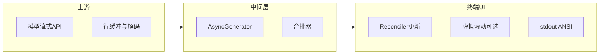
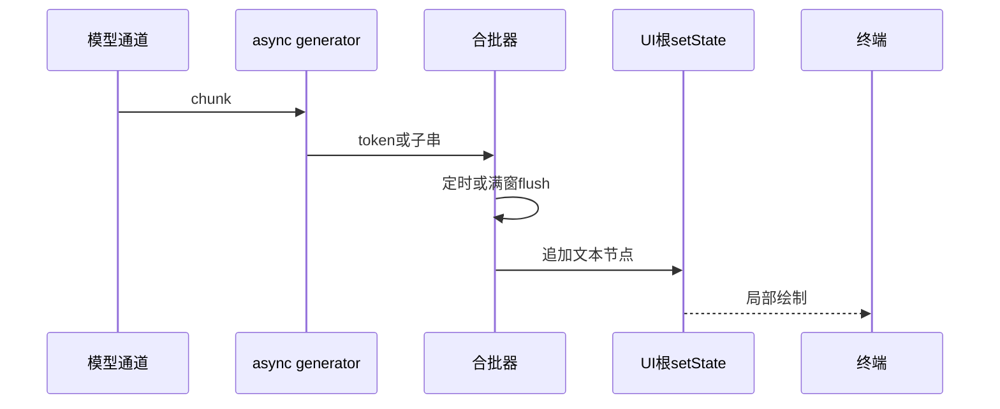
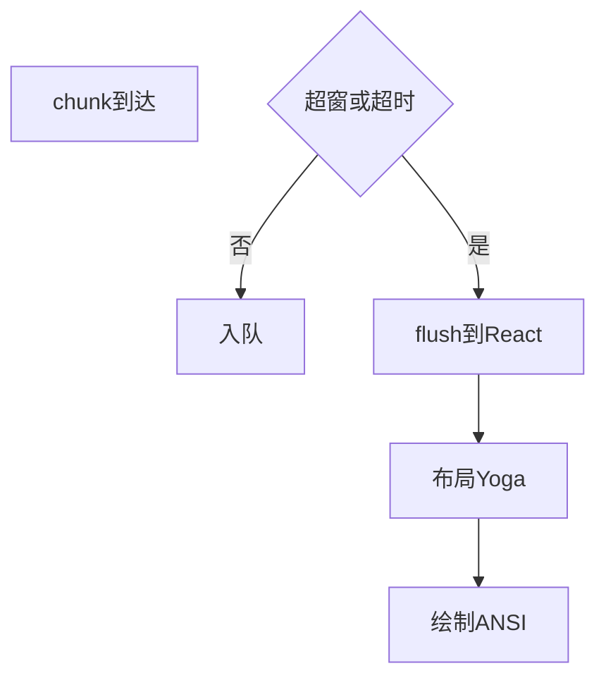

# 11.4 流式渲染：Async Generator 与逐词输出

> **路径**：`docs/part11-terminal-ui/04-streaming-render.md`  
> **系列**：Claude Code 完全指南 V2 · 第 11 篇

---

## 学习目标

完成本节学习后，你应该能够：

1. **描述** Claude Code 如何将 **LLM 流式 token** 映射到终端 UI 的**增量更新**。
2. **使用** `async generator` 组织「读一块 → 合批 → 提交 reconciler」的流水线。
3. **权衡** 刷新频率与 **CPU/闪屏**：批量、节流、`requestAnimationFrame` 类比。
4. **关联** 虚拟滚动（11.6）：长流式文本如何避免**全量布局**。

---

## 生活类比：听写与板书

老师**口述**课文，学生**往黑板上写**：

- 若每个字都**立刻擦了重写**，黑板会闪、手臂会酸——对应终端 **过度重绘**。
- 合理做法是**一小句一停顿**（**批量**），或**每秒最多擦几次**（**节流**）。

`async generator` 就像**分段听写**：上游说「下一段」，下游决定**何时抄到板上**。

---

## 流式数据路径（鸟瞰）





---

## 为何选 Async Generator？

| 方案 | 优点 | 缺点 |
|------|------|------|
| 回调地狱 | 简单 | 组合难、背压不清晰 |
| Promise 链 | 扁平 | 难表达「无限流」 |
| **Async generator** | **for await**、可中断、可组合 | 需理解迭代器协议 |
| Observable | 丰富算子 | 依赖与团队心智成本 |

---

## 源码片段：合批与背压（示意）

```typescript
type StreamChunk = { text: string; done?: boolean };

async function* parseModelStream(
  body: ReadableStream<Uint8Array>
): AsyncGenerator<StreamChunk> {
  const reader = body.getReader();
  const decoder = new TextDecoder();
  while (true) {
    const { value, done } = await reader.read();
    if (done) break;
    yield { text: decoder.decode(value, { stream: true }) };
  }
}

function createBatchedAppender(
  flush: (slice: string) => void,
  opts: { maxChars: number; maxMs: number }
) {
  let buf = '';
  let timer: ReturnType<typeof setTimeout> | null = null;

  const flushNow = () => {
    if (!buf) return;
    flush(buf);
    buf = '';
    if (timer) clearTimeout(timer);
    timer = null;
  };

  return (piece: string) => {
    buf += piece;
    if (buf.length >= opts.maxChars) flushNow();
    else if (!timer) {
      timer = setTimeout(flushNow, opts.maxMs);
    }
  };
}
```

---

## 与 React 更新的边界

| 实践 | 说明 |
|------|------|
| 单一文本宿主节点 | 长消息尽量挂在**一个** `text` 或容器，减少 Fiber 深度 |
| key 稳定 | 流式段落用**稳定 key**，避免整段卸载重建 |
| 受控高度 | 外层滚动容器固定高度，配合 **11.6 虚拟滚动** |
| 取消与竞态 | 新会话开始时 **abort** 旧流，**丢弃过期 chunk** |

---

## 节流与「伪 rAF」

浏览器有 `requestAnimationFrame`；Node 终端常用：

- `setImmediate` / `queueMicrotask` 微批
- `setTimeout(0)` 合并宏任务
- 与 **屏幕刷新**无关，但与 **stdin 事件循环**协同



---

## 错误与降级

| 场景 | 策略 |
|------|------|
| 解析半包 JSON | **增量解析器**或状态机，不 `JSON.parse` 全串 |
| 编码异常 | `TextDecoder` `fatal: false`，替换字符 |
| 用户 Ctrl+C | `AbortSignal` 贯通 generator |
| 极长单条消息 | 强制**切块显示**或折叠，避免 O(n) 全量 diff |

---

## 性能检查清单

1. **每帧**（每次 flush）是否触发布局子树过大？
2. 是否在 flush 中做 **同步文件 IO**？（应移出热路径）
3. **ANSI 拼接**是否可缓存样式前缀？
4. 与 **Diff**（11.8）同时开启时，是否**互斥重绘**？

---

## 小结

**Async generator** 为模型输出提供**自然的异步迭代抽象**；**合批**把细粒度 token 变成**粗粒度 UI 提交**，是终端流畅度的关键。下一节 **11.5** 讲解 **输入处理**：Kitty 协议、能力检测与多路复用器差异。

---

## 自测

1. 写出一个会导致「竞态重复段落」的流式 bug 场景及修复思路。
2. 解释 `maxChars` 与 `maxMs` 两个维度如何共同约束刷新。

---

## 附录：与 Ink 理念的差异点

| Ink 典型模式 | 自研栈可增强点 |
|--------------|----------------|
| 静态更新为主 | **无限流**一等公民 |
| 通用组件 | **Agent 专用**卡片与工具态 |
| 布局黑盒 | **Yoga TS** 白盒调试 |

---

## 术语对照

| 英文 | 中文表述 |
|------|----------|
| backpressure | 背压 |
| flush | 刷盘/刷新到 UI |
| chunk | 数据块 |
| reconciler | 协调器 |

---

## 延伸阅读（概念）

- 迭代器与异步迭代器：MDN `AsyncGenerator`
- React 18 并发特性在自定义渲染器中的**可选**启用策略（视宿主支持而定）

---

## 实战思考题

某用户在 SSH + tmux 中运行，网络延迟高，chunk 稀疏。若仅按 `maxChars` 合批，会出现「半天无输出」的错觉。应如何调整策略？

**提示**：引入 **时间优先** flush、或 **首个 token 立即显示** 的「冷启动例外」。

---

## 与虚拟滚动的接口

流式追加时，虚拟列表需获知：

- **总行数**变化
- **锚定行**（用户是否手动上滚阅读历史）

建议在滚动容器上维护 `scrollTop` 与 `contentHeight` 的**单一数据源**，避免双状态打架。

---

## 伪代码：锚定策略

```typescript
type ScrollModel = {
  contentHeight: number;
  viewportHeight: number;
  scrollTop: number;
  stickToBottom: boolean;
};

function onStreamAppend(m: ScrollModel, deltaLines: number) {
  m.contentHeight += deltaLines;
  if (m.stickToBottom) {
    m.scrollTop = Math.max(0, m.contentHeight - m.viewportHeight);
  }
}
```

---

## 版本演进备忘

当产品增加「工具调用中间态」时，流式管线需插入 **结构化事件**（非纯文本），generator 可产出 **discriminated union**：

```typescript
type UiEvent =
  | { kind: 'text'; value: string }
  | { kind: 'tool'; name: string; status: 'start' | 'end' };
```

UI 层 `switch (e.kind)` 分别更新子树——这是 **389 个组件** 协同的典型扩展点。
