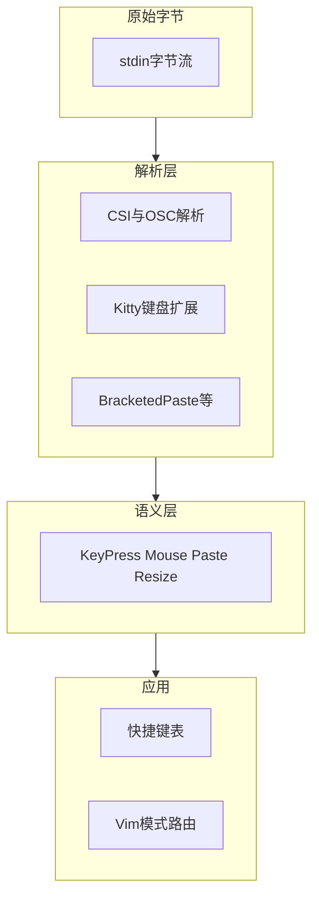
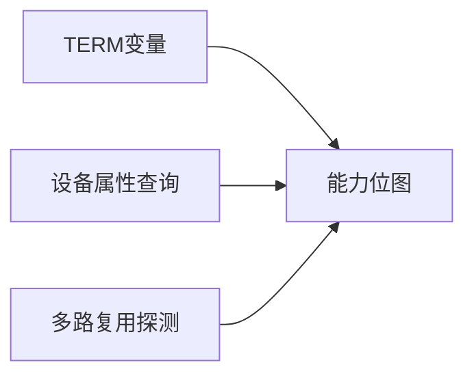
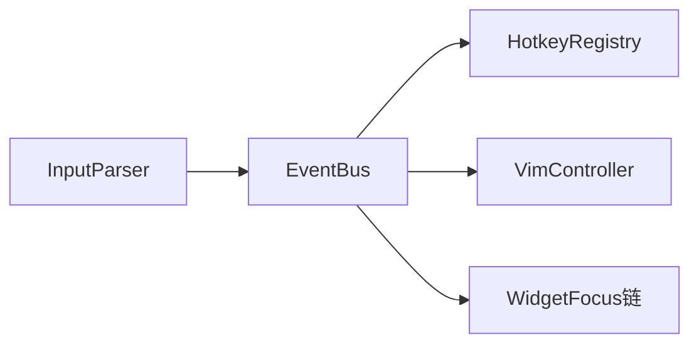

# 11.5 输入处理：Kitty 协议与终端能力检测

> **路径**：`docs/part11-terminal-ui/05-input-handling.md`  
> **系列**：Claude Code 完全指南 V2 · 第 11 篇

---

## 学习目标

完成本节学习后，你应该能够：

1. **列举** 终端输入源：**键盘**、**鼠标**、**粘贴**、**焦点** 等在不同仿真器中的表示差异。
2. **说明** **Kitty 键盘协议** 的价值：扩展键、组合键、释放事件的统一表达。
3. **设计** 一层 **能力检测**：区分 iTerm2、xterm.js、tmux/screen 等多路复用场景。
4. **将** 原始转义序列解析为**语义化输入事件**，供 Fiber 事件系统消费。

---

## 生活类比：多国插座与转接头

你的笔记本插头（**物理按键**）到了不同国家（**终端仿真器**），插孔形状不同。Kitty 协议像 **USB-C 统一标准**：尽量**一种转义格式**描述更多键位。

能力检测则是**旅行前查电压**：能不能用 110V？要不要变压器？——对应「**支不支持修饰键报告**」「**是否在 multiplexer 内**」。

---

## 输入栈分层



---

## Kitty 键盘协议（要点）

| 能力 | 无扩展时 | Kitty 扩展后 |
|------|----------|--------------|
| 组合键 | 常丢失或映射混乱 | **显式修饰位** |
| 功能键 F1-F12 | 各终端不一 | **参数化 CSI** |
| 释放事件 | 常无 | **press/release 区分**（若启用） |

启用通常通过 **特定 DSR/模式序列** 与终端握手；具体序列以**实现与版本**为准，代码中常集中在一处 **capability negotiation** 模块。

---

## 能力检测矩阵（教学用）

| 环境 | 典型特征 | 注意事项 |
|------|----------|----------|
| **iTerm2** | 丰富键鼠、真彩色 | 部分序列与 xterm 兼容子集 |
| **xterm.js**（VS Code 等） | Web 技术栈 | 粘贴、焦点与桌面终端不同 |
| **tmux** | 包裹序列 | **外层与内层**能力可能剥离 |
| **screen** | 老协议 | 高级键位常降级 |
| **纯 SSH** | 取决于远端 TERM | `TERM=xterm-256color` 仍非能力全集 |



---

## 源码片段：输入状态机（示意）

```typescript
type KeyEvent = {
  type: 'key';
  key: string;
  ctrl: boolean;
  alt: boolean;
  shift: boolean;
  meta: boolean;
  action: 'press' | 'repeat' | 'release';
};

type ParseState =
  | { kind: 'ground' }
  | { kind: 'escape' }
  | { kind: 'csi'; buf: string }
  | { kind: 'osc'; buf: string };

class InputParser {
  private state: ParseState = { kind: 'ground' };

  feed(byte: number, emit: (e: KeyEvent) => void) {
    // 真实实现需处理 UTF-8 多字节与非法续字节
    const ch = String.fromCodePoint(byte);
    // ... CSI/SS3 分支、Kitty 解析、退格与回车 ...
  }
}
```

---

## 窗口尺寸与 SIGWINCH

| 信号/事件 | 行为 |
|-----------|------|
| `SIGWINCH` | 终端尺寸变化，需重读 `ioctl` |
| 备用 | 部分环境用 **CSI t** 报告 |
| UI | 触发 **根容器** `columns/rows` 更新 → Yoga **重新布局** |

---

## Bracketed Paste 与安全性

**括号粘贴**模式把粘贴内容包在 **转义序列** 内，应用可区分「用户手打」与「整段粘贴」——对 **Vim 模式**与 **命令行注入** 防护有意义。

---

## 与鼠标追踪协同

鼠标事件常以 **SGR 1006** 等格式上报。输入层解析后产出：

```typescript
type MouseEvent = {
  type: 'mouse';
  button: 'left' | 'middle' | 'right' | 'wheelUp' | 'wheelDown';
  x: number;
  y: number;
  modifiers: { shift: boolean; alt: boolean; ctrl: boolean };
};
```

上层 **11.9** 负责命中测试与 OSC 8 超链接。

---

## 多路复用器下的陷阱

| 问题 | 成因 | 缓解 |
|------|------|------|
| 修饰键丢失 | tmux 过滤 | 检测后降级快捷键 |
| 颜色不对 | palette 重映射 | 能力位 + 主题回退 |
| 延迟感 | 网络 + 缓冲 | 本地 echo 策略（慎用） |

---

## 测试建议

1. **矩阵测试**：同一构建在 iTerm2、Terminal.app、Windows Terminal、web 终端跑**按键表**。
2. **录制 stdin**：捕获字节 golden file，解析器回归。
3. **fuzz**：随机字节流不崩溃。

---

## 小结

**输入层**是终端 UI 的「**耳朵**」：把混乱的字节流变成 **Key/Mouse/Paste/Resize** 事件。Kitty 协议与 **能力检测** 让高级交互在**支持的环境**发光，同时在不支持时 **优雅降级**。下一节 **11.6 虚拟滚动** 解决**长输出**的性能问题。

---

## 快捷键路由表（示例）

| 上下文 | 按键 | 行为 |
|--------|------|------|
| 全局 | Ctrl+L | 清屏或滚动到底（产品定义） |
| 全局 | Ctrl+C | 中断当前流 |
| 输入框 | Ctrl+V | 粘贴（尊重 bracketed） |
| Vim | `j` / `k` | 上下移动（见 11.7） |

---

## 与 Reconciler 的事件挂钩

宿主可把语义事件投递到 **根 Fiber 的 onKeyDown** 等价钩子，或走**命令总线**：



---

## 自测

1. 解释为何在 tmux 内 `DA` 查询结果可能与「直连终端」不同。
2. Bracketed Paste 如何帮助防止「粘贴即执行」类事故？

---

## 术语

| 英文 | 中文 |
|------|------|
| CSI | Control Sequence Introducer |
| OSC | Operating System Command |
| multiplexer | 多路复用器 |

---

## 实现清单（供读者对照源码）

- [ ] UTF-8 解码与非法序列恢复  
- [ ] CSI 参数解析（分号分隔数字）  
- [ ] Kitty 键盘扩展开关与版本协商  
- [ ] 鼠标 SGR 模式启用/关闭配对  
- [ ] `SIGWINCH` 与初始 `ioctl` 尺寸读取  
- [ ] 能力位写入 `HostCtx` 供子组件只读  

---

## 延伸阅读

- xterm 控制序列参考（对照阅读，勿死记硬背）  
- Kitty 文档：键盘协议章节  

---

## 常见问答

**问**：为何不全用 `readline`？  
**答**：全屏 TUI 需要**非规范模式**、**原始字节**与**自定义焦点**，`readline` 面向行编辑而非画布。

**问**：Web 终端与本地终端输入最大差异？  
**答**：**焦点模型**、**浏览器快捷键抢占**、以及 **WebSocket 延迟** 对合批策略的影响。
