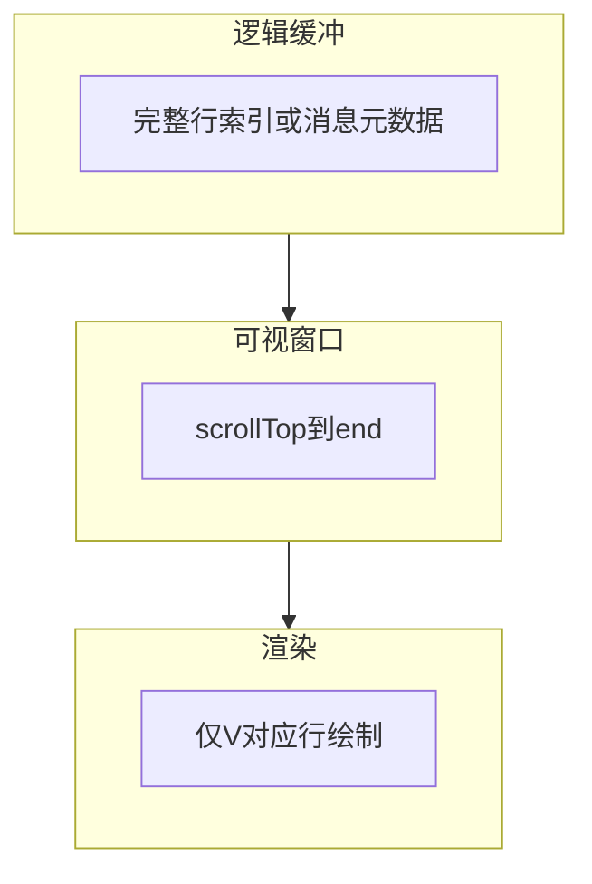
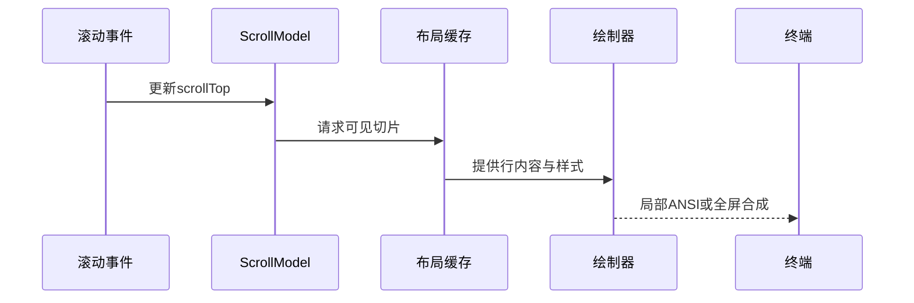
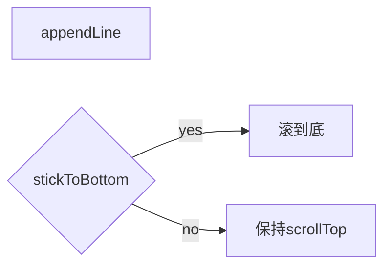

# 11.6 虚拟滚动：长输出的性能护栏

> **路径**：`docs/part11-terminal-ui/06-virtual-scroll.md`  
> **系列**：Claude Code 完全指南 V2 · 第 11 篇

---

## 学习目标

完成本节学习后，你应该能够：

1. **解释** 虚拟滚动在终端 UI 中的目标：**O(可见行)** 而非 **O(总行数)** 的布局与绘制。
2. **描述** **窗口、项高、偏移量、缓冲区** 四个核心变量如何联动。
3. **关联** 11.4 流式：追加内容时如何维护 **stick-to-bottom** 与 **用户上翻阅读** 的冲突。
4. **识别** 与 Yoga 布局的切分点：仅对**可见子树**做精细测量或使用**估算高度**。

---

## 生活类比：超市货架可视窗口

仓库里有一万件货（**十万行日志**），但顾客只能透过**一个橱窗**看十几件。店员不必把一万件全摆进橱窗——只需根据**你站的位置**换上**该段的样品**。

虚拟滚动就是**换样品**：滚动时更换「当前窗口对应的数据切片」，而不是渲染全部行。

---

## 核心公式（行定向）

设：

- `totalLines`：逻辑总行数（或消息条目的累计行数）
- `viewportHeight`：可视行数
- `scrollTop`：第一条可见逻辑行的索引
- `end = min(totalLines, scrollTop + viewportHeight)`

则**可见范围**为 `[scrollTop, end)`，仅这些行参与 **TermNode 实例化** 或 **字符串拼接**。



---

## 架构序列



---

## 变高行与估算

终端中每行高度常为 **1**，但若支持 **换行消息** 或 **富文本块**，条目高度 **不等**。

| 策略 | 适用 | 代价 |
|------|------|------|
| 固定行高 | 纯日志 | 最简单 |
| **测量缓存** | Markdown 渲染后高度已知 | 需缓存每条目高度 |
| **二分 + 前缀和** | 快速定位 scrollTop | 实现复杂 |
| 懒测量 | 首次进入视口才测 | 滚动时可能 **跳动** |

---

## 源码片段：可见切片（示意）

```typescript
type LineRef = { id: string; height: number; render: () => string };

function visibleSlice(
  lines: LineRef[],
  scrollTopPx: number,
  viewportH: number
): LineRef[] {
  let acc = 0;
  const out: LineRef[] = [];
  for (const line of lines) {
    const start = acc;
    const end = acc + line.height;
    if (end > scrollTopPx && start < scrollTopPx + viewportH) {
      out.push(line);
    }
    acc = end;
    if (start > scrollTopPx + viewportH) break;
  }
  return out;
}
```

---

## 与流式输出的协同

| 用户状态 | 策略 |
|----------|------|
| 在底部「跟随」 | 新行追加后 **自动** `scrollTop = max - viewport` |
| 向上阅读历史 | **不**自动滚动；可显示「新消息 N 条」提示 |
| 跳转到某工具结果 | `scrollToLineId` **程序化**滚动 |



---

## 与 Fiber 更新粒度

| 做法 | 说明 |
|------|------|
| 整屏重绘 | 实现简单，CPU 可能高 |
| **脏行合并** | 仅变更行写缓冲 |
| 双缓冲 | 前台缓冲展示，后台合成 |

---

## 内存与对象池

长会话中，反复创建字符串与数组会加压 GC。可考虑：

- **行对象池**（注意内容失效）
- **Rope/大块缓冲**（降低拼接次数）
- **淘汰策略**：仅保留最近 K 条 **完整** 内容，更早的只保留 **摘要**（产品决策）

---

## 无障碍与可搜索性

虚拟滚动可能导致「屏幕阅读器/复制全文」困难。可选：

- 「导出完整会话」命令
- 专用 **全缓冲视图** 模式（性能换功能）

---

## 小结

**虚拟滚动**把终端 UI 从「**无限向下增长**」变成「**恒定窗口成本**」，是 **Agent 长输出** 的必要护栏。实现要点是 **scrollTop 单一数据源**、**变高测量缓存**、以及与 **流式 stick-to-bottom** 的协同。下一节 **11.7 Vim 模式**。

---

## 性能预算（经验值）

| 指标 | 目标直觉 |
|------|----------|
| 单次滚动帧 | 布局+绘制 < 16ms（理想） |
| 可见行数 | 通常 < 终端行数，留 status bar |
| 缓存命中率 | 高度前缀和 O(log n) 查询 |

---

## 与 Diff 视图冲突时的策略

同时展示 **Diff**（11.8）与 **对话流** 时，建议 **分面板** 各自滚动模型，避免一个 `scrollTop` 驱动两套逻辑。

---

## 自测

1. 变高条目下，为何「仅按行号滚动」会错位？
2. `stickToBottom` 与「用户轻微上滚」如何区分（阈值像素/行）？

---

## 术语表

| 英文 | 中文 |
|------|------|
| viewport | 视口 |
| overscan | 过扫描（上下多渲染几行防闪烁） |
| stick to bottom | 粘底 |

---

## overscan 示意

多渲染上下各 `overscan=2` 行，滚动快速时减少 **空白闪动**：

```typescript
const start = Math.max(0, scrollTop - overscan);
const end = Math.min(totalLines, scrollTop + viewportHeight + overscan);
```

---

## 调试技巧

- 在 dev 模式打印 `visibleCount / totalLines` 比例。  
- 人为注入 1e5 行假数据压测。  
- 与 **389 组件** 中列表容器联调，确认 **key** 不抖动。

---

## 常见 bug

| 现象 | 原因 |
|------|------|
| 滚动条跳 | 高度测量前后不一致 |
| 空白洞 | slice 区间 off-by-one |
| 内存仍涨 | 逻辑缓冲无限增长无淘汰 |

---

## 与 Yoga 的边界

虚拟滚动是 **数据面** 优化；Yoga 仍可对**可见容器**做 flex。避免对不可见子树调用昂贵 `measure`。

---

## 延伸阅读

- 前端虚拟列表经典文章（概念迁移到终端）  
- Rope 数据结构简介  

---

## 实战题

设计一个策略：当 `totalLines` 超过 100 万时，如何在**不丢失可检索性**的前提下控制内存？

**提示**：分段归档文件 + 索引 + 视窗只映射文件 offset。
