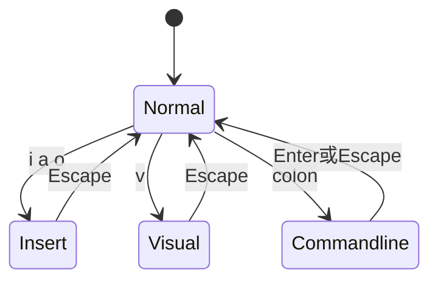
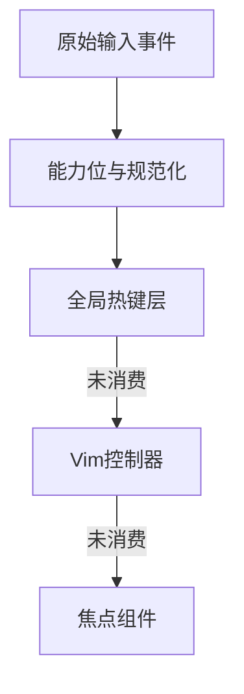

# 11.7 Vim 模式：键位绑定与状态机

> **路径**：`docs/part11-terminal-ui/07-vim-mode.md`  
> **系列**：Claude Code 完全指南 V2 · 第 11 篇

---

## 学习目标

完成本节学习后，你应该能够：

1. **描述** Vim 风格交互在终端 UI 中的 **模式状态机**：Normal / Insert / Visual 等（以产品实现为准）。
2. **解释** 为何键位路由需在 **输入解析之后**、**组件焦点链之前** 做统一仲裁。
3. **列举** 与全局快捷键冲突时的 **优先级** 设计思路。
4. **关联** 11.5：修饰键与 Kitty 协议如何影响 `hjkl` 可靠性。

---

## 生活类比：汽车档位

**Insert 模式**像 **D 档**：踩油门就走（字符进缓冲区）。  
**Normal 模式**像 **N 档或 P 档**：同样踩「字母键」，车**不会前进**，而是触发**其他机构**（命令）。

Vim 模式就是把键盘从「**打字**」切换成「**导航与编辑命令**」——终端 TUI 同样需要**显式档位**，否则会与 **Agent 输入框** 抢键。

---

## 状态机鸟瞰



（状态命名以实际产品为准；上图为教学抽象。）

---

## 键位路由管线



| 层级 | 职责 | 示例 |
|------|------|------|
| 全局 | 不随模式变化的安全键 | Ctrl+C 中断 |
| Vim | 模式敏感导航 | `gg` `G` `Ctrl+u` |
| 组件 | 文本框内编辑 | 普通字符输入 |

---

## 源码片段：简单路由（示意）

```typescript
type Mode = 'normal' | 'insert' | 'visual';

type VimContext = {
  mode: Mode;
  buffer: string; // 待处理多键序列如 "di"
};

function routeKey(
  ctx: VimContext,
  ev: KeyEvent,
  sink: { vim?: (e: KeyEvent) => boolean; widget?: (e: KeyEvent) => boolean }
): void {
  if (ev.ctrl && ev.key === 'c') {
    /* 全局中断 */ return;
  }
  if (ctx.mode !== 'insert') {
    if (sink.vim?.(ev)) return;
  }
  sink.widget?.(ev);
}
```

---

## 绑定表数据结构

常用 **Trie** 或 **前缀表** 处理多键命令：

| 方案 | 优点 | 缺点 |
|------|------|------|
| 大 switch | 易读 | 组合爆炸 |
| **Trie** | `d` 等待第二键 | 需超时取消 |
| 声明式 JSON | 非程序员可配 | 运行时构建表 |

```typescript
type BindingLeaf = { action: string };
type BindingNode = Map<string, BindingNode | BindingLeaf>;

// 例: "gg" -> jumpTop
```

---

## 与文本选择的协同

**Visual 模式**常与 **鼠标拖拽**（11.9）共享选择模型：

- 起始 offset
- 结束 offset
- 高亮属性（主题令牌）

---

## 超时与「前缀等待」

用户按 `d` 后停顿，系统应：

1. 进入 **pending** 状态，显示状态栏提示  
2. **超时**后把 `d` 当作普通命令或丢弃（策略）  
3. 与 **流式输出** 同时发生时，避免 **状态栏被冲掉** 不可见  

---

## 可发现性

| 手段 | 说明 |
|------|------|
| `:` 命令面板 | 列出可用动作 |
| 内置帮助 | `?` 显示当前模式键位 |
| 与 IDE Bridge | 侧栏展示快捷键表（第 12 篇） |

---

## 测试矩阵

| 场景 | 期望 |
|------|------|
| Normal + `j` | 光标下移，不插入字符 |
| Insert + `j` | 插入字符 j |
| tmux 下修饰键 | 能力检测降级仍可用 hjkl |
| Bracketed Paste | 粘贴不进 Normal 命令解析 |

---

## 小结

**Vim 模式**本质是 **模式敏感的路由层** + **多键绑定表** + **与焦点/选择/流式 UI 的协同**。实现质量取决于 **11.5 输入** 的语义是否干净。下一节 **11.8 Diff 展示**。

---

## 与 React 组件的关系

建议在根 Provider 注入：

```typescript
type VimApi = {
  mode: Mode;
  dispatch: (cmd: VimCommand) => void;
};
```

子组件用 `useContext` 只读模式，避免 **props 钻透**。

---

## 常见命令映射（示例）

| 按键 | Normal 行为 |
|------|-------------|
| `h` `j` `k` `l` | 左下上右 |
| `0` `^` `$` | 行首/首非空/行尾 |
| `gg` `G` | 顶/底 |
| `v` | 进入可视 |
| `y` | yank（与剪贴板 11.9） |

---

## 自测

1. 为何 `:` 开头的命令需要独立 **Commandline** 状态？
2. 设计一个避免 `d` 前缀永久挂起的超时策略。

---

## 术语

| 英文 | 中文 |
|------|------|
| chord | 组合键序列 |
| pending prefix | 前缀等待 |

---

## 安全注意

Vim 宏与「执行寄存器」类能力在 AI 终端中可能 **放大误操作**。产品可 **默认关闭** 或 **二次确认**。

---

## 性能注意

每次按键全树 reconciler 更新状态栏会贵；优先 **局部 context** 或 **命令总线**。

---

## 与 389 组件的落点

典型会有：`VimStatusBar`、`ScrollableBuffer`、`InputPrompt`、`SelectionLayer` 协同——阅读源码时从 **VimController** 入口 grep。

---

## 扩展阅读

- Neovim 键位哲学（对比差异）  
- Readline Emacs 模式（互斥用户预期）  

---

## 模式冲突解决

若用户同时开启 **IDE 快捷键** 与 **终端 Vim**，Bridge 层（12 篇）可把某些键 **转发给 IDE**，需在文档中标明 **优先级**。

---

## 伪代码：pending 超时

```typescript
let pendingTimer: ReturnType<typeof setTimeout> | null = null;

function onKey(k: string) {
  if (pendingPrefix) {
    clearTimeout(pendingTimer!);
    pendingTimer = setTimeout(() => {
      flushPendingAsLiteral();
    }, 800);
  }
}
```

---

## 复盘清单

- [ ] Normal 下不向 stdin 发送可打印字符到错误目标  
- [ ] Insert 与中文输入法兼容（IME 事件若存在）  
- [ ] 大小写与 `shift` 组合在 Kitty 下正确  

---

## 结语

好的 Vim 模式不是「照搬 Neovim」，而是在 **Agent 工作流** 中提供 **可预测的导航与编辑肌肉记忆**。
