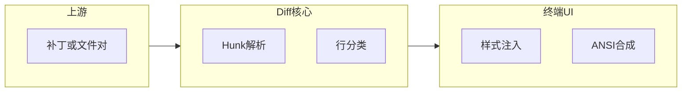
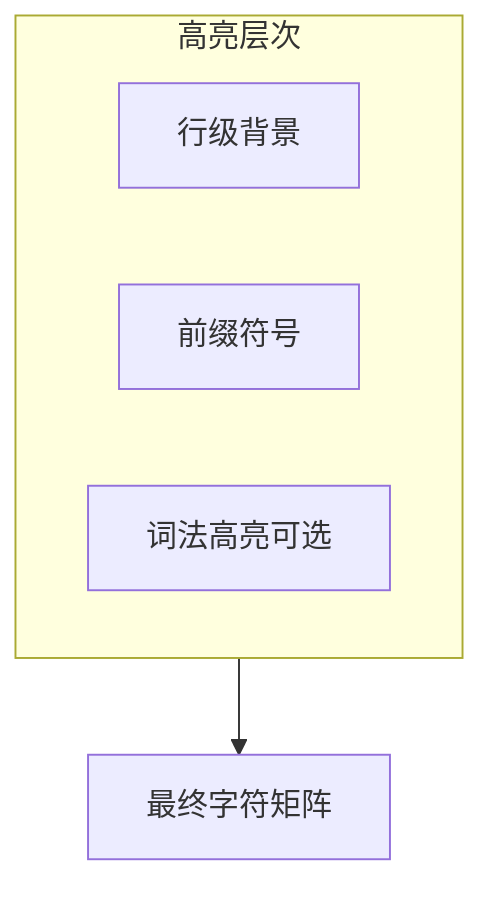
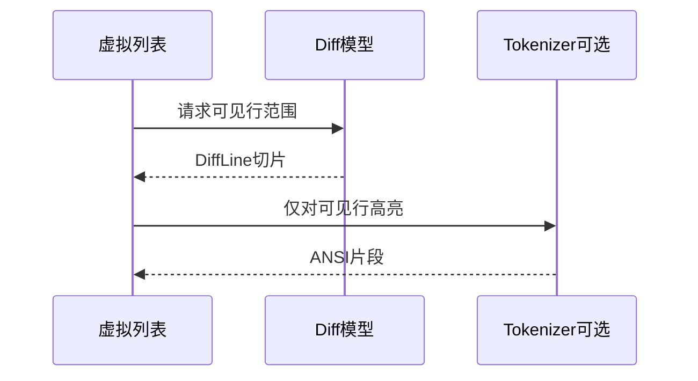
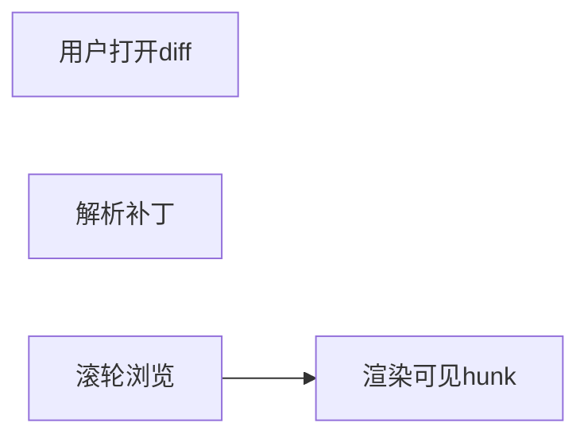

# 11.8 Diff 展示：代码修改对比子系统

> **路径**：`docs/part11-terminal-ui/08-diff-display.md`  
> **系列**：Claude Code 完全指南 V2 · 第 11 篇

---

## 学习目标

完成本节学习后，你应该能够：

1. **说明** Diff 子系统在终端 UI 中的职责：把 **unified / side-by-side** 等结构转成 **带 ANSI 的行块**。
2. **区分** **语法高亮**、**行级高亮**、**字符级高亮** 三层的成本与效果。
3. **关联** 主题系统（11.10）：`added` / `removed` / `context` **令牌颜色** 必须可主题化。
4. **理解** 与 **虚拟滚动**（11.6）结合时，如何按 **hunk** 切片而非按原始文件全长渲染。

---

## 生活类比：批改作文的红笔

老师用 **红笔划掉** 旧句、**绿笔写上** 新句——Diff 就是 **红绿标注** 的机器版本。终端没有 Word 的修订视图，只能用 **前景色、背景色、前缀符号**（`+` `-` ` `）表达。

---

## 数据流





---

## 行类型与主题令牌

| 行类型 | 常见前缀 | 主题令牌示例 |
|--------|----------|----------------|
| 上下文 | 空格 | `diff.context` |
| 删除 | `-` | `diff.removed` |
| 新增 | `+` | `diff.added` |
| hunk 头 | `@@` | `diff.meta` |

---

## 源码片段：行对象（示意）

```typescript
type DiffLineKind = 'context' | 'add' | 'del' | 'hunk' | 'eof';

type DiffLine = {
  kind: DiffLineKind;
  raw: string; // 不含前缀或含前缀，按渲染器约定
  oldNo?: number;
  newNo?: number;
};

function paintLine(line: DiffLine, theme: ThemeTokens): string {
  const style = theme.diff[line.kind];
  return ansiApply(style, formatPrefix(line) + line.raw);
}
```

---

## Unified vs Side-by-side

| 模式 | 终端友好度 | 信息密度 |
|------|------------|----------|
| **Unified** | 高，单列 | 顺序阅读好 |
| Side-by-side | 需宽列，易裁切 | 对照直观 |

在窄终端自动 **降级 unified** 是常见产品策略。

---

## 与语法高亮的组合

| 策略 | CPU | 效果 |
|------|-----|------|
| 仅 diff 色 | 低 | 快 |
| **整行词法高亮** | 中 | 更像 IDE |
| 字符级 intra-line | 高 | 最细 |

建议：**可见 hunk** 内才跑高成本高亮（与虚拟滚动一致）。

---

## Hunk 虚拟化



---

## 制表符与对齐

代码 diff 常含 **Tab**。终端渲染需统一：

- **展开宽度**（如 tab=2 或 tab=4）
- 与 **side-by-side** 列分割对齐

否则会出现「竖线对不齐」的错觉。

---

## 与 Agent 工具输出对接

工具可能返回：

- Git unified diff
- 结构化 JSON patch

UI 层应 **归一化** 为 `DiffLine[]`，避免组件感知多种上游格式。

---

## 无障碍与色弱

| 手段 | 说明 |
|------|------|
| 非仅依赖颜色 | **前缀符号**保留 |
| 高对比主题 | 11.10 提供 **highContrast** |
| 蓝/黄替代红/绿 | 主题变量可换 |

---

## 小结

**Diff 展示**是「**审阅 Agent 改代码**」的关键屏。把 **hunk 行模型**、**主题令牌**、**可选词法高亮** 与 **虚拟滚动** 组合，才能在长补丁下保持 **流畅与可读**。下一节 **11.9 鼠标与超链接**。

---

## 性能清单

- [ ] 大文件 diff **流式解析** 或 **worker**（若架构允许）  
- [ ] 避免在每次 `paint` **重新 diff**  
- [ ] 缓存 **ansi 字符串** 至内容哈希变化  

---

## 测试用例建议

1. 仅换行变更的补丁  
2. 重命名 + 内容变更混合  
3. 极大列宽行（终端折行 vs 横向滚动策略）  

---

## 自测

1. 解释为何 side-by-side 在 80 列终端可能失败。  
2. `diff.meta` 与 `diff.context` 颜色过于接近时如何解决？

---

## 术语

| 英文 | 中文 |
|------|------|
| hunk | 差异块 |
| unified diff | 统一差异格式 |

---

## 与剪贴板

用户可能想复制 **纯文本 diff** 而非 ANSI。提供 **Copy as plain** 动作，剥离转义序列。

---

## 错误处理

若 patch **解析失败**，降级为 **原始文本块** + 警告条，避免白屏。

---

## 组件拆分（389 中可能命名）

- `DiffView` 容器  
- `DiffLineRow` 行渲染  
- `DiffGutter` 行号槽  
- `DiffHeader` 文件路径与模式切换  

---

## Mermaid：用户操作流



---

## 与权限系统

若 diff 包含 **密钥片段**，需在 **上游脱敏**；UI 层只做展示，不信任为安全边界。

---

## 扩展

支持 **inline word diff** 时，可在 `DiffLine` 内嵌 `Span[]`：

```typescript
type Span = { text: string; kind: 'equal' | 'ins' | 'del' };
```

---

## 实战题

实现「**忽略空白**」切换时，如何 **复用** 同一视图组件而 **不泄漏** 旧高亮缓存？

---

## 结语

Diff 子系统是工程师对 Agent 的**信任界面**：**快、准、清晰** 比花哨动画更重要。
