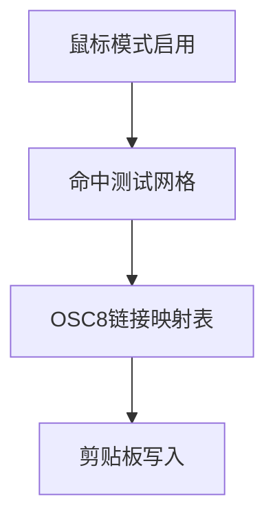
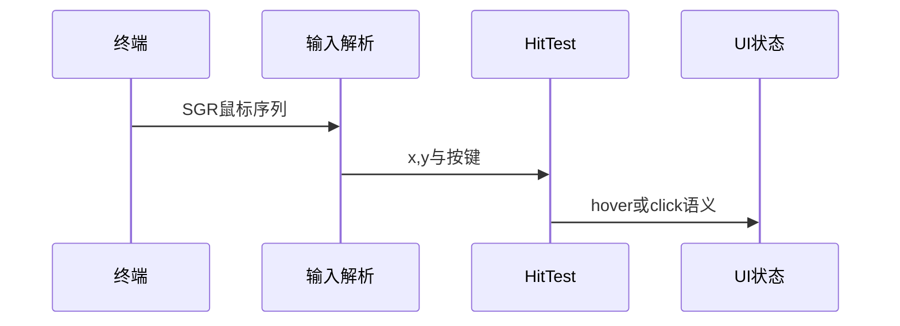
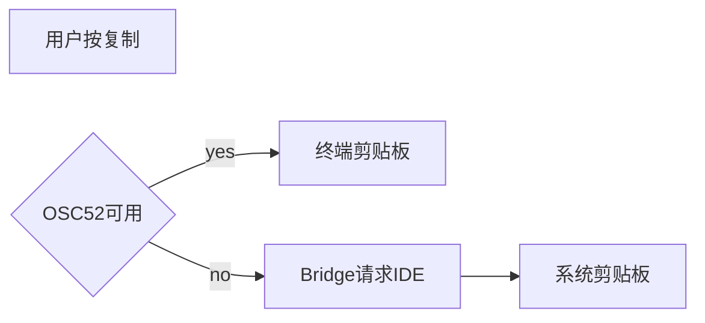

# 11.9 鼠标、文本选择与 OSC 8 超链接

> **路径**：`docs/part11-terminal-ui/09-mouse-hyperlinks.md`  
> **系列**：Claude Code 完全指南 V2 · 第 11 篇

---

## 学习目标

完成本节学习后，你应该能够：

1. **说明** 终端中 **鼠标追踪**（SGR 等）如何启用，以及事件如何映射到 **字符坐标**。
2. **描述** **文本选择** 模型：锚点、拖曳、释放、与 **复制** 动作。
3. **解释** **OSC 8** 超链接格式如何把 URL **附着**到一段可见文本。
4. **列举** **剪贴板集成**：OSC 52、桌面集成回退、权限与安全注意。

---

## 生活类比：触摸屏上的链接

手机屏幕上，文字块下面可以藏 **超链接**——你看到的是字，点的是链。终端里 **OSC 8** 类似：在 **纯文本画布** 上为一段范围打上「**可点的 URL 元数据**」。

鼠标追踪则像 **触摸屏坐标**：系统告诉你用户点在第几行第几列。

---

## 能力依赖关系



---

## 鼠标事件到网格

解析层（11.5）产出 `x,y` 后，渲染器维护：

| 结构 | 作用 |
|------|------|
| **字符单元矩阵** | 当前帧每个格子的样式与字符 |
| **链接索引** | `Rect` 或 run-length 区间 → URL |
| **选择区间** | `[start,end)` 逻辑 offset |



---

## OSC 8 超链接（概念）

格式思想：**开启**链 → **可见文本** → **关闭**链。具体字节序列遵循规范；实现上常封装：

```typescript
type HyperlinkSpan = { url: string; text: string; id?: string };

function osc8Wrap(span: HyperlinkSpan): string {
  // 伪代码：参数需 URL 编码与 id 可选
  const params = `id=${encodeURIComponent(span.id ?? '')}`;
  const open = `\x1b]8;${params};${span.url}\x1b\\`;
  const close = `\x1b]8;;\x1b\\`;
  return open + span.text + close;
}
```

---

## 安全与 OSC 8

| 风险 | 缓解 |
|------|------|
| **钓鱼链接** | 状态栏显示 **真实 URL**，点击二次确认 |
| **超长 URL** | 截断显示与提示 |
| **不可信会话** | 可配置关闭 OSC 8 点击 |

---

## 文本选择

| 阶段 | 行为 |
|------|------|
| pointerDown | 记录 `anchor` |
| pointerMove | 更新 `active` |
| pointerUp | 固化 `selection` |
| doubleClick | 选词（需分词表或启发式） |
| tripleClick | 选行 |

与 **Vim Visual**（11.7）共享 **selection model** 可减少重复。

---

## 剪贴板：OSC 52 与回退

| 路径 | 环境 |
|------|------|
| **OSC 52** | 许多现代终端允许 base64 传剪贴板 |
| **Bridge 到 IDE** | 第 12 篇：由 IDE 写入系统剪贴板 |
| **无能力** | 显示「请手动复制」或写入临时文件 |



---

## 与流式输出的竞态

流式刷新时 **行内容平移** 会导致选择区间失效策略：

- **锁定选择**：刷新跳过选中区域合并（复杂）
- **清除选择**：新内容到达即清空（简单）
- **逻辑锚定**：用 **消息 id + offset** 而非纯坐标

---

## 源码片段：命中测试（示意）

```typescript
type Cell = { char: string; linkId?: string };

function hitTest(grid: Cell[][], x: number, y: number): Cell | null {
  const row = grid[y];
  if (!row) return null;
  return row[x] ?? null;
}
```

真实实现需处理 **双倍宽字符**：`x` 与 **逻辑列** 非线性。

---

## iTerm2 / xterm.js 差异

| 点 | 备注 |
|----|------|
| 焦点 | Web 终端 **blur** 行为不同 |
| 鼠标追踪启用序列 | 需查各自兼容矩阵 |
| OSC 52 长度限制 | 大块 base64 可能被截断——**分片协议**（若支持） |

---

## 小结

**鼠标 + 选择 + OSC 8 + 剪贴板** 把终端从「**纯键盘**」推进到「**可点的控制台应用**」。实现关键是 **坐标 ↔ 逻辑偏移** 映射、**链接索引**、以及 **能力降级链**。下一节 **11.10 设计系统与主题**。

---

## 自测

1. 双倍宽字符下 `x++` 命中为何会跳过？  
2. OSC 8 关闭序列遗漏会导致什么 UI 事故？

---

## 表格：事件到动作

| 事件 | 无修饰 | Ctrl |
|------|--------|------|
| 左键点击 | 移动光标/打开链接 | 块选（示例） |
| 拖曳 | 文本选择 | — |
| 滚轮 | 滚动缓冲 | 加速滚动 |

---

## 术语

| 英文 | 中文 |
|------|------|
| hit testing | 命中测试 |
| wide character | 宽字符 |

---

## 与 389 组件

常见分层：`MouseLayer`、`SelectionOverlay`、`LinkHintBar`、`ScrollView`。

---

## 调试

- 打开 **cell 网格调试模式**（dev）显示每个逻辑列边界。  
- 记录 OSC 8 **开启/关闭** 是否配对（栈深度）。

---

## 无障碍

纯鼠标交互对键盘用户不友好：**Enter** 打开当前聚焦链接、**Shift+箭头** 扩展选择应保留。

---

## 扩展阅读

- iTerm2 文档：复制模式与报告  
- xterm.js 输入文档  

---

## 实战题

设计当 **Bridge 断开** 时，复制操作如何 **仅依赖本地终端能力** 而不静默失败。

---

## 伪代码：链接栈

```typescript
const stack: string[] = [];

function onOpen(url: string) {
  stack.push(url);
}

function onClose() {
  stack.pop();
}

function currentUrl() {
  return stack[stack.length - 1];
}
```

---

## 性能

命中测试 O(1) 每格理想；每帧重建链接映射可从 **渲染遍历** 同步生成，避免二次扫描。

---

## 结语

当 Agent 输出里充满 **路径、Issue、文档链接**，OSC 8 让终端 **像网页一样可导航**——这是现代 CLI 产品体验的分水岭。
