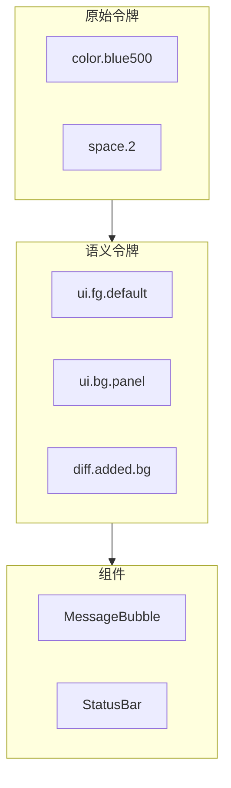
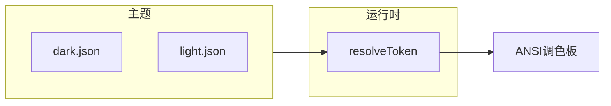
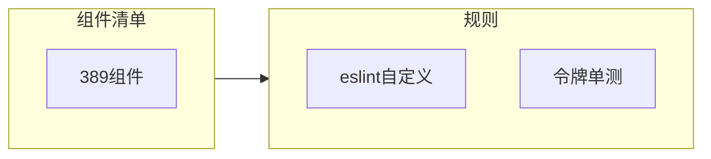

# 11.10 设计系统与主题：暗色、亮色与 389 组件一致性

> **路径**：`docs/part11-terminal-ui/10-design-system.md`  
> **系列**：Claude Code 完全指南 V2 · 第 11 篇

---

## 学习目标

完成本节学习后，你应该能够：

1. **描述** 终端 UI **设计系统** 的组成：**设计令牌**、**语义色**、**排版刻度**、**间距与圆角（字符近似）**。
2. **解释** **暗色 / 亮色** 切换如何流经 `HostCtx`、Provider 与 **ANSI 调色**。
3. **将** **389 个 React 组件** 的样式来源归为「**令牌优先**」而非散落的魔法数字。
4. **关联** Diff（11.8）、超链接（11.9）：语义色在主题切换下保持 **对比度**。

---

## 生活类比：城市路灯与路牌

**设计令牌**像 **交通系统标准**：路牌颜色、字体大小、反光材料统一，司机 **不用重新学习** 每个路口。

若每条街自制路牌（**魔法颜色**），夜间（**暗色主题**）就会有人看不清——对应终端里 **对比度崩溃** 与 **品牌感消失**。

---

## 令牌层级



| 层级 | 稳定性 | 例 |
|------|--------|-----|
| 原始 | 可随品牌重塑调整 | `palette.cyan` |
| **语义** | 组件应只依赖这层 | `text.primary` |
| 组件局部 | 极少数例外 | 一次性实验 |

---

## 暗色与亮色映射



| 语义 | 暗色直觉 | 亮色直觉 |
|------|----------|----------|
| 主文字 | 近白 | 近黑 |
| 面板背景 | 深灰 | 浅灰 |
| 次要文字 | 灰 400 | 灰 600 |
| 链接 | 高饱和蓝/青 | 深蓝 |

---

## 源码片段：令牌解析（示意）

```typescript
type ThemeName = 'dark' | 'light';

type TokenTable = Record<string, string>; // '#RRGGBB' 或逻辑名

const dark: TokenTable = {
  'text.primary': '#e6e6e6',
  'diff.added.fg': '#56d364',
  'diff.removed.fg': '#ff7b72',
};

function resolveToken(theme: ThemeName, key: string): string {
  const table = theme === 'dark' ? dark : light;
  return table[key] ?? '#ffffff';
}

function toAnsiFg(hex: string, trueColor: boolean): string {
  // 真彩色 CSI 或 256 色降级
  return trueColor ? ansiTrueColorFg(hex) : ansi256Fallback(hex);
}
```

---

## 与能力位联动

| 能力 | 主题策略 |
|------|----------|
| 真彩色 | 直接用 hex |
| 256 色 | **最近色**映射表 |
| 仅 16 色 | **粗粒度**语义桶 |

---

## 389 组件治理

| 实践 | 说明 |
|------|------|
| **禁止**组件内写死 `#rrggbb` | 除调试开关 |
| **lint** | CI 检查裸色值 |
| Storybook 式快照 | 若仓库有，跑 dark/light 双主题 |



---

## 排版与间距（终端特化）

| Web 概念 | 终端近似 |
|----------|----------|
| `px` | **字符单元** |
| `rem` | **行高倍数** |
| `border-radius` | **ASCII 边框**或 **色块背景**模拟 |

---

## 状态色与工具态

Agent UI 常见：

| 状态 | 语义令牌示例 |
|------|----------------|
| 运行中 | `agent.status.running` |
| 成功 | `agent.status.success` |
| 失败 | `agent.status.error` |
| 只读探索 | `agent.mode.explore` |

---

## 可访问性

| 检查 | 方法 |
|------|------|
| 对比度 | WCAG 公式对 hex 校验 |
| 色盲 | **非颜色线索**（图标前缀 `✓` `✗`） |
| 终端背景透明 | 主题需 **alpha 合成**假设或禁用混色 |

---

## 小结

**设计系统**让 **389 个组件** 在迭代中仍 **视觉一致、主题可切换、Diff/链接/状态** 语义稳定。令牌化 + 能力降级是终端产品的 **工程纪律**。第 11 篇至此从 **Yoga → Fiber → 流式 → 输入 → 滚动 → Vim → Diff → 交互 → 主题** 形成闭环。

---

## 本篇复盘表

| 小节 | 关键词 |
|------|--------|
| 11.1 | 自研渲染栈、389 组件 |
| 11.2 | Yoga TS、flex、盒模型 |
| 11.3 | 自定义 reconciler |
| 11.4 | async generator、合批 |
| 11.5 | Kitty、能力检测 |
| 11.6 | 虚拟滚动 |
| 11.7 | Vim 状态机 |
| 11.8 | Diff 层次 |
| 11.9 | 鼠标、OSC 8、剪贴板 |
| 11.10 | 令牌与主题 |

---

## 自测

1. 为什么组件应消费 **语义令牌** 而非 **palette 原始色**？  
2. 真彩色不可用时，如何保证 **diff.added** 仍可辨？

---

## 术语

| 英文 | 中文 |
|------|------|
| design token | 设计令牌 |
| semantic color | 语义色 |

---

## 与第 12 篇衔接

IDE **Bridge** 可把 **主题偏好** 从编辑器同步到 CLI，或反向——见 `docs/part12-bridge/`。

---

## 实战题

为 **highContrast** 主题增加一套映射，要求 **不改动** 组件代码，仅增 **主题 JSON** ——如何设计令牌继承？

---

## 伪代码：主题继承

```typescript
function mergeTheme(base: TokenTable, override: TokenTable): TokenTable {
  return { ...base, ...override };
}
```

---

## 组件作者清单

发布新组件前：

- [ ] 所有颜色来自 `resolveToken`  
- [ ] 焦点环可见（键盘导航）  
- [ ] dark/light 快照通过  
- [ ] diff/代码块使用 **等宽** 令牌  

---

## 扩展阅读

- Material Design Token 概念（类比）  
- ANSI 颜色历史与限制  

---

## 结语

终端 UI 的「美」来自 **约束中的秩序**：在字符网格里，**令牌化**比「随意调色」更接近 **专业工具** 的长期可维护性。
