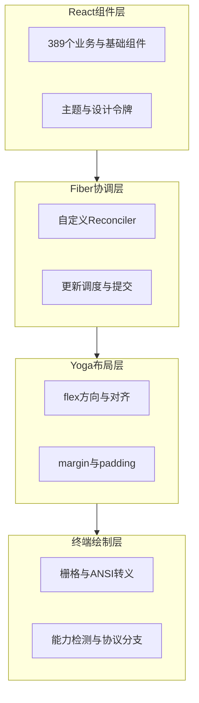
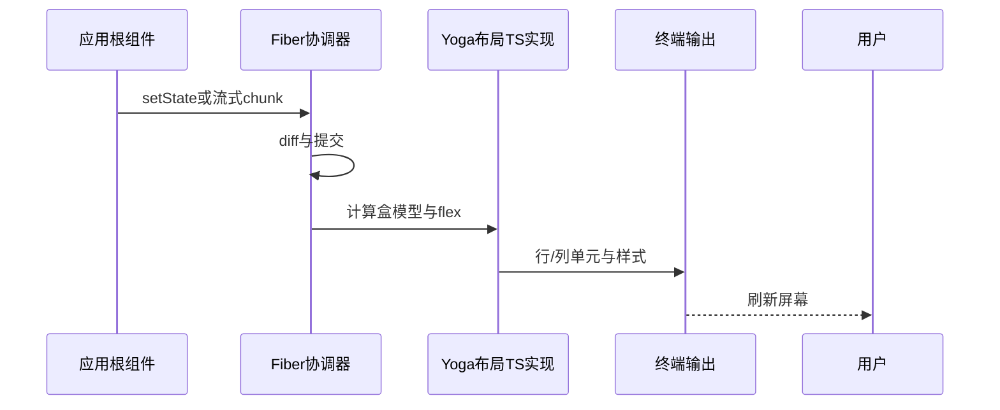
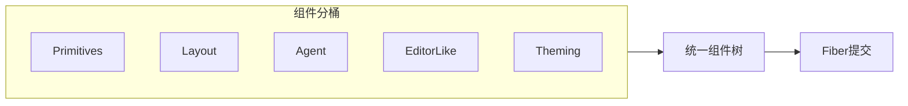

# 第 11 篇：终端 UI · 11.1 架构总览与自研渲染栈

> **路径**：`docs/part11-terminal-ui/index.md`  
> **系列**：Claude Code 完全指南 V2

---

## 学习目标

完成本节学习后，你应该能够：

1. **说明** Claude Code 终端界面为何采用**自研 React/Ink 风格渲染器**，而非直接依赖标准 npm `ink` 包。
2. **描述** 终端 UI 的四层心智模型：**React 组件树 → Fiber 协调器 → Yoga 布局 → 字符栅格绘制**。
3. **列举** 终端交互能力边界：鼠标、文本选择、OSC 8 超链接、剪贴板、Kitty 协议与能力探测。
4. **建立** 与后续小节（Yoga、Fiber、流式输入、虚拟滚动、Vim、Diff、设计系统）的**阅读路线图**。

---

## 生活类比：剧院后台 vs 观众席

把终端想成一座**小剧场**：

- **剧本（React 组件）** 描述「谁站哪、说什么」——但观众看不见 JSX，只看**最终灯光与台词**。
- **导演（Reconciler / Fiber）** 决定「这一场改台词还是换演员」，**最小化重排**。
- **舞台机械（Yoga）** 按 Flex 规则把演员**摆到格子**上：前后顺序、对齐、留白。
- **灯光师（渲染器）** 把二维布局**刷成 ANSI 转义序列**，送到 stdout。

标准 npm Ink 像是**租来的整套舞美**；Claude Code 选择**自研**，是为了把**流式输出、389 个组件、Diff、Vim、虚拟滚动**等需求**焊进同一条流水线**，而不是在第三方抽象缝隙里打补丁。

---

## 自研渲染栈：为何不是「npm install ink」

| 对比维度 | 典型 npm Ink 用法 | Claude Code 自研方向 |
|----------|-------------------|----------------------|
| 包边界 | 黑盒 API，升级与定制受上游约束 | **可控演进**：协议、性能、交互与产品节奏对齐 |
| 布局引擎 | 常依赖既有绑定或简化布局 | **纯 TS 移植 Meta Yoga**，无 C++ 绑定，便于同仓调试 |
| 流式场景 | 通用 TUI，流式长文需额外胶水 | **async generator 逐词**、虚拟滚动、与 Agent 输出管线一体化 |
| 交互深度 | 基础键盘为主 | **鼠标追踪、选择、OSC 8、剪贴板、Kitty、Vim 模式** |
| 组件规模 | 中小项目 | **约 389 个 React 组件**，需要统一设计系统与主题 |

---

## 架构鸟瞰：从 React 到像素（字符）





---

## 源码心智模型（示意片段）

以下**伪代码**展示「自定义渲染器」在概念上如何**挂接** React 与终端，真实仓库会有更多类型与边界处理：

```typescript
// 概念示意：自定义 reconciler 的“宿主配置”一角
// 真实实现会包含 createInstance、appendChild、commitUpdate 等完整宿主方法
type TerminalHostConfig = {
  // 将 React 元素类型映射为终端节点描述
  createInstance: (type: string, props: Record<string, unknown>) => TermNode;
  // 布局阶段：把子树交给 Yoga 计算
  finalizeInitialChildren: (node: TermNode) => void;
};

// 流式渲染常与 async generator 结合：逐词/逐块提交到子树
async function* streamTokens(source: AsyncIterable<string>) {
  for await (const token of source) {
    yield token; // UI 层消费后触发局部 reconciler 更新
  }
}
```

---

## 核心能力速查表

| 能力 | 用户可感知效果 | 技术要点（后文展开） |
|------|----------------|----------------------|
| Flex 布局 | 面板对齐、自适应宽度 | Yoga TS：`flex-direction`、`align*`、`margin`/`padding` |
| Fiber | 流畅刷新、局部更新 | 自定义 reconciler 桥接「终端 DOM」 |
| 流式输出 | 打字机式 Agent 回复 | async generator + 受控提交频率 |
| 输入 | 各终端差异缩小 | Kitty 协议、能力检测（iTerm2 / xterm.js / multiplexer） |
| 长列表 | 不卡顿 | 虚拟滚动：只布局可见窗口 |
| 编辑体验 | hjkl 党友好 | Vim 模式键位绑定 |
| 审阅代码 | 并排/高亮变更 | Diff 展示子系统 |
| 主题 | 暗色/亮色一致 | 设计系统与设计令牌 |

---

## 389 个组件：如何不迷路

建议按**职责分桶**阅读源码（名称以仓库为准）：

1. **Primitives**：文本、盒子、分隔、图标位。
2. **Layout shells**：侧边栏、面板、堆叠、滚动容器。
3. **Agent UI**：消息气泡、工具调用卡片、状态条。
4. **Editor-like**：选择、光标、Vim 状态、命令面板。
5. **Theming**：Provider、令牌解析、暗/亮切换。



---

## 与本篇其他小节的关系

| 小节 | 文件 | 重点 |
|------|------|------|
| 11.2 | `02-yoga-layout.md` | Yoga 纯 TS、flex、盒模型 |
| 11.3 | `03-react-fiber.md` | 自定义 reconciler 与终端节点 |
| 11.4 | `04-streaming-render.md` | async generator 流式渲染 |
| 11.5 | `05-input-handling.md` | 输入解码与能力检测 |
| 11.6 | `06-virtual-scroll.md` | 长输出性能 |
| 11.7 | `07-vim-mode.md` | 键位绑定与模式状态机 |
| 11.8 | `08-diff-display.md` | 代码对比呈现 |
| 11.9 | `09-mouse-hyperlinks.md` | 鼠标、OSC 8、剪贴板 |
| 11.10 | `10-design-system.md` | 主题与设计系统 |

---

## 常见误解

| 误解 | 澄清 |
|------|------|
| 「用了 Ink 就等于用了 npm 包」 | 此处是 **Ink 风格/理念**（React 驱动 TUI），实现为**自研渲染栈**。 |
| 「Yoga 一定要原生绑定」 | 本栈为 **TypeScript 移植**，避免 C++ 绑定与跨平台分发成本。 |
| 「终端只能键盘」 | 现代终端 + 协议可支持**鼠标、链接、剪贴板**；需**降级路径**。 |

---

## 小结

终端 UI 是 Claude Code 的「**面孔**」：它必须把 **Agent 流式智能**、**代码审阅**、**类 IDE 交互** 压缩进**纯文本管线**。自研 React 渲染器 + Yoga 布局 + Fiber 协调，是为了在 **389 个组件** 的规模下仍保持**可演进、可调试、可主题化**。下一节深入 **Yoga 纯 TypeScript 布局引擎** 如何服务 flex 与盒模型。

---

## 延伸阅读建议

- 先通读 **11.2 Yoga** 与 **11.3 Fiber**，再读 **11.4 流式**，可建立「布局—提交—输出」闭环。
- 若你维护终端兼容性，优先 **11.5 输入** 与 **11.9 鼠标与链接**。

---

## 与 Claude Code 其他子系统的接口（概念）

| 邻域 | 终端 UI 承担的角色 |
|------|---------------------|
| Agent 输出 | 流式文本与工具卡片的**呈现与合批** |
| 权限与确认 | 对话框、列表选择在 **TUI 层** 的交互外壳 |
| 记忆与上下文 | 通常**不**在 UI 层持久化，只负责展示摘要 |
| Bridge（第 12 篇） | 同一核心能力可走 **IDE 原生 UI**，终端为 **另一前端** |

---

## 读者画像与阅读路径

| 读者 | 建议路径 |
|------|----------|
| 前端背景 | 先 **11.3 Fiber** → **11.10 设计系统** → **11.2 Yoga** |
| 基础设施 | 先 **11.5 输入** → **11.9 鼠标链接** → **11.6 滚动** |
| 技术写作 | 按目录 **11.1→11.10** 保持叙事连贯 |

---

## 自研渲染器的「非目标」

以下通常**不是**终端 UI 栈的一等目标（避免误读）：

- 完整 CSS Grid 与任意选择器（终端以 **布局子集** 为主）。
- 与浏览器 DOM **API 级兼容**。
- 像素级 WYSIWYG 打印（ANSI 与终端字体差异巨大）。

明确 **非目标** 有助于在源码中理解为何某些 Web 模式被**刻意省略**。
