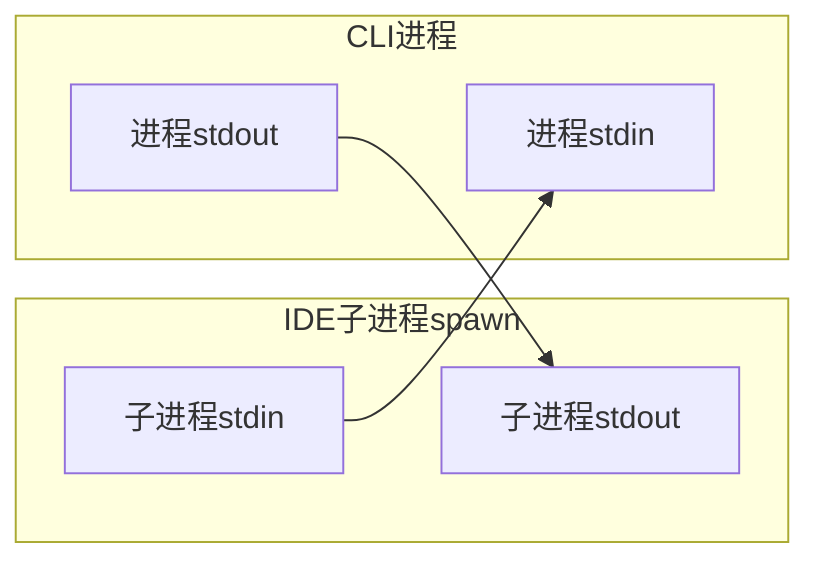
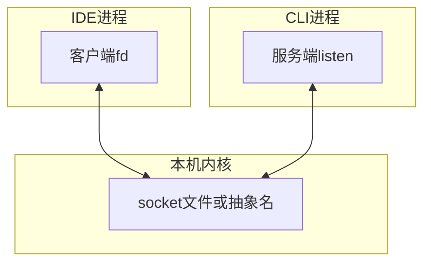
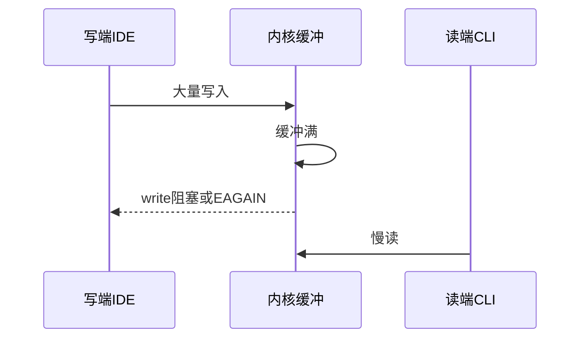

# 12.2 跨进程通信基础：stdin/stdout 与 Unix Domain Socket

> **路径**：`docs/part12-bridge/02-ipc.md`  
> **系列**：Claude Code 完全指南 V2 · 第 12 篇

---

## 学习目标

完成本节学习后，你应该能够：

1. **对比** **标准流（stdin/stdout）** 与 **Unix domain socket（UDS）** 在 Bridge 场景下的优缺点。
2. **解释** 为何 **JSON 行协议** 常与 newline-delimited JSON 结合出现在管道传输中。
3. **识别** **背压**：读端慢时写端行为、以及 **缓冲区膨胀** 风险。
4. **为** 后续 `Transport` 抽象（12.7）建立 **操作系统级直觉**。

---

## 生活类比：水管 vs 专用电话线

**stdin/stdout** 像 **住宅里的通用上下水**：装修简单、到处可用，但你要自己约定 **水里流的是茶还是油**（**应用层协议**）。

**Unix domain socket** 像 **楼宇内部对讲专线**：**不经过网络栈**、延迟更低、可传递 **文件描述符**（能力视 OS），适合 **本机高吞吐** 的 Bridge。

---

## stdin/stdout 管道模型



| 优点 | 缺点 |
|------|------|
| **跨平台**（概念上）易用 | **半双工心智**易混（实际两路各一根） |
| 与 **CI/脚本** 友好 | **二进制与多帧**需额外分帧 |
| 权限模型简单 | **难做多客户端**（一对一管道） |

---

## Unix Domain Socket 模型



| 优点 | 缺点 |
|------|------|
| **面向连接**，可多路复用架构 | 路径/权限要管理 |
| 性能常优于管道突发场景 | **Windows 命名管道**是另一套 API |
| 可做 **凭证**（部分 OS） | 调试工具链与 stdout 不同 |

---

## 分帧：为何不能「裸 JSON 粘包」

TCP/流式 socket 上 **无消息边界**；stdout 管道同理。常见策略：

| 策略 | 说明 |
|------|------|
| **NDJSON** | 每行一个 JSON，`\n` 为界 |
| **长度前缀** | `u32 be length` + `utf8 payload` |
| **WebSocket** | 帧边界由协议提供 |

Bridge 若采用 **JSON-RPC 风格**，传输层必须 **定义分帧**，否则解析器会在 **半个对象** 处失败。

---

## 背压与流控



| 现象 | 解释 |
|------|------|
| CLI 处理慢 | stdout 缓冲涨，**内存压力** |
| IDE 发送洪泛 | 需 **限流** 或 **队列丢弃策略**（谨慎） |

---

## 源码片段：按行解码（示意）

```typescript
import { createInterface } from 'node:readline';

async function* ndjsonLines(stdin: NodeJS.ReadableStream) {
  const rl = createInterface({ input: stdin, crlfDelay: Infinity });
  for await (const line of rl) {
    if (!line.trim()) continue;
    yield JSON.parse(line);
  }
}
```

生产代码需 **try/catch**、**最大行长度**、**JSON.parse 安全预算**。

---

## 安全注意

| 面 | 建议 |
|----|------|
| 本地 socket 文件 | **文件权限** `0600` 级别视场景 |
| 任意本地连接 | 必须叠 **JWT**（12.5）或等价 |
| 环境注入 | 小心 **LD_PRELOAD** 等（运维向） |

---

## 与 Windows 的映射

| Unix | Windows 思路 |
|------|----------------|
| UDS | **命名管道 Named Pipe** 或 loopback TCP |
| `fork/spawn` | **CreateProcess** 与句柄继承 |

Bridge 的 **Transport 抽象**（12.7）常为此存在。

---

## 小结

**IPC 基础**决定 Bridge 的 **延迟、吞吐、安全面**。stdin/stdout **简单普适**，UDS **强本机连接**；二者都需 **分帧** 与 **背压意识**。下一节 **12.3 bridgeMain 主循环**。

---

## 自测

1. 说明 **粘包** 在 stdout JSON 中的成因。  
2. 何时 UDS 优于匿名管道？

---

## 调试技巧

| 工具 | 用途 |
|------|------|
| `socat` | 探针 socket |
| `strace` / `dtruss` | 看 read/write 阻塞点 |
| 代理日志 | 在 **解码前后** 打印长度与类型 |

---

## 术语

| 英文 | 中文 |
|------|------|
| backpressure | 背压 |
| framing | 分帧 |

---

## 性能数量级（直觉）

本机 UDS 常 **微秒级** RTT；真正瓶颈多在 **JSON 序列化** 与 **上层业务**。

---

## 与 12.4 协议衔接

分帧之上才有 **id、method、params** 等字段；否则协议只是字符串约定。

---

## 常见问答

**问**：能用 gRPC 吗？  
**答**：可以，但需评估 **浏览器/扩展侧** 生态与 **调试成本**；JSON-RPC 风格在脚本与日志上更轻。

---

## 实战题

设计 **最大消息大小** 为 8MB 时，如何在解码前 **拒绝** 恶意前缀长度攻击？

---

## 伪代码：长度前缀读取

```typescript
async function readExact(rs: Readable, n: number): Promise<Buffer> {
  const chunks: Buffer[] = [];
  let got = 0;
  while (got < n) {
    const buf = await readChunk(rs, n - got);
    if (!buf) throw new Error('EOF');
    chunks.push(buf);
    got += buf.length;
  }
  return Buffer.concat(chunks, n);
}
```

---

## 清单：选择传输前的问题

- [ ] 是否 **仅本机**？  
- [ ] 是否需要 **多客户端**？  
- [ ] 是否需要 **双向同时** 高频？  
- [ ] **防火墙/NAT** 是否参与？  

---

## 结语

理解 IPC 像理解 **Bridge 的地基**：协议是 **钢筋**，传输是 **地基土质**。
