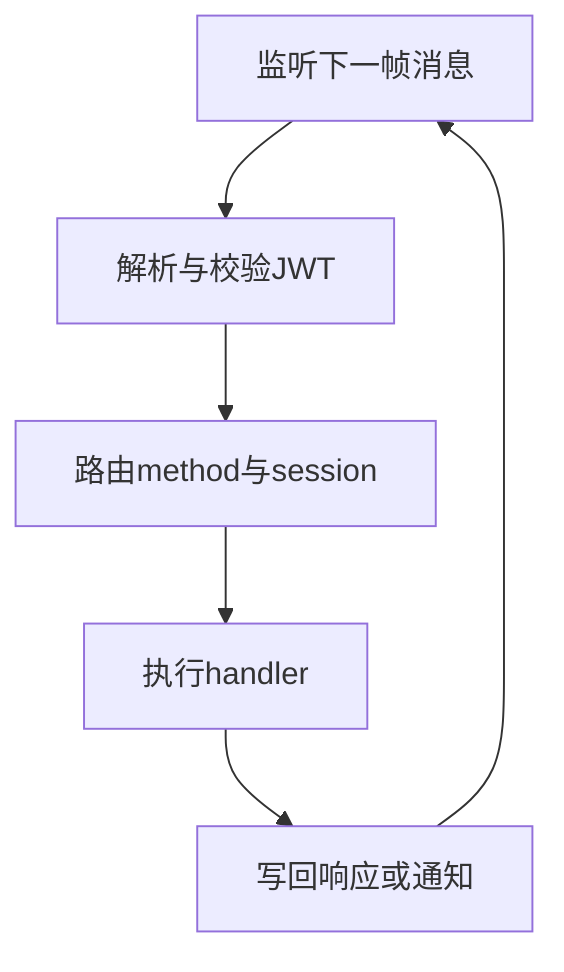
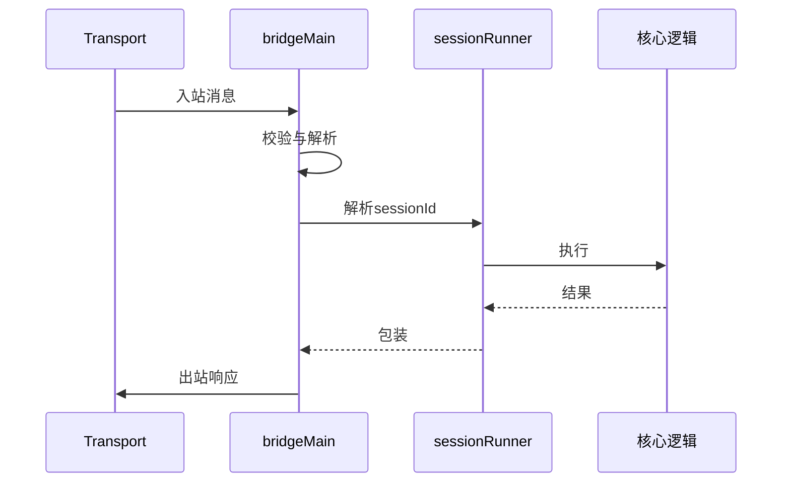
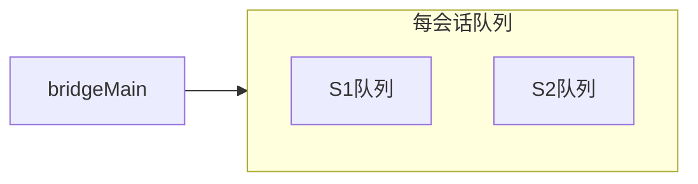

# 12.3 bridgeMain 主循环：监听、分发、执行、返回

> **路径**：`docs/part12-bridge/03-bridge-main.md`  
> **系列**：Claude Code 完全指南 V2 · 第 12 篇

---

## 学习目标

完成本节学习后，你应该能够：

1. **描述** `bridgeMain` 风格主循环的四个阶段：**监听 IDE 消息 → 分发 → 执行 → 返回结果**。
2. **区分** **同步处理**、**异步任务**、**后台通知** 在循环中的调度差异。
3. **解释** **错误**如何映射为 **RPC 错误对象** 而非裸异常泄漏。
4. **关联** `sessionRunner`（12.6）：主循环如何把消息路由到正确会话。

---

## 生活类比：医院分诊台

分诊台护士（**bridgeMain**）**不停听**病人诉求（**IDE 消息**）：

1. **听**：挂号机吐票（**读取一帧**）  
2. **分**：内科还是外科（**method 路由**）  
3. **办**：医生问诊（**调用核心能力**）  
4. **回**：打印回执（**写回响应**）

若护士把多张票**粘在一起读**，就会误诊——对应 **协议分帧**（12.2）。

---

## 主循环鸟瞰





---

## 处理表（概念）

| method 类型 | 典型行为 |
|-------------|----------|
| `ping` / `handshake` | 健康检查、能力交换 |
| `runTool` | 进入沙箱与权限（他篇） |
| `openFile` | 回调 IDE 或记录意图 |
| `subscribe` | 建立通知频道 |

真实方法名以仓库为准；此处强调 **注册表 + 类型安全**。

---

## 源码片段：极简循环骨架（伪代码）

```typescript
async function bridgeMain(tr: Transport, deps: Deps) {
  for await (const frame of tr.incomingFrames()) {
    const msg = decode(frame);
    const auth = await deps.jwt.verify(msg.auth);
    if (!auth.ok) {
      await tr.send(encode(errorResponse(msg.id, 'unauthorized')));
      continue;
    }

    try {
      const session = deps.sessions.resolve(msg.sessionId);
      const result = await dispatch(msg.method, msg.params, session, deps);
      if (msg.kind === 'request' && msg.id != null) {
        await tr.send(encode({ type: 'response', id: msg.id, result }));
      }
    } catch (e) {
      await tr.send(encode(rpcError(msg.id, e)));
    }
  }
}
```

---

## 并发模型

| 模型 | 说明 |
|------|------|
| **单线程循环** + worker pool | 常见 Node 风格 |
| 每会话队列 | **避免同会话重入** |
| 全局并发限制 | 保护 CPU 与文件句柄 |



---

## 通知路径

**通知**无 `id` 或无需响应：主循环可能 **单向 `tr.send`**。注意 **与请求的交错顺序** 是否被 IDE 接受。

---

## 关闭与优雅退出

| 阶段 | 动作 |
|------|------|
| SIGINT | 停止接收新请求 |
| drain | 等待在途响应 |
| cleanup | 关闭 transport、`sessionRunner` 释放 |

---

## 可观测性

| 字段 | 作用 |
|------|------|
| `traceId` | 关联日志 |
| `method` | 指标聚合 |
| `latencyMs` | SLO |

---

## 小结

`bridgeMain` 是 Bridge 的 **心脏**：把 **传输字节** 变成 **可靠的消息处理管线**，并把 **会话** 与 **认证** 放在 **最外层**。下一节 **12.4 消息协议** 细化三类消息。

---

## 自测

1. 为何错误要编码为 **RPC 错误** 而非直接 `throw` 到传输层？  
2. 同会话串行 vs 全局并行各解决什么 bug？

---

## 与 JWT 顺序

常见顺序：**先验 JWT**，再解析业务体；避免 **重 CPU 路由** 在非法连接上浪费。

---

## 术语

| 英文 | 中文 |
|------|------|
| dispatch | 分发 |
| graceful shutdown | 优雅退出 |

---

## 常见坑

| 坑 | 后果 |
|----|------|
| 忘记响应 `id` | IDE 侧 **挂起** |
| 通知当请求回 | 协议状态机错乱 |
| 未捕获 Promise | **静默失败** |

---

## 测试策略

- **假 transport**：内存双端队列  
- **属性测试**：随机 method 与 id 交错  
- **混沌**：半关 socket 看恢复  

---

## 实战题

设计 **method 未注册** 时错误码与 **IDE 可恢复** 策略。

---

## 伪代码：注册表

```typescript
type Handler = (p: unknown, s: Session) => Promise<unknown>;
const registry = new Map<string, Handler>();

function register(method: string, fn: Handler) {
  registry.set(method, fn);
}

async function dispatch(method: string, params: unknown, session: Session) {
  const fn = registry.get(method);
  if (!fn) throw rpcMethodNotFound(method);
  return fn(params, session);
}
```

---

## 与 31 文件关系

`bridgeMain` 常是 **单文件或单模块** 焦点；周边为 **protocol 编解码**、**transport 适配**、**session 存储**。

---

## 性能提示

**热路径**避免同步 **大 JSON.stringify**；可考虑 **结构化克隆** 或 **共享缓冲**（高级）。

---

## 结语

主循环代码往往 **不长**，但决定 **系统性格**：稳健、可调试、可测试 —— 比「功能多」更重要。
