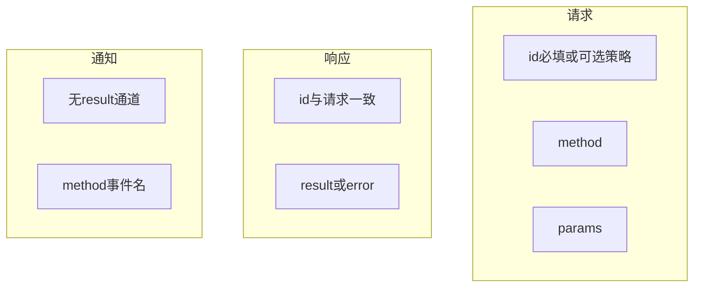
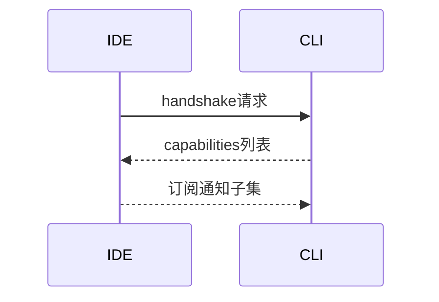

# 12.4 消息协议：JSON-RPC 风格的请求、响应与通知

> **路径**：`docs/part12-bridge/04-protocol.md`  
> **系列**：Claude Code 完全指南 V2 · 第 12 篇

---

## 学习目标

完成本节学习后，你应该能够：

1. **区分** 三种消息类型：**请求（request）**、**响应（response）**、**通知（notification）**。
2. **解释** `id` 字段在 **异步** 环境下的 **关联** 作用。
3. **列举** 常见 **错误对象** 字段：`code`、`message`、`data`。
4. **设计** 版本协商：`protocolVersion` 或 `capabilities` 交换。

---

## 生活类比：快递单号

- **请求**像 **寄件**：你拿到 **单号 `id`**。  
- **响应**像 **签收**：必须带回 **同一单号**，才知道对应哪包裹。  
- **通知**像 **小广告传单**：**不需要回执**，收件人看了就行。

---

## 三类消息（教学模型）



| 类型 | 是否有 `id` | 是否期待对端回包 |
|------|-------------|------------------|
| 请求 | **有**（推荐） | 是 |
| 响应 | **同请求 id** | 否（本身是回包） |
| 通知 | **无** 或约定忽略 | 否 |

---

## JSON-RPC 2.0 对齐点

Bridge 常 **借鉴** JSON-RPC 2.0，但可能 **扩展** 头字段：

| JSON-RPC | Bridge 可能扩展 |
|----------|-----------------|
| `jsonrpc: "2.0"` | 可保留或省略 |
| `method` | 命名空间 `claude.xxx` |
| `params` | **对象**优于数组（自描述） |
| `id` | string/number，需 **稳定序列化** |

---

## 源码片段：类型判别（示意）

```typescript
type RpcRequest = {
  type: 'request';
  id: string;
  method: string;
  params?: unknown;
};

type RpcResponse = {
  type: 'response';
  id: string;
  result?: unknown;
  error?: RpcError;
};

type RpcNotification = {
  type: 'notification';
  method: string;
  params?: unknown;
};

type RpcError = { code: number; message: string; data?: unknown };
```

---

## 错误码分层

| 区间 | 含义示例 |
|------|----------|
| -32700 ~ -32600 | JSON-RPC 保留（解析错误等） |
| 40xx | **认证** |
| 41xx | **会话** |
| 42xx | **方法参数** |
| 43xx | **业务不可用** |

具体表以产品为准；关键是 **稳定文档化**。

---

## 能力协商



| 能力项 | 例 |
|--------|-----|
| `maxMessageBytes` | 8192 |
| `supportsProgress` | true |
| `editorKinds` | `["vscode","cursor","jetbrains"]` |

---

## 版本演进策略

| 策略 | 说明 |
|------|------|
| **向后兼容** 加可选字段 | 首选 |
| **method 版本后缀** | `foo.v2` |
| **特性开关** | capabilities |

---

## 与传输分帧关系

协议层假设拿到 **完整一条消息**；分帧由 **12.2/12.7** 负责。

---

## 安全字段放置

| 字段 | 位置 |
|------|------|
| JWT | **Authorization 头** 或 `auth` 顶层（团队约定） |
| `sessionId` | params 或顶层 |

避免把密钥塞进 **可日志化的 method 名**。

---

## 小结

**JSON-RPC 风格** 让 IDE 与 CLI **对齐心智**：`id` **关联异步**、**通知**减轻握手负担、**错误对象**可机读。下一节 **12.5 JWT 认证**。

---

## 自测

1. 通知若误带 `id`，接收端应如何处理？（策略）  
2. `error.data` 适合放什么不适合放什么？

---

## 与 IDE 生成代码

强类型语言可为 `method` 建立 **联合类型** + **discriminated union**：

```typescript
type Methods =
  | { method: 'ping'; params?: undefined }
  | { method: 'open'; params: { path: string } };
```

---

## 术语

| 英文 | 中文 |
|------|------|
| correlation id | 关联 id |
| fire-and-forget | 发后即忘 |

---

## 调试输出注意

日志打印 **截断 params**、**脱敏 token**。

---

## 实战题

设计 **批量请求** `batch` 时，`id` 与 **子响应顺序** 的约束。

---

## 伪代码：多路复用等待

```typescript
const pending = new Map<string, Deferred<RpcResponse>>();

function onInbound(msg: RpcResponse) {
  const d = pending.get(msg.id);
  d?.resolve(msg);
  pending.delete(msg.id);
}
```

---

## 与 bridgeMain

主循环 **decode → switch kind** → **invoke** → **encode**；类型收窄靠 **TypeScript** 或 **zod** 校验。

---

## 常见扩展：Progress

长任务可发 **通知** `progress`：

```json
{ "type": "notification", "method": "progress", "params": { "token": "t1", "pct": 0.4 } }
```

---

## 结语

协议是 **契约**；契约清晰，**31 个文件**才不会变成 **31 种方言**。
