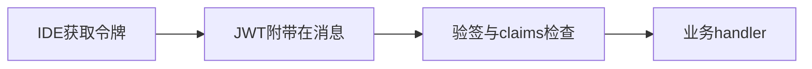
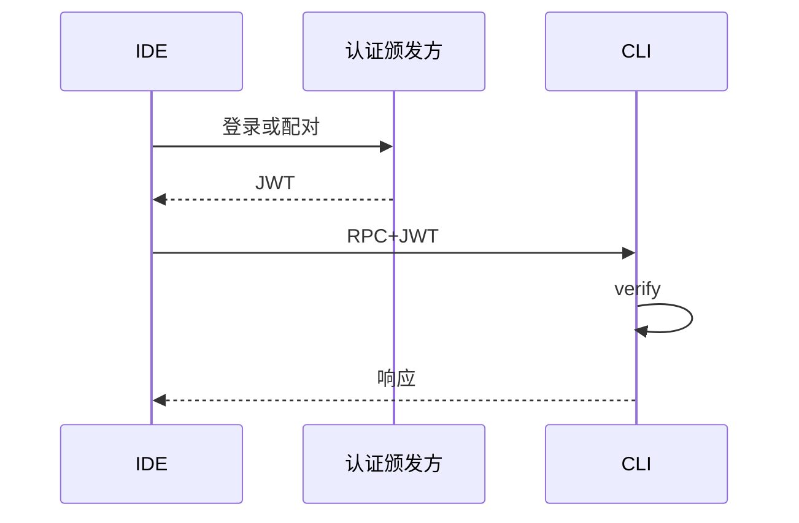

# 12.5 JWT 认证：验证 IDE 连接合法性

> **路径**：`docs/part12-bridge/05-jwt-auth.md`  
> **系列**：Claude Code 完全指南 V2 · 第 12 篇

---

## 学习目标

完成本节学习后，你应该能够：

1. **说明** Bridge 使用 **JWT** 的目的：**声明式凭证**、**无会话服务器**（视架构）下的 **快速验签**。
2. **列举** 必须校验的字段：`exp`、`nbf`、`iss`、`aud`、签名算法 **禁止 `none`**。
3. **区分** **对称（HS256）** 与 **非对称（RS256）** 在本机 Bridge 中的取舍。
4. **描述** **密钥轮换** 与 **时钟偏移** 对认证稳定性的影响。

---

## 生活类比：游乐园手带

JWT 像 **一次性手带**：门口盖章（**签名**）后，园内各摊位（**bridgeMain 各方法**）**只看手带**不必再问你身份证——但手带 **有过期时间**，而且 **伪造要成本**。

---

## JWT 在 Bridge 中的位置





---

## Claims 教学表

| Claim | 含义 | 校验 |
|-------|------|------|
| `iss` | 签发者 | 白名单 |
| `aud` | 受众 | 固定 `claude-bridge` 等 |
| `sub` | 主体 | 用户或设备 id |
| `exp` | 过期 | **必须** |
| `nbf` | 生效时间 | 可选 |
| `jti` | 令牌 id | **防重放**（若配合存储） |

---

## 源码片段：验签伪代码

```typescript
import { createRemoteJWKSet, jwtVerify } from 'jose';

type VerifyResult = { ok: true; claims: Claims } | { ok: false; reason: string };

async function verifyJwt(token: string, expectedAud: string): Promise<VerifyResult> {
  try {
    const { payload } = await jwtVerify(token, jwksOrSecret, {
      audience: expectedAud,
      issuer: ALLOWED_ISS,
      algorithms: ['RS256', 'ES256'],
    });
    return { ok: true, claims: payload as Claims };
  } catch (e) {
    return { ok: false, reason: String(e) };
  }
}
```

**禁止**接受 `alg: none` 或未声明算法的 **kid 混淆** 攻击面——使用成熟库并 **固定算法白名单**。

---

## 对称 vs 非对称

| 方案 | 场景 | 备注 |
|------|------|------|
| **HS256** | 本机共享密钥 | 轮换需 **同步两端** |
| **RS256/ES256** | IDE 只持公钥 | **私钥**集中在签发服务 |

本机 stdio Bridge 可能用 **短期 HS256** 简化；企业部署倾向 **非对称 + JWKS**。

---

## 密钥轮换


| 实践 | 说明 |
|------|------|
| `kid` 头 | 选择正确公钥 |
| 重叠窗口 | **旧 JWT** 仍可验证 |
| 紧急吊销 | 需 **黑名单** 或 **极短 TTL** |

---

## 时钟偏移

| 问题 | 缓解 |
|------|------|
| IDE 快 5 分钟 | `nbf` 误判 | `clockTolerance: 60s`（谨慎） |
| NTP 未同步 | 运维层面修 |

---

## 与传输安全关系

| 传输 | JWT 是否足够 |
|------|----------------|
| **TLS** | 防窃听；JWT 防 **伪造** |
| **明文 TCP** | **必须 TLS**；否则 JWT 泄露即被盗用 |
| **本机 UDS** | 依赖 **OS 权限** + JWT **纵深防御** |

---

## 错误映射到 RPC

| 失败 | `code` 例 | `message` |
|------|-----------|-----------|
| 过期 | 40101 | token expired |
| 签名校验失败 | 40102 | invalid signature |
| aud 不匹配 | 40103 | invalid audience |

---

## 小结

**JWT** 让 Bridge 在 **多客户端** 与 **多会话** 场景下仍能 **快速拒绝非法连接**。正确性来自 **严格验签 + claims + 轮换 + 传输层配合**。下一节 **12.6 sessionRunner**。

---

## 自测

1. 为何 **仅 Base64 解码 payload 不够**？  
2. `jti` 在无服务器状态下如何实现吊销？

---

## 威胁建模简表

| 威胁 | 缓解 |
|------|------|
| 令牌窃取 | 短 TTL、绑定机器指纹（可选） |
| 重放 | `jti` + 短期缓存拒绝 |
| 算法降级 | 固定 `algorithms` |

---

## 术语

| 英文 | 中文 |
|------|------|
| claim | 声明/载荷字段 |
| JWKS | JSON Web Key Set |

---

## 与 IDE 集成

扩展启动时向 **本地服务** 换 JWT，或 **用户登录 OAuth** 后注入——见 **12.8**。

---

## 实战题

设计 **开发模式** `CLAUDE_BRIDGE_INSECURE=1` 的风险与 **编译期剔除** 策略。

---

## 伪代码：clockTolerance

```typescript
await jwtVerify(token, key, {
  audience: AUD,
  clockTolerance: '60s',
});
```

---

## 日志纪律

**永不** `console.log(token)`；出错只打印 **`jti` 前缀** 或 **hash**。

---

## 合规注意

若 JWT **含 PII**，日志与崩溃上报需 **脱敏**。

---

## 结语

JWT 不是「**万能钥匙**」，而是 **时间盒凭证**：短、可验、可轮换，才配得上 **Bridge 这种高频通道**。
