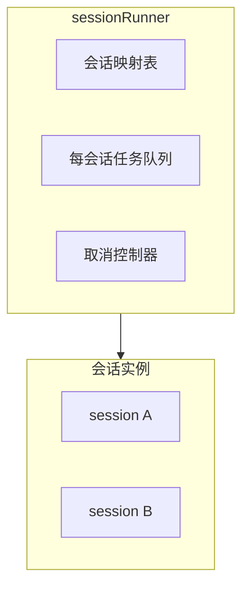
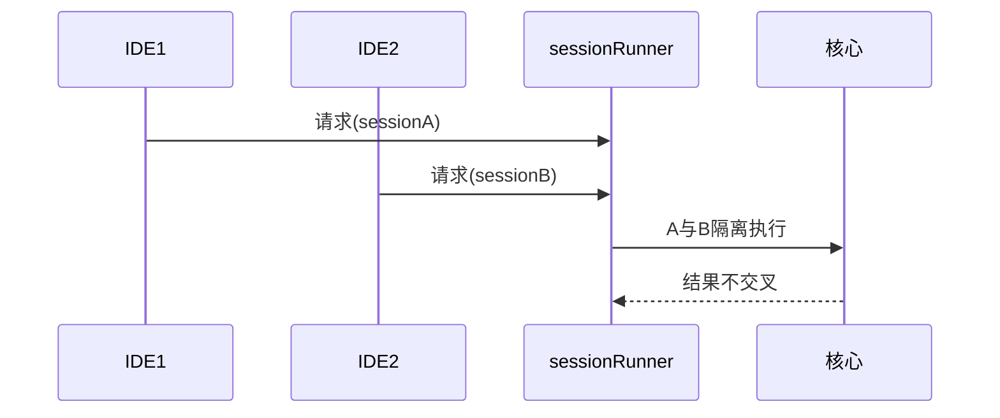

# 12.6 sessionRunner：多会话并发与隔离

> **路径**：`docs/part12-bridge/06-session-runner.md`  
> **系列**：Claude Code 完全指南 V2 · 第 12 篇

---

## 学习目标

完成本节学习后，你应该能够：

1. **解释** `sessionRunner` 如何管理 **多个并发 IDE↔CLI 会话** 的生命周期。
2. **描述** **会话隔离**：上下文、取消令牌、资源上限。
3. **关联** `BoundedUUIDSet`（12.9）：限制 **活跃会话 id** 集合防止 **内存泄漏**。
4. **列举** 会话结束条件：显式 `close`、进程退出、超时闲置。

---

## 生活类比：银行窗口叫号

每个 **会话**像 **一个窗口客户**：柜员系统（**Runner**）要知道 **当前叫到几号**、**哪个窗口空闲**、**客户走了要释放柜台**。

若只用一个全局计数器，**A 客户**和 **B 客户**的 **业务单据**会混在一起——对应 **Agent 上下文串线** 的严重 bug。

---

## 会话模型



| 对象 | 职责 |
|------|------|
| `SessionId` | 稳定关联 IDE 侧 tab/window |
| `SessionState` | 运行中/结束/错误 |
| `AbortController` | 中断工具调用与流 |

---

## 并发策略



| 策略 | 说明 |
|------|------|
| **会话内串行** | 避免同上下文重入 |
| **会话间并行** | 提高吞吐 |
| 全局上限 | **保护文件描述符与 CPU** |

---

## 源码片段：会话注册（示意）

```typescript
type Session = {
  id: string;
  abort: AbortController;
  createdAt: number;
  lastActiveAt: number;
};

class SessionRunner {
  private sessions = new Map<string, Session>();

  create(id: string): Session {
    if (this.sessions.has(id)) return this.sessions.get(id)!;
    const s = { id, abort: new AbortController(), createdAt: Date.now(), lastActiveAt: Date.now() };
    this.sessions.set(id, s);
    return s;
  }

  dispose(id: string) {
    const s = this.sessions.get(id);
    s?.abort.abort();
    this.sessions.delete(id);
  }
}
```

---

## 与 bridgeMain 集成

1. 解码消息后读取 `sessionId`。  
2. `runner.create` / `get`。  
3. 将 `abort.signal` 传入 **下游 fetch / 子进程**。  
4. 响应后 `touch(sessionId)` 更新活跃时间。

---

## 闲置超时

| 参数 | 作用 |
|------|------|
| `idleTtlMs` | 回收长时间无消息会话 |
| `sweepIntervalMs` | 周期扫描 |

需 **通知 IDE** 会话已关闭，避免 **幽灵 UI**。

---

## 错误隔离

| 原则 | 说明 |
|------|------|
| **会话 A 抛错** | 不关闭 **全局 Bridge** |
| 记录 `sessionId` | 日志可过滤 |

---

## 与 BoundedUUIDSet

活跃 `sessionId` 若无限增长（恶意或 bug），可用 **有界集合**统计最近 id，配合 **LRU 淘汰策略**——详见 **12.9**。

---

## 小结

`sessionRunner` 是 **多窗口 IDE 工作流** 的 **地基**：**隔离**、**取消**、**生命周期** 三角缺一不可。下一节 **12.7 传输层抽象**。

---

## 自测

1. 同会话并发两个 `runAgent` 请求会发生什么？如何选策略？  
2. `abort` 应传播到哪些下游？

---

## 资源表

| 资源 | 每会话 |
|------|--------|
| 临时目录 | 可选隔离 |
| 子进程 | 绑定 `signal` |
| 打开文件 | **ulimit** 级别保护 |

---

## 术语

| 英文 | 中文 |
|------|------|
| reentrancy | 重入 |
| teardown | 拆卸/清理 |

---

## 测试用例

- 创建 1000 会话后 **批量 dispose** 不泄漏句柄。  
- **abort** 后 **无新 chunk** 到达 UI。  

---

## 实战题

设计 **会话迁移**：IDE 崩溃重启后 **恢复** 同 `sessionId` 的风险与 **新 session** 策略。

---

## 伪代码：每会话队列

```typescript
async function enqueue<T>(sessionId: string, job: () => Promise<T>): Promise<T> {
  return withSessionLock(sessionId, job);
}
```

---

## 与多 Agent

**会话**可包含 **多个子 Agent**（第 10 篇），但 **Runner** 不直接编排 Agent——只提供 **边界与信号**。

---

## 监控指标

| 指标 | 含义 |
|------|------|
| `sessions_active` | 当前数 |
| `sessions_created_total` | 累计 |
| `session_job_latency` | 处理耗时 |

---

## 结语

会话管理是 **分布式系统的微缩版**：哪怕只有 **本机两进程**，也要 **正经对待隔离**。
