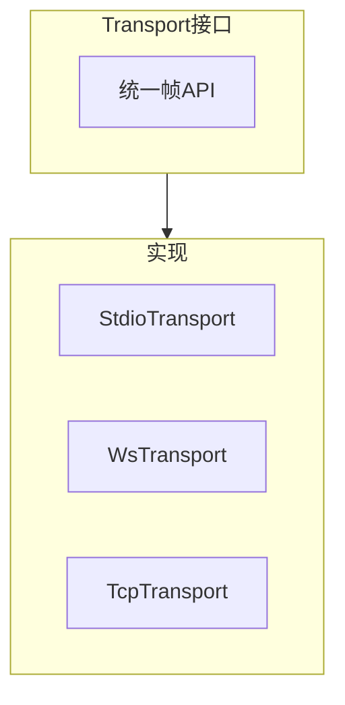
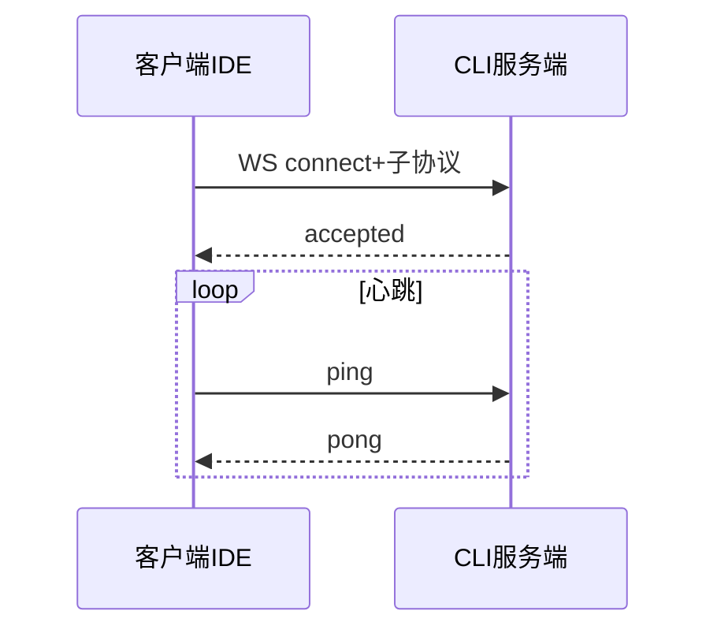

# 12.7 传输层抽象：stdio、WebSocket 与 TCP 可切换

> **路径**：`docs/part12-bridge/07-transport.md`  
> **系列**：Claude Code 完全指南 V2 · 第 12 篇

---

## 学习目标

完成本节学习后，你应该能够：

1. **定义** **Transport** 接口：**双向帧流**、**连接/断开**、**背压** 语义。
2. **对比** **stdio**、**WebSocket**、**TCP loopback** 的部署场景。
3. **解释** 为何 **同一协议**（12.4）可复用在多种传输之上。
4. **列举** WebSocket 下 **ping/pong**、**心跳**、**重连** 的注意点。

---

## 生活类比：同一种语言，不同交通工具

协议像 **普通话**；传输像 **高铁/飞机/公交**。你可以 **换交通工具** 仍说同一种话——Transport 抽象让 Bridge **换连接方式** 而不重写 **RPC 语义**。

---

## 接口形状（示意）

```typescript
type Frame = Uint8Array | string;

type Transport = {
  name: 'stdio' | 'websocket' | 'tcp';
  connect(): Promise<void>;
  close(): Promise<void>;
  readonly incomingFrames: AsyncIterable<Frame>;
  send(frame: Frame): Promise<void>;
};
```

真实实现可能分 **二进制/文本** 两轨，或统一 `Uint8Array`。

---

## 三种传输对比

| 传输 | 典型场景 | 优点 | 风险 |
|------|----------|------|------|
| **stdio** | 本地扩展 `spawn` CLI | 简单、权限跟随进程 | 一对一、难远程 |
| **WebSocket** | 远程/浏览器侧 | 双向、穿越 HTTP 基础设施 | 代理与心跳 |
| **TCP** | 高性能本机或内网 | 灵活 | **需 TLS**、防火墙 |



---

## stdio 实现要点

| 点 | 说明 |
|----|------|
| **stdin 非 tty** | 与交互 CLI 抢 stdin 时要协调 |
| **stdout 与日志** | **结构化输出**与 **人类日志** 分离（文件或 stderr） |
| **Windows** | 换行与编码 **UTF-8** 统一 |

---

## WebSocket 实现要点



| 点 | 说明 |
|----|------|
| 子协议 | 约定 `claude-bridge.v1` |
| 消息类型 | text vs binary（与帧格式一致） |
| 重连 | **恢复会话**策略与 **id 幂等** |

---

## TCP 实现要点

| 点 | 说明 |
|----|------|
| TLS | `ca` 校验、**证书固定**（可选） |
| 粘包 | **长度前缀**（12.2） |
| 端口 | **localhost 绑定** 优先 |

---

## 源码片段：适配器组合（伪代码）

```typescript
class FramingTransport implements Transport {
  constructor(private inner: Transport, private codec: Codec) {}

  async *incomingFrames() {
    for await (const f of this.inner.incomingFrames()) {
      for (const msg of this.codec.decodeChunk(f)) {
        yield msg;
      }
    }
  }

  async send(frame: Frame) {
    for (const chunk of this.codec.encode(frame)) {
      await this.inner.send(chunk);
    }
  }
}
```

---

## 选择矩阵（运维）

| 环境 | 首选 |
|------|------|
| 本地 VS Code | stdio |
| Remote SSH | WebSocket 隧道或 stdio 转发 |
| 企业零信任 | mTLS TCP |

---

## 小结

**Transport 抽象**让 Bridge **部署可选**：开发用 **stdio**，远程用 **WS**，性能实验用 **TCP**。协议层保持稳定。下一节 **12.8 IDE 集成实践**。

---

## 自测

1. 为何 **日志** 不应与 **协议 stdout** 混用？  
2. WebSocket 断线时 **进行中的 RPC** 如何处理？

---

## 术语

| 英文 | 中文 |
|------|------|
| multiplexing | 多路复用 |
| keepalive | 保活 |

---

## 与 JWT

WS 可在 **首帧** 发送 `auth` 或在 **子协议+Header**（视客户端能力）。

---

## 实战题

设计 **双通道**：一条 **低延迟控制面**、一条 **大块日志面**，是否值得？

---

## 伪代码：stdio 双工

```typescript
const incoming = ndjsonLines(process.stdin);
async function send(obj: unknown) {
  process.stdout.write(JSON.stringify(obj) + '\n');
}
```

---

## 性能

**批量 send** 减少 syscall；注意 **writev** 或缓冲合并。

---

## 调试

为每种 Transport 提供 **内存 fake**，可在 **单元测试** 跑全链路。

---

## 常见坑

| 坑 | 修复 |
|----|------|
| stdout 缓冲全块 | `setEncoding` + `flush` 或换行帧 |
| WS 最大消息 | 对齐 **协议 max** |

---

## 结语

传输是可替换的 **齿轮**；**不要在齿轮里写业务**——这是 **31 文件** 能维护住的关键。
