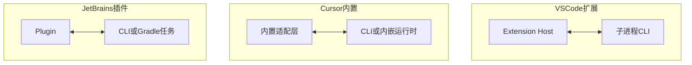
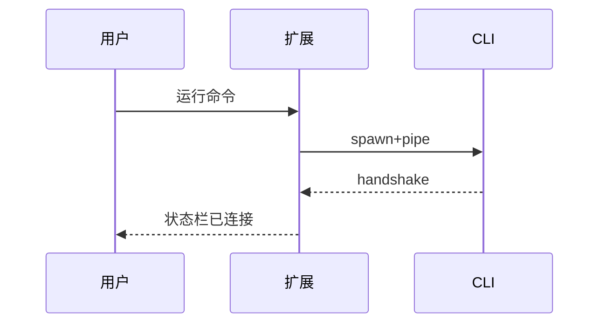

# 12.8 IDE 集成实践：VS Code 扩展、Cursor 内置与 JetBrains 插件

> **路径**：`docs/part12-bridge/08-ide-integration.md`  
> **系列**：Claude Code 完全指南 V2 · 第 12 篇

---

## 学习目标

完成本节学习后，你应该能够：

1. **对比** **VS Code 扩展**、**Cursor 内置**、**JetBrains 插件** 三种集成路径的 **进程模型** 差异。
2. **描述** 扩展侧如何 **spawn 或连接** CLI 并建立 **Transport**（12.7）。
3. **列举** 常见 **UX 能力**：内联 diff、文件树跳转、状态栏、WebView 面板。
4. **解释** **JWT 获取** 在 IDE 内的典型流程（登录/配对/本机密钥）。

---

## 生活类比：同一台车，三种车钥匙

**核心引擎**仍是 CLI（或共享库），但 **钥匙形状**不同：

- VS Code：**标准扩展 API** 钥匙  
- Cursor：**内置通道** 钥匙（更紧耦合）  
- JetBrains：**Platform SDK** 钥匙  

Bridge 协议是 **点火线路**——钥匙不同，但 **线路电压**应一致。

---

## 集成架构对比



| 维度 | VS Code | Cursor | JetBrains |
|------|---------|--------|-----------|
| API | `vscode.*` | 产品私有/混合 | IntelliJ Platform |
| 终端集成 | `Terminal` API | 内置终端 | Run Configuration |
| 分发 | Marketplace | 应用内置 | Plugin Repo |

---

## VS Code 扩展路径（概念步骤）

1. `activate()` 中注册命令 `claude.start`。  
2. `child_process.spawn` 启动 CLI，`stdio` Transport。  
3. **ExtensionContext.secrets** 存 refresh token（若适用）。  
4. `window.showTextDocument` 响应 `openFile` **通知/响应**。



---

## Cursor 内置路径

| 特点 | 说明 |
|------|------|
| **更深集成** | 编辑器事件可直接映射 Bridge **通知** |
| 版本齐步走 | 协议与 IDE **同发版** |
| 调试 | 内部通道可能对 **外部插件** 不可见 |

---

## JetBrains 插件路径

| 特点 | 说明 |
|------|------|
| **VirtualFile** 体系 | `openFile` 需映射路径与模块根 |
| 后台任务 | `ProgressIndicator` 展示长 RPC |
| 多 IDE | Android Studio 等 **兼容矩阵** |

---

## 共享：协议客户端 SDK

建议在仓库维护 **TypeScript 客户端**：

```typescript
export class BridgeClient {
  constructor(private tr: Transport) {}
  async call<T>(method: string, params: unknown): Promise<T> {
    const id = crypto.randomUUID();
    await this.tr.send(encode({ type: 'request', id, method, params }));
    return waitForId(id) as Promise<T>;
  }
}
```

各 IDE **薄适配** 即可。

---

## UX 映射表

| Bridge 消息 | IDE 动作 |
|-------------|----------|
| `openFile` | 打开编辑器并定位行 |
| `showDiff` | diff 编辑器或 inline |
| `setStatus` | 状态栏文本 |
| `focusPanel` | WebView / ToolWindow |

---

## 安全与权限

| 点 | 说明 |
|----|------|
| **工作区信任** | VS Code **Trust** 闸门 |
| **路径校验** | 防 **目录穿越** |
| **命令执行** | 与权限系统（他篇）对齐 |

---

## 小结

**IDE 集成**是 Bridge 的 **产品面**：三种平台 **共享协议**，在 **spawn/连接/密钥存储/UI API** 上分叉。下一节 **12.9 BoundedUUIDSet**。

---

## 自测

1. 为何扩展侧宜用 **secrets** 而非 `settings.json` 存 JWT？  
2. `openFile` 应 **同步阻塞** 还是 **异步 fire**？

---

## 分发与版本

| 策略 | 说明 |
|------|------|
| **协议版本** 握手 | 防止 **新旧混用** |
| CLI 捆绑 | 扩展内置 **固定 minor** |

---

## 术语

| 英文 | 中文 |
|------|------|
| extension host | 扩展宿主进程 |

---

## 调试清单

- [ ] `--bridge-debug` 打印帧类型  
- [ ] MITM 本地 loopback（仅 dev）  
- [ ] 记录 **method 直方图**  

---

## 实战题

Remote SSH 场景：扩展跑 **远端**，CLI 应跑 **远端还是本地**？权衡 **文件系统** 与 **延迟**。

---

## 与终端 UI 第 11 篇

IDE 用户可能 **不打开 TUI**；Bridge **独立提供** 面板与 diff——**双前端** 并存。

---

## 用户文档建议

为每种 IDE 提供 **三步上手**：安装 → 登录/配对 → 打开面板。

---

## 结语

集成工作 **琐碎但关键**：用户感知的是 **按钮与光标**，不是 **JSON 帧**。

---

## 发布与遥测（产品向）

| 话题 | 建议 |
|------|------|
| 崩溃报告 | **脱敏** RPC method 与路径 |
| 功能开关 | `settings.json` / Registry 统一前缀 |
| A/B | 协议能力位协商后再启用新 method |

---

## 本地化与可访问性

- 状态栏字符串走 **i18n 资源**，避免硬编码英文。  
- 关键操作提供 **键盘快捷方式** 与 **屏幕阅读器** 标签（平台允许范围内）。
