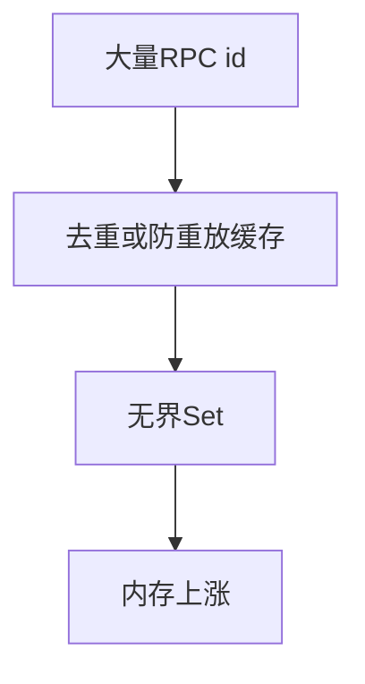

# 12.9 BoundedUUIDSet：有界 UUID 集合与防内存泄漏

> **路径**：`docs/part12-bridge/09-bounded-uuid-set.md`  
> **系列**：Claude Code 完全指南 V2 · 第 12 篇

---

## 学习目标

完成本节学习后，你应该能够：

1. **解释** 为何 Bridge 需要 **有界** 的 UUID 集合：**长时间运行** + **高频 id** → **Set 无限增长** 风险。
2. **描述** **BoundedUUIDSet** 的典型语义：`add`、`has`、**淘汰策略**（FIFO、LRU）。
3. **权衡** **误判**（Bloom 过滤） vs **精确**（纯 Set + 上限）。
4. **关联** `sessionRunner`（12.6）：**活跃会话** 与 **历史 id 去重** 的不同需求。

---

## 生活类比：门禁卡回收桶

公司发卡（**UUID**）记录 **谁进过门**。若只进不出，办公室堆满 **废卡盒**（**内存泄漏**）。**有界桶**策略：**最多保留最近 N 张卡复印件**——旧复印件扔掉，但 **仍在有效期** 的卡 **另有权威登记**（**会话表**）。

---

## 问题场景



| 场景 | 需要 Bounded？ |
|------|----------------|
| **已处理通知 id** | 是 |
| **当前会话 Map** | 用 **dispose** 而非盲目增长 |
| **调试日志索引** | 可落盘而非内存 |

---

## API 形状（示意）

```typescript
class BoundedUUIDSet {
  constructor(private readonly maxSize: number) {}

  add(id: string): boolean {
    // 返回是否首次出现
  }

  has(id: string): boolean {}

  get size(): number {}
}
```

---

## 实现策略对比

| 策略 | 优点 | 缺点 |
|------|------|------|
| **Set + 队列** | 精确、实现简单 | `has` O(1)，淘汰 O(1) |
| **Map + LRU** | 可刷新热点 | 稍复杂 |
| **Bloom Filter** | 省内存 | **假阳性** |

Bridge **防重放**若不能容忍假阳性，优先 **精确结构**。

---

## 源码片段：Set + 队列（示意）

```typescript
class BoundedUUIDSet {
  private readonly set = new Set<string>();
  private readonly q: string[] = [];

  constructor(private readonly maxSize: number) {}

  add(id: string): boolean {
    if (this.set.has(id)) return false;
    this.set.add(id);
    this.q.push(id);
    while (this.q.length > this.maxSize) {
      const old = this.q.shift()!;
      this.set.delete(old);
    }
    return true;
  }

  has(id: string): boolean {
    return this.set.has(id);
  }
}
```

---

## 与 sessionRunner 的边界

| 结构 | 职责 |
|------|------|
| `Map<SessionId, Session>` | **权威活跃会话** |
| `BoundedUUIDSet` | **短期去重**（通知 id / 重试） |

**勿用 Bounded 结构代替会话释放逻辑**。

---

## 参数选择

| 参数 | 经验直觉 |
|------|----------|
| `maxSize` | 与 **峰值 QPS × TTL窗口** 相关 |
| 监控 | `bounded_set_evictions_total` |

---

## 并发

多线程语言需 **锁**；Node **单线程** 也要注意 **async 交错** —— **批量 add** 时在 **同一 tick** 内完成。

---

## 小结

**BoundedUUIDSet** 是 **小工具、大收益**：防止 **边缘路径** 把 **长期进程** 拖死。最后一节 **12.10 总结**。

---

## 自测

1. 队列淘汰后 **旧 id 再来** 会被如何判断？是否符合你的 **防重放** 语义？  
2. 为何 LRU 有时优于 FIFO？

---

## 术语

| 英文 | 中文 |
|------|------|
| eviction | 淘汰 |
| LRU | 最近最少使用 |

---

## 测试用例

- `maxSize=3` 序列 `a b c d` 后 `has(a)` 期望？  
- 并发 1e5 **随机 uuid** 内存平台稳定。

---

## 实战题

若 **jti** 需要 **强吊销**（12.5），BoundedSet **不够**——应补充什么存储？

---

## 伪代码：LRU Map

```typescript
// 使用 Map 迭代顺序：最近插入在末尾
function touch(m: Map<string, true>, id: string, max: number) {
  if (m.has(id)) m.delete(id);
  m.set(id, true);
  while (m.size > max) {
    const first = m.keys().next().value;
    m.delete(first);
  }
}
```

---

## 与 31 文件

该结构常是 **独立 util**，被 **bridgeMain** 与 **通知子系统** 引用。

---

## 监控告警

若 **淘汰速率** 持续高于预期，可能 **maxSize 过小** 或 **攻击重放**。

---

## 结语

工程魅力常在 **边界条件**：**有界数据结构**是 **成熟后端本能** 在 Bridge 中的投影。

---

## 与其他「有界」结构类比

| 结构 | 用途 |
|------|------|
| 有界队列 | 限制待处理 RPC 深度 |
| Ring buffer 日志 | 限制内存中 **最近 N 条** 诊断 |
| **BoundedUUIDSet** | 限制 **去重/防重放** 集合 |

统一哲学：**长期进程中的任何无限集合都要么落盘，要么有界。**

---

## 复杂度小结

| 操作 | Set+队列实现 |
|------|--------------|
| `add` | 均摊 O(1) |
| `has` | O(1) |
| 空间 | O(maxSize) |

在 **maxSize** 为几千到几万量级时，对 Bridge **微不足道**；换来 **可预测的内存上界**。
