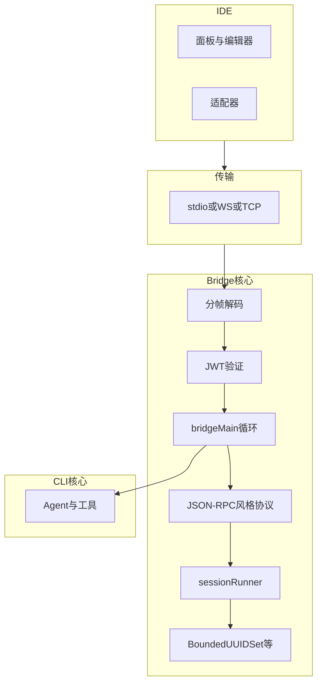
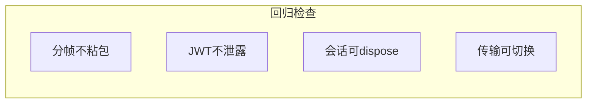

# 12.10 总结：Bridge 桥接全链路检查表

> **路径**：`docs/part12-bridge/10-summary.md`  
> **系列**：Claude Code 完全指南 V2 · 第 12 篇

---

## 学习目标

完成本节学习后，你应该能够：

1. **复述** Bridge **端到端链路**：IPC → 分帧 → JWT → `bridgeMain` → 协议 → `sessionRunner` → Transport → IDE。
2. **使用** 检查表 **自检** 实现或阅读源码时的遗漏点。
3. **关联** 第 11 篇终端 UI：理解 **双前端** 产品形态。
4. **说出** **约 31 个 Bridge 文件** 在你团队分工中的 **模块边界** 建议。

---

## 生活类比：收工前的安检清单

飞行员 **降落前** 有 **检查表**，不按表走 **容易漏襟翼**。Bridge 交付也同理：**协议、安全、资源、可观测** 一条条勾掉，才能 **长期飞行**。

---

## 全链路一张图





---

## 模块→文件分工建议（31 文件级）

| 模块 | 职责边界 |
|------|----------|
| `transport/*` | 仅字节与连接，不知业务 |
| `protocol/*` | 编解码、类型、错误码表 |
| `auth/*` | JWT、密钥、轮换 |
| `bridgeMain*` | 循环、路由、生命周期 |
| `session/*` | Runner、队列、abort |
| `ide/*` | 可选：共享客户端 SDK |
| `util/*` | BoundedUUIDSet 等 |

---

## 检查表：安全

| 项 | 通过标准 |
|----|----------|
| JWT 算法白名单 | 拒绝 `none` |
| TLS | 非本机 TCP **必须** |
| 日志脱敏 | 无裸 token |
| 路径校验 | `openFile` **根目录**限制 |
| 重放 | `jti` 或短 TTL |

---

## 检查表：正确性

| 项 | 通过标准 |
|----|----------|
| 请求 `id` | 响应 **可关联** |
| 通知 | **不阻塞**等待响应 |
| 错误对象 | **稳定 code** |
| 版本握手 | **不兼容则拒绝** |

---

## 检查表：性能与资源

| 项 | 通过标准 |
|----|----------|
| 背压 | 慢消费者 **不无限缓冲** |
| 会话上限 | **拒绝或淘汰**策略明确 |
| Bounded 集合 | **淘汰指标**可观测 |
| JSON | **大 payload** 流式或分块 |

---

## 检查表：可观测性

| 项 | 通过标准 |
|----|----------|
| `traceId` | 跨 IDE-CLI |
| method 指标 | P95 延迟 |
| 错误率 | 按 code 聚合 |

---

## 与第 11 篇关系小结

| 11 篇 | 12 篇 |
|-------|-------|
| stdout **绘制** | **结构化侧信道** |
| 主题令牌 | **可从 IDE 同步** |
| 鼠标 OSC8 | IDE **原生超链接** 可替代部分场景 |

---

## 31 文件阅读顺序建议

1. `04-protocol` 类型定义  
2. `07-transport` 实现之一  
3. `03-bridge-main`  
4. `06-session-runner`  
5. `05-jwt-auth`  
6. `09-bounded-uuid-set`  
7. `08-ide-integration`（产品向）

---

## 源码片段：启动开关（示意）

```typescript
type BridgeConfig = {
  enabled: boolean;
  transport: 'stdio' | 'websocket' | 'tcp';
  jwt: { audience: string; issuer: string };
  sessions: { max: number; idleMs: number };
  dedupe: { maxIds: number };
};

function assertBridgeConfig(c: BridgeConfig) {
  if (c.transport !== 'stdio' && !c.jwt) {
    throw new Error('JWT required for network transports');
  }
}
```

---

## 常见反模式

| 反模式 | 后果 |
|--------|------|
| 业务逻辑塞进 Transport | 不可测试 |
| 全局单会话 | 多窗口 **串线** |
| 无限缓存 uuid | **内存泄漏** |
| 日志打印帧全文 | **密钥与隐私泄露** |

---

## 本篇一句提纲

**Bridge = 传输上的 JSON-RPC 风格协议 + JWT 信任 + 会话隔离 + IDE 适配**。

---

## 自测总复习

1. 画出 **粘包** 与 **分帧** 关系。  
2. 解释 **通知** 与 **请求** 在 `bridgeMain` 中的分支。  
3. `SessionRunner` 与 `BoundedUUIDSet` **各防什么**？

---

## 术语总表

| 英文 | 中文 |
|------|------|
| Bridge | 桥接 |
| IPC | 进程间通信 |
| RPC | 远程过程调用 |
| JWT | JSON Web Token |
| Transport | 传输层 |
| session | 会话 |

---

## 团队落地建议

| 角色 | 关注点 |
|------|--------|
| 后端/CLI | 协议、会话、安全 |
| 扩展开发 | UX 映射、spawn 生命周期 |
| SRE | TLS、端口、日志 |

---

## 与系列其他篇的接口

| 系列篇 | 接口 |
|--------|------|
| 权限 | `runTool` 鉴权下游 |
| 工具系统 | 方法 → 工具编排 |
| 多 Agent | 会话内子 Agent |

---

## 结语

Bridge 把 Claude Code 从 **终端单形态** 扩展到 **IDE 共生**。掌握 **12.2–12.7** 即可 **读懂大部分故障**；**12.5/12.6/12.9** 决定 **能不能长期跑**。

---

## 附录：最小可行演示（伪）

1. `socat` 建 TCP 回显（仅实验）。  
2. `ndjson` CLI 读写 **handshake**。  
3. 打印 **capabilities**。

---

## 下一步学习

回到 **第 11 篇** 看 **主题同步**，或回到 **第 10 篇** 看 **会话内多 Agent** 编排。

---

## 质量门禁建议

- [ ] 协议 JSON Schema CI 校验  
- [ ] 模糊测试解码器  
- [ ] 渗透：伪造 JWT、目录穿越  

---

## 致谢读者

若你 **逐篇读到 12.10**，已具备 **通读 Bridge 源码** 的 **导航能力**；剩下是 **在仓库里对号入座文件名**。
