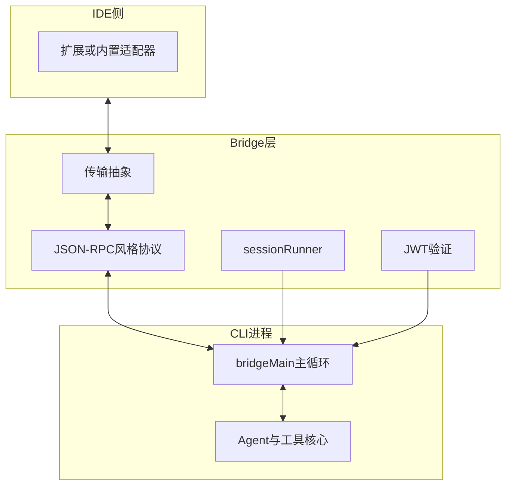
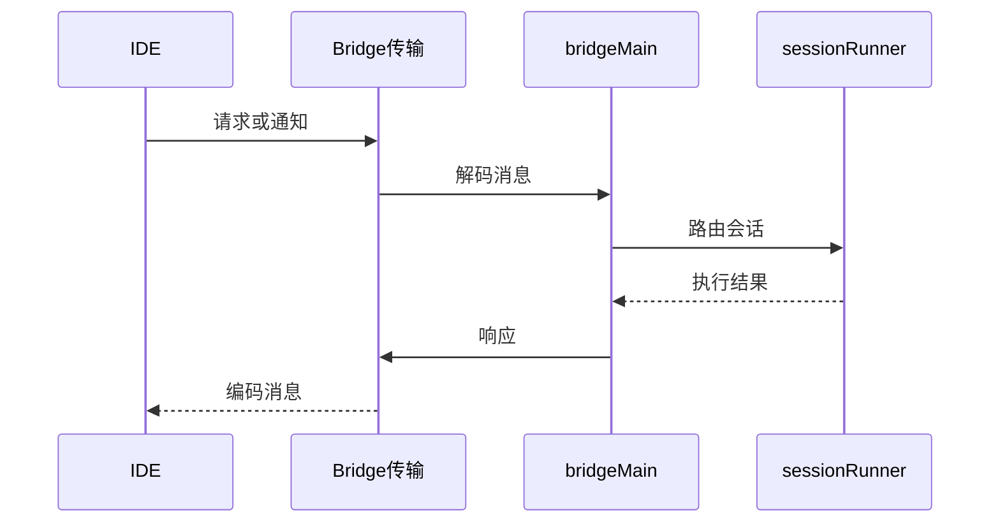

# 第 12 篇：Bridge 桥接 · 12.1 总览：CLI 与 IDE 的双向通道

> **路径**：`docs/part12-bridge/index.md`  
> **系列**：Claude Code 完全指南 V2

---

## 学习目标

完成本节学习后，你应该能够：

1. **定义** **Bridge**：在 **CLI 进程** 与 **IDE（VS Code / Cursor / JetBrains）** 之间的 **双向通信通道**。
2. **说出** Bridge 解决的痛点：**共享上下文**、**统一认证**、**多会话并发**、**传输可插拔**。
3. **列举** 仓库中与 Bridge 相关的 **约 31 个文件** 可能承担的职责分层（协议、传输、会话、安全）。
4. **建立** 本篇路线图：IPC → `bridgeMain` → 协议 → JWT → `sessionRunner` → 传输 → IDE 实践 → `BoundedUUIDSet` → 总结。

---

## 生活类比：机场廊桥

飞机（**CLI 核心逻辑**）停在远机位时，乘客要坐摆渡车，**慢且易脱节**。**廊桥**让机舱门直接对准航站楼（**IDE 窗口**）——**双向通行**：你可以从 IDE 看 CLI 状态，也可以让 CLI 回调 IDE 打开文件。

Bridge 就是这座 **双向廊桥**，而不是单向广播喇叭。

---

## Bridge 在系统中的位置





---

## 为何需要 Bridge？

| 无 Bridge | 有 Bridge |
|-----------|-----------|
| CLI 与编辑器 **各说各话** | **结构化消息**对齐能力 |
| 多窗口会话 **状态打架** | **sessionRunner** 管理并发 |
| 任意进程可冒充 IDE | **JWT** 校验连接合法性 |
| 仅适合本地管道 | **stdio / WebSocket / TCP** 可切换 |

---

## 31 个 Bridge 相关文件：如何分层阅读

建议从入口 **grep** `bridgeMain`、`sessionRunner`、`Transport` 等符号，按层归档：

| 分层 | 可能包含 |
|------|----------|
| **入口与主循环** | `bridgeMain`、生命周期、错误边界 |
| **协议** | 请求/响应/通知类型、序列化 |
| **认证** | JWT 签发、校验、时钟偏移 |
| **会话** | 多会话映射、取消、隔离 |
| **传输** | stdio、WebSocket、TCP 适配 |
| **工具类** | `BoundedUUIDSet` 等有界结构 |

（具体文件名以仓库为准；本节提供 **心智地图**。）

---

## 源码片段：概念性桥接门面（伪代码）

```typescript
type BridgeFacade = {
  start(): Promise<void>;
  stop(): Promise<void>;
  /** IDE -> CLI */
  onRequest(handler: (req: RpcRequest) => Promise<RpcResponse>): void;
  /** CLI -> IDE */
  notify(event: RpcNotification): Promise<void>;
};
```

---

## 与第 11 篇终端 UI 的关系

| 终端 UI（11 篇） | Bridge（12 篇） |
|------------------|-----------------|
| **stdout 绘制** | **结构化侧信道**（可并存） |
| 键盘鼠标交互 | IDE **编辑器焦点**、**diff 内联** |
| 主题本地令牌 | 可从 IDE **同步主题** |

---

## 安全心智

| 话题 | 要点 |
|------|------|
| JWT | **验签**、**过期**、**受众** claim |
| 传输 | TLS（WebSocket/TCP）与 **证书校验** |
| 本地 stdio | 依赖 **OS 管道权限**，非网络暴露 |

---

## 本篇目录

| 小节 | 文件 | 主题 |
|------|------|------|
| 12.2 | `02-ipc.md` | stdin/stdout、Unix domain socket |
| 12.3 | `03-bridge-main.md` | 主循环：监听→分发→执行→返回 |
| 12.4 | `04-protocol.md` | JSON-RPC 风格三类消息 |
| 12.5 | `05-jwt-auth.md` | JWT 认证 |
| 12.6 | `06-session-runner.md` | 并发会话 |
| 12.7 | `07-transport.md` | stdio / WebSocket / TCP |
| 12.8 | `08-ide-integration.md` | VS Code、Cursor、JetBrains |
| 12.9 | `09-bounded-uuid-set.md` | 有界 UUID 集合 |
| 12.10 | `10-summary.md` | 总结与检查表 |

---

## 常见误解

| 误解 | 澄清 |
|------|------|
| Bridge 等于 LSP | **不同协议与目标**，可共存但不要混为一谈 |
| 有 Bridge 就不要终端 UI | 很多用户 **仅终端**；Bridge 是 **增强轨道** |
| JWT 越长越安全 | **短寿命 + 旋转** 比冗长 payload 更重要 |

---

## 小结

**Bridge** 把 Claude Code 从「**孤立的 TTY 应用**」提升为「**IDE 共生体**」：靠 **IPC** 传血，靠 **协议** 说话，靠 **JWT** 验身，靠 **sessionRunner** 管多开，靠 **传输抽象** 适配环境。下一节 **12.2** 夯实 **跨进程通信** 基础。

---

## 自测

1. 画一张 **IDE 发起打开文件** 请求的往返箭头图。  
2. 说出 Bridge 与 **纯 stdio Agent 输出** 正交的一处证据。

---

## 延伸阅读建议

先读 **02-ipc** 与 **04-protocol**，再读 **03-bridge-main**，可最快建立「**字节如何变消息**」的全景。

---

## 术语表

| 英文 | 中文 |
|------|------|
| IPC | 进程间通信 |
| RPC | 远程过程调用（此处多为本地） |

---

## 运维视角

| 场景 | 提示 |
|------|------|
| CI 无 IDE | Bridge **可禁用**或 **mock 传输** |
| 远程开发 | WebSocket/TCP **穿透**与 **认证**更重要 |

---

## 与多 Agent（第 10 篇）的边界

**sessionRunner** 管 **IDE↔CLI 会话**，多 Agent 是 **CLI 内部编排**；二者可在 **会话 id** 上对齐，但职责不同。

---

## 实现清单（读者对照）

- [ ] 启动时选择传输实现  
- [ ] JWT 中间件挂载点  
- [ ] 请求 id 与响应关联  
- [ ] 通知 **无响应** 的 fire-and-forget 路径  
- [ ] 进程退出时 **flush** 与 **关闭套接字**  

---

## 质量属性

| 属性 | Bridge 相关手段 |
|------|-----------------|
| 可靠 | 超时、重试策略（谨慎）、幂等 key |
| 性能 | 批量通知、有界集合 |
| 可观测 | 结构化日志、trace id |

---

## 结语

把 Bridge 想成 **产品的一体两面**：终端用户看到 **字符画布**，IDE 用户看到 **编辑器原生体验**——**同一核心**，**两条前端**。
