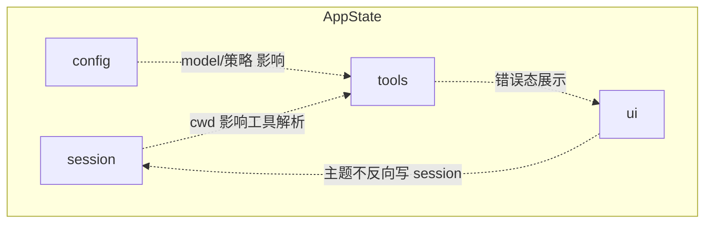
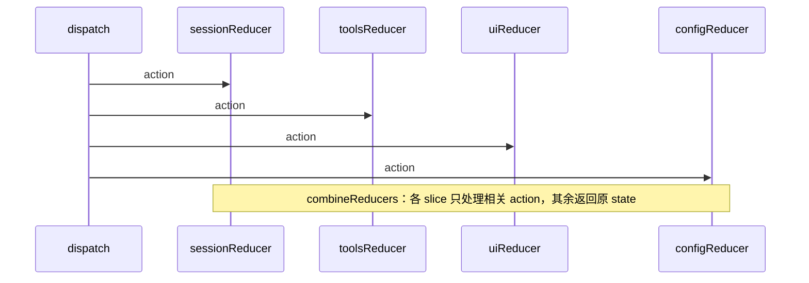

# 第13篇：状态管理 · 第2节 AppState — 全局应用状态组织

> 本节将「会话 / 工具 / UI / 配置」四类关注点收拢到**一棵可类型化的状态树**，并说明与 `createStore` 的衔接方式。

---

## 学习目标

| 能力项 | 说明 |
|--------|------|
| **建模** | 为 CLI/Agent 应用划分 `session`、`tools`、`ui`、`config` 四大域及边界 |
| **类型** | 用 TypeScript 表达嵌套 `AppState`，并定义各 slice 的 action 命名空间 |
| **选择器** | 编写 memo 友好的 selector，避免无关重渲染或重复计算 |
| **安全** | 识别哪些字段属于敏感数据（令牌、路径），在日志与快照中脱敏 |
| **演进** | 预留 `version` 与 `meta` 字段，为迁移节铺路 |

---

## 生活类比：移动指挥所里的四张桌子

一次野外救援，指挥所有四张桌子：**人事签到本**（谁在场上）、**工具清单**（铲子无人机是否可用）、**大屏 UI**（当前展示哪块地图）、**操作手册与规章**（配置）。四张桌子上的信息**彼此有关**但不能混成一本乱账：人事变动可能影响 UI 上显示的队长名，但**规章本子**不该被临时涂改——对应**配置与运行时态分离**。`AppState` 就是把四张桌子的**台账结构**印在一张总表上，值班长（reducer）按规矩更新，任何人抬头都能看到**一致的全局图景**。

---

## AppState 形状（教学示意）

```typescript
// state/appState.ts — 教学示意
export interface SessionSlice {
  sessionId: string;
  cwd: string;
  startedAt: number;
  lastUserMessageAt?: number;
  /** 续接会话时由 History 注入 */
  resumedFromCheckpoint?: string;
}

export interface ToolInvocation {
  id: string;
  name: string;
  status: "pending" | "running" | "success" | "error";
  startedAt: number;
  endedAt?: number;
  /** 仅调试；生产日志应脱敏 */
  argsDigest?: string;
}

export interface ToolsSlice {
  registryVersion: string;
  active: ToolInvocation[];
  lastError?: { code: string; message: string };
}

export interface UiSlice {
  theme: "dark" | "light" | "system";
  layout: "compact" | "comfortable";
  modalStack: string[];
  /** TUI：当前焦点面板 id */
  focusPaneId?: string;
}

export interface ConfigSlice {
  /** 与磁盘 profile 对齐的版本号 */
  schemaVersion: number;
  model: string;
  approvalPolicy: "off" | "ask" | "strict";
  experimental: Record<string, boolean>;
}

export interface AppState {
  session: SessionSlice;
  tools: ToolsSlice;
  ui: UiSlice;
  config: ConfigSlice;
}
```

---

## 根 reducer 组合

```typescript
import { combineReducers, Action, Reducer } from "../store/createStore";

const appReducer: Reducer<AppState> = combineReducers({
  session: sessionReducer,
  tools: toolsReducer,
  ui: uiReducer,
  config: configReducer,
});

export function createAppStore(preloaded?: Partial<AppState>) {
  const initial: AppState = {
    session: defaultSession,
    tools: defaultTools,
    ui: defaultUi,
    config: defaultConfig,
    ...preloaded,
  };
  return createStore(appReducer, initial);
}
```

---

## Action 命名空间约定

| 前缀 | 含义 | 示例 `type` |
|------|------|-------------|
| `session/` | 会话生命周期 | `session/SET_CWD` |
| `tools/` | 工具注册与调用 | `tools/INVOCATION_END` |
| `ui/` | 界面与交互 | `ui/PUSH_MODAL` |
| `config/` | 持久化相关配置 | `config/PATCH` |

统一前缀便于日志过滤与遥测聚合（见第14篇）。

---

## Mermaid：四域依赖（只读视角）



### 图2：dispatch 在各 slice 间的广播



---

## 选择器与派生状态

```typescript
export const selectActiveTool = (s: AppState) =>
  s.tools.active.find((t) => t.status === "running");

export const selectIsModalOpen = (name: string) => (s: AppState) =>
  s.ui.modalStack.includes(name);

/** 派生：是否处于「需要用户注意」状态 */
export const selectNeedsAttention = (s: AppState) =>
  !!s.tools.lastError || s.ui.modalStack.length > 0;
```

| 实践 | 说明 |
|------|------|
| 派生放 selector | 避免在 reducer 存重复字段导致双写 |
| 昂贵计算 memo | 大列表 + 过滤时引入 LRU 或显式缓存键 |
| 禁止 selector 副作用 | 与 reducer 同样保持纯函数 |

---

## 敏感字段与脱敏策略

| 字段示例 | 风险 | 处理 |
|----------|------|------|
| `sessionId` | 关联用户轨迹 | 日志只打 hash 前缀 |
| `tools.active[].argsDigest` | 泄露路径/密钥 | 默认关闭；开启时加盐 hash |
| `config` 内 API 相关 | 合规 | 从不进入匿名遥测 payload |

---

## 与 createStore / 副作用 / 持久化的衔接

| 组件 | 关系 |
|------|------|
| createStore | 承载整棵 `AppState` |
| 副作用同步 | `subscribe` 监听 `config` 或 `session` 变更触发 I/O |
| Memdir | 用户偏好可能映射到 `config.experimental` 或独立 mem 文件 |
| History | `session.resumedFromCheckpoint` 与检查点元数据 |
| Migrations | `config.schemaVersion` 驱动升级脚本 |
| 持久化 | 仅部分 slice 写入 `~/.claude/`（见第7节） |

---

## 表：slice 职责边界

| Slice | 典型 action 来源 | 是否默认持久化 |
|-------|------------------|----------------|
| session | 进程启动、用户输入 | 部分元数据 |
| tools | MCP/内置工具回调 | 通常不 |
| ui | 键盘/配置切换 | 部分 |
| config | 设置页、环境变量合并 | 是 |

---

## 小结

`AppState` 把**运行时真相**结构化：会话提供上下文，工具承载 Agent 能力状态，UI 承载人机交互壳层，配置承载策略与模型选择。四域通过 **action 广播 + selector 派生** 协作，而**敏感数据与持久化边界**需在类型与文档层显式标出。

---

## 自测

1. 为何 `ui` 不应直接写 `session.sessionId`？应通过哪种 action？  
2. `tools.lastError` 清除动作应放在哪个 reducer？是否可能跨 slice？  
3. 若新增 `permissions` slice，对 `combineReducers` 与迁移脚本各有什么影响？

---

**上一节**：[index.md](./index.md) · **下一节**：[03-side-effects.md](./03-side-effects.md)
