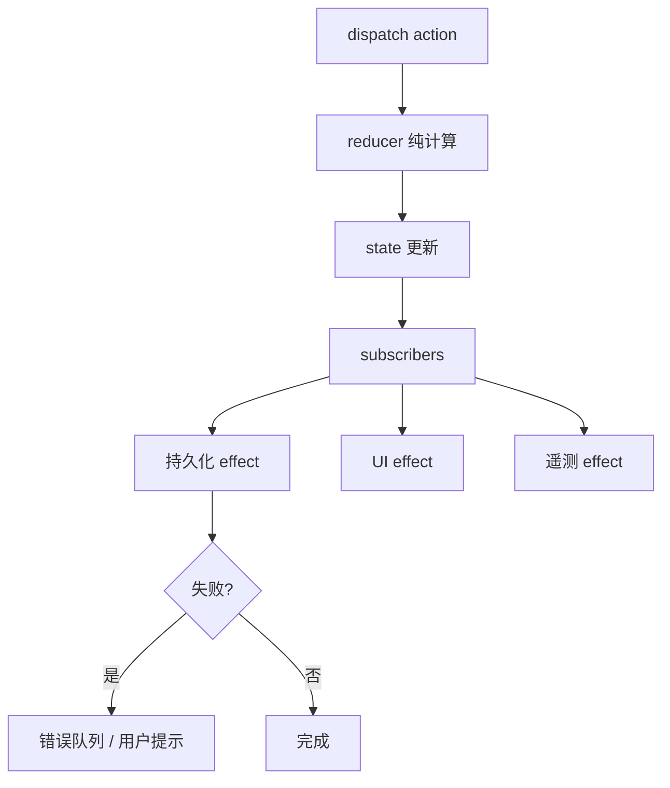
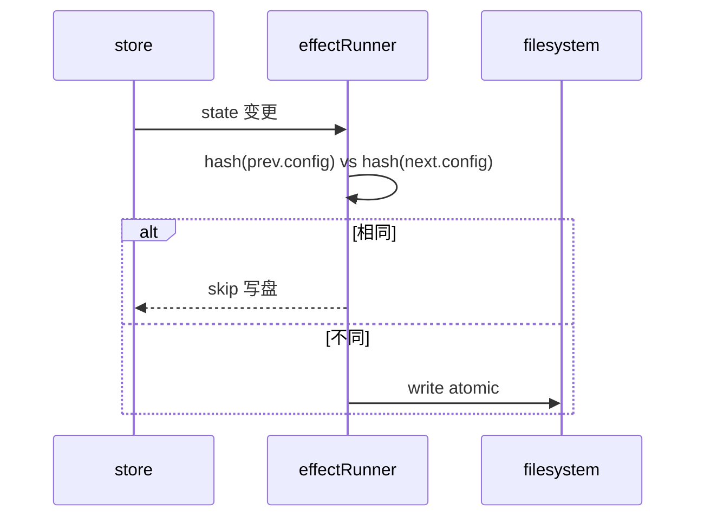

# 第13篇：状态管理 · 第3节 副作用同步 — 状态变更触发外部世界

> reducer 保持纯粹；**副作用**在状态提交之后运行。本节讲解如何把「写文件、刷新 TUI、打点」编排成**可测试、可取消、可去重**的管线。

---

## 学习目标

| 能力项 | 说明 |
|--------|------|
| **分层** | 严格区分「计算下一状态」与「对外界产生影响」 |
| **模式** | 实现 `runEffects(prev, next, action)` 或中间层 `effectScheduler` |
| **幂等** | 对同一 state 指纹不重复写盘或重复上报 |
| **顺序** | 处理 effect 之间的先后依赖（如先持久化再通知 UI） |
| **故障** | effect 失败不反滚已提交 state 时的用户可见策略 |

---

## 生活类比：法院判决书与执行局

法官敲锤定下判决（**新 state 成立**），但**不会亲自去查封账户**。执行局在判决生效后启动（**副作用**）：冻结、划扣、登记公示。若执行失败，**判决书本身通常不会自动作废**——而是走「执行异议 / 重试」流程。同理：store 已更新代表**应用内部真相**已变；写配置文件失败时，可提示用户、重试或回写「脏标记」，而不是悄悄把内存 state 改回旧值造成**双真相**。

---

## 核心模式：订阅 + 差异驱动

```typescript
// effects/sync.ts — 教学示意
export type EffectContext = {
  action: { type: string; payload?: unknown };
  prev: AppState;
  next: AppState;
};

export type Effect = (ctx: EffectContext) => void | Promise<void>;

export function attachSideEffects(store: Store<AppState>, effects: Effect[]) {
  let prev = store.getState();
  return store.subscribe(() => {
    const next = store.getState();
    const action = (store as unknown as { __lastAction?: EffectContext["action"] })
      .__lastAction ?? { type: "@@/UNKNOWN" };
    const ctx = { action, prev, next };
    for (const fx of effects) {
      void Promise.resolve(fx(ctx)).catch((e) => {
        console.error("[effect]", e);
      });
    }
    prev = next;
  });
}
```

> 生产实现中应在 `dispatch` 包装器里传入**真实 lastAction**，上例仅展示结构。

### 带 lastAction 的 dispatch 包装

```typescript
export function withEffectContext(store: Store<AppState>) {
  const raw = store.dispatch.bind(store);
  let last: { type: string; payload?: unknown } = { type: "@@/INIT" };
  store.dispatch = (a) => {
    last = a;
    return raw(a);
  };
  return { ...store, getLastAction: () => last };
}
```

---

## 典型 effect 表

| Effect | 触发条件 | 行为 |
|--------|----------|------|
| persistConfig | `next.config !== prev.config` | 写入 `~/.claude/settings` |
| flushMemdir | `action.type === 'memdir/DIRTY'` | 同步偏好目录 |
| repaintTUI | `ui` 任意浅变 | 局部 diff 渲染 |
| telemetry | 关键 action | 匿名事件队列 |
| auditLog | 工具调用结束 | 追加本地只读日志 |

---

## Mermaid：effect 管线



### 图2：幂等指纹



---

## 源码片段：去重写盘

```typescript
let lastConfigFingerprint = "";

function fingerprintConfig(c: AppState["config"]): string {
  return JSON.stringify({
    v: c.schemaVersion,
    model: c.model,
    policy: c.approvalPolicy,
    exp: c.experimental,
  });
}

const persistConfigEffect: Effect = async ({ prev, next }) => {
  const fp = fingerprintConfig(next.config);
  if (fp === lastConfigFingerprint) return;
  if (fp === fingerprintConfig(prev.config)) return;
  lastConfigFingerprint = fp;
  await atomicWriteJson("~/.claude/settings.json", next.config);
};
```

---

## 与 Memdir / History 的协作

| 模块 | effect 角色 |
|------|-------------|
| Memdir | `memdir/DIRTY` 或定时 flush；避免每次按键写盘 |
| History | checkpoint 前 snapshot `session` + 压缩消息列表 |
| Migrations | 在 **hydrate 之后**、**业务 dispatch 之前**跑一次性升级 effect |

---

## 故障与一致性

| 场景 | 推荐策略 |
|------|----------|
| 写盘失败 | `ui` 显示「设置未保存」；内存 state 保持新值 |
| 遥测失败 | 队列落本地，下次启动重发 |
| UI 重绘抛错 | 边界组件捕获，不影响 store |
| 高频 action | `requestAnimationFrame` 或 debounce 合并 repaint |

---

## 表：禁止 vs 允许

| 位置 | 禁止 | 允许 |
|------|------|------|
| reducer | `fs`、`fetch`、随机数 | 纯计算 |
| selector | I/O、Date.now 用于缓存键 | 纯派生 |
| effect | 修改 reducer 输入的旧对象 | 读 `next`、调用外部 API |

---

## 小结

副作用同步的本质是：**先承认新状态，再与世界对齐**。通过 `subscribe` + `prev/next` 对比 + 指纹去重，可以在不引入重型中间件的前提下，保持 Claude Code 风格应用的**可测性与可恢复性**。

---

## 自测

1. 若 effect 内再次 `dispatch`，需注意哪些死锁或顺序问题？  
2. 如何把「仅会话结束写一次」与「配置立即写」放在同一 runner？  
3. `atomicWriteJson` 在实现上通常用什么策略避免半写文件？

---

## 进阶：按 action 类型的 effect 注册表

将 effect 从线性数组改为**模式匹配**，可降低无关调用的空转成本（大状态树时尤其明显）：

```typescript
type EffectMap = Partial<Record<string, Effect[]>>;

export function attachKeyedEffects(
  store: Store<AppState>,
  map: EffectMap,
  getLastAction: () => { type: string }
) {
  let prev = store.getState();
  return store.subscribe(() => {
    const next = store.getState();
    const action = getLastAction();
    const list = map[action.type] ?? [];
    const ctx = { action, prev, next };
    for (const fx of list) void Promise.resolve(fx(ctx)).catch(console.error);
    prev = next;
  });
}
```

| 设计点 | 说明 |
|--------|------|
| 默认桶 `*` | 可放「任意 action 都跑」的遥测 |
| 顺序 | 同 type 多 effect 时数组顺序即执行序 |
| 测试 | 对 `map['tools/INVOCATION_END']` 单测即可隔离 |

---

## 与架构全景（第8节）的对照

副作用层是**有向无环图**上的叶节点：只读 `next`、写外部世界，**禁止**再经隐蔽通道改写 reducer 输入。这样在全链路调试时，只需比对「action 序列 + 最终 state」，不必猜测某个定时器是否偷偷改了内存。

---

**上一节**：[02-app-state.md](./02-app-state.md) · **下一节**：[04-memdir.md](./04-memdir.md)
