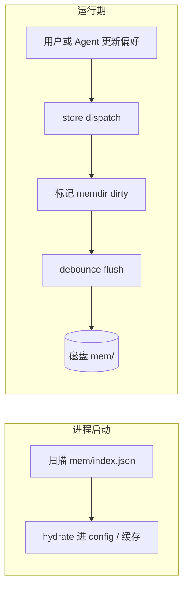
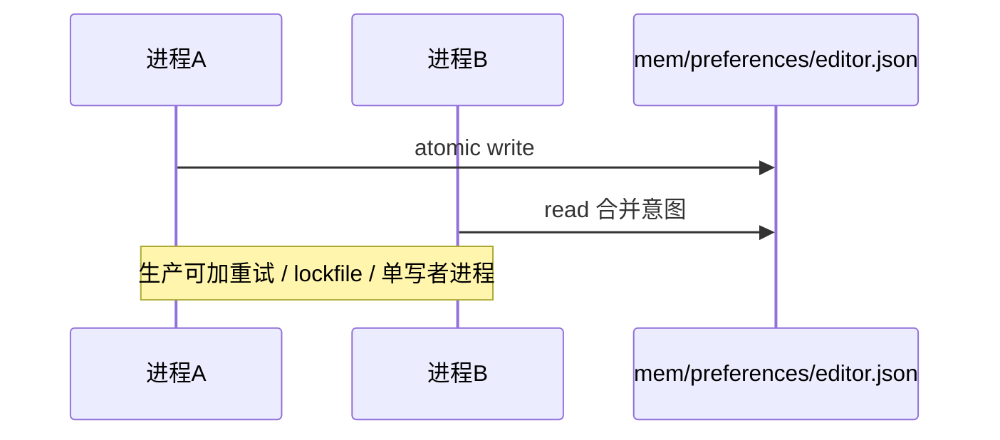

# 第13篇：状态管理 · 第4节 Memdir — 基于文件系统的记忆目录

> **Memdir** 指一类「把结构化偏好与长期记忆落在磁盘目录」的方案：人类可读、可 diff、可备份，并与 `AppState` / 副作用层松耦合。

---

## 学习目标

| 能力项 | 说明 |
|--------|------|
| **布局** | 设计 `~/.claude/mem/` 下多级目录与文件命名规范 |
| **原子性** | 使用临时文件 + rename 保证崩溃下不损坏主文件 |
| **模式** | 区分「键值偏好」「片段记忆」「索引清单」三类文档 |
| **同步** | 与 store 的 `subscribe` 或显式 `flush()` 协调 |
| **隐私** | 用户可整体打包导出或 `.gitignore` 式排除 |

---

## 生活类比：书房抽屉里的分类便签

有人喜欢把所有备忘写在一个巨型 Word 里——**难找、难合并**。Memdir 像是在书房设了**多个贴好标签的抽屉**：「常用联系人」「菜谱」「项目 A 灵感」。每张便签是一张**独立小文件**，搬家时整抽屉端走即可。Agent 读记忆时不必一次加载全部，可按**路径约定**只打开相关抽屉，**降低 token 与延迟**。

---

## 目录结构示意

```text
~/.claude/
├── settings.json          # 配置（非 memdir 本体，常与之并列）
└── mem/
    ├── preferences/
    │   ├── editor.json
    │   └── shortcuts.yaml
    ├── projects/
    │   └── acme-app/
    │       ├── context.md
    │       └── decisions/
    │           └── 2026-04-02-auth.md
    └── index.json         # 可选：轻量索引，指向热点文件
```

---

## 读写 API 示意

```typescript
// memdir/Memdir.ts — 教学示意
import fs from "node:fs/promises";
import path from "node:path";

export class Memdir {
  constructor(private root: string) {}

  private resolve(rel: string): string {
    const full = path.join(this.root, rel);
    if (!full.startsWith(this.root)) throw new Error("path traversal");
    return full;
  }

  async readText(rel: string): Promise<string | null> {
    try {
      return await fs.readFile(this.resolve(rel), "utf8");
    } catch {
      return null;
    }
  }

  async writeTextAtomic(rel: string, body: string): Promise<void> {
    const target = this.resolve(rel);
    await fs.mkdir(path.dirname(target), { recursive: true });
    const tmp = `${target}.${process.pid}.tmp`;
    await fs.writeFile(tmp, body, "utf8");
    await fs.rename(tmp, target);
  }

  async mergeJson(rel: string, patch: Record<string, unknown>): Promise<void> {
    const raw = (await this.readText(rel)) ?? "{}";
    const cur = JSON.parse(raw) as Record<string, unknown>;
    const next = { ...cur, ...patch };
    await this.writeTextAtomic(rel, JSON.stringify(next, null, 2));
  }
}
```

---

## 与 AppState 的映射

| AppState 路径 | Memdir 文件 | 说明 |
|---------------|-------------|------|
| `config.experimental` | `mem/preferences/flags.json` | 可与 feature flags 叠加 |
| 项目级上下文 | `mem/projects/<slug>/context.md` | 长文，按需加载 |
| 用户显式「记住」 | `mem/preferences/user-notes.md` | 人工可编辑 |

---

## Mermaid：加载与脏写回



### 图2：多进程与文件锁（概念）



---

## 结构化存储：Markdown + frontmatter

```markdown
---
id: decision-auth-20260402
project: acme-app
tags: [auth, oauth]
---

# 决策：采用 OAuth2+PKCE

原因：……
```

解析时先读 YAML 头，正文供人类与 Agent 共读。

---

## 表：Memdir vs 单一大 JSON

| 维度 | Memdir 多文件 | 单文件 JSON |
|------|---------------|-------------|
| 合并冲突 | 文件级，较易手工解决 | 整文件冲突 |
| 部分读取 | 易 | 需解析全量 |
| 备份 | rsync 友好 | 单点 |
| 一致性 | 需索引或约定 | 天然单快照 |

---

## 副作用集成片段

```typescript
let dirty = false;
let timer: NodeJS.Timeout | null = null;

export function scheduleMemdirFlush(mem: Memdir, getSlice: () => object) {
  dirty = true;
  if (timer) clearTimeout(timer);
  timer = setTimeout(async () => {
    if (!dirty) return;
    dirty = false;
    await mem.writeTextAtomic(
      "preferences/editor.json",
      JSON.stringify(getSlice(), null, 2)
    );
  }, 400);
}
```

---

## 隐私与合规

| 项 | 建议 |
|----|------|
| 路径 | 默认在用户 home，不进入项目仓库 |
| 导出 | 提供「导出记忆包」显式勾选范围 |
| 清理 | `claude mem purge --older-than` 类命令（教学名） |

---

## 小结

Memdir 用**文件系统当数据库**：扩展性好、可人工审计、与 Git 式工作流相容。关键是 **原子写、路径净化、脏标记 + debounce**，以及与 `AppState` 的**单向数据流**（state 为源，磁盘为投影）。

---

## 自测

1. 为何 `writeTextAtomic` 要先写临时文件再 `rename`？  
2. `index.json` 与真实文件不同步时如何修复？  
3. 多机器同步 Memdir 时有哪些冲突解决策略？

---

**上一节**：[03-side-effects.md](./03-side-effects.md) · **下一节**：[05-history.md](./05-history.md)
