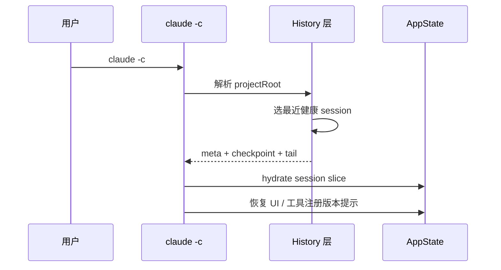
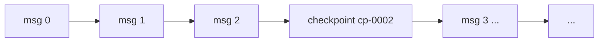

# 第13篇：状态管理 · 第5节 History — 会话历史与续接（claude -c）

> 会话历史不仅是聊天记录：**检查点、元数据、工具轨迹**共同决定能否可靠 **resume**。本节以 `claude -c` 心智模型讲解 History 的存储与回放。

---

## 学习目标

| 能力项 | 说明 |
|--------|------|
| **模型** | 区分 transcript、checkpoint、session manifest |
| **续接** | 解释 `-c` / `--continue` 如何定位最近可恢复会话 |
| **压缩** | 长会话下裁剪与摘要策略对 state 的影响 |
| **一致** | 恢复后 `sessionId`、cwd、工具注册版本的对齐 |
| **排错** | 损坏历史文件时的降级路径（新建会话、只读模式） |

---

## 生活类比：电视剧的「上一集回顾」

追剧时点「继续观看」，播放器要知：**哪一季哪一集**、**上次看到第几分钟**、**字幕语言**是否照旧。若云端记录损坏，至少从头播——对应 **无法续接则新开 session**。History 就是这份**播放进度 + 剧情摘要**：全量台词（transcript）太大时，用「前情提要」（摘要 checkpoint）换体积。

---

## 历史数据分层

```text
~/.claude/
├── projects/
│   └── <project-hash>/
│       ├── sessions/
│       │   └── <session-id>/
│       │       ├── transcript.jsonl
│       │       ├── checkpoints/
│       │       │   └── cp-0007.json
│       │       └── meta.json
│       └── ...
└── cache/   # 可选：嵌入向量等，续接时非必须
```

| 文件 | 用途 |
|------|------|
| `transcript.jsonl` | 追加式消息流，一行一条事件 |
| `checkpoints/*.json` | 周期性快照：消息游标 + 摘要 + 关键 tool 结果引用 |
| `meta.json` | `startedAt`、`cwd`、`model`、`cliVersion` |

---

## 元数据类型示意

```typescript
// history/types.ts — 教学示意
export interface SessionMeta {
  sessionId: string;
  projectPath: string;
  cwd: string;
  cliVersion: string;
  model: string;
  createdAt: string;
  updatedAt: string;
  /** 续接链：父 session（fork 场景） */
  parentSessionId?: string;
}

export interface TranscriptLine {
  ts: string;
  role: "user" | "assistant" | "tool" | "system";
  /** 工具事件可含 invocation id */
  payload: Record<string, unknown>;
}

export interface Checkpoint {
  id: string;
  atMessageIndex: number;
  summary: string;
  /** 大 payload 仅存引用，不内联全文 */
  artifactRefs?: string[];
}
```

---

## 续接流程（claude -c）

```typescript
// history/resume.ts — 教学示意
export async function findLatestResumableSession(
  projectRoot: string
): Promise<SessionMeta | null> {
  const sessions = await listSessions(projectRoot);
  const sorted = sessions.sort(
    (a, b) => Date.parse(b.updatedAt) - Date.parse(a.updatedAt)
  );
  for (const m of sorted) {
    if (await isSessionHealthy(m)) return m;
  }
  return null;
}

export async function continueSession(meta: SessionMeta): Promise<LoadResult> {
  const cp = await loadLatestCheckpoint(meta.sessionId);
  const tail = await readTranscriptTail(meta.sessionId, cp?.atMessageIndex);
  return { meta, checkpoint: cp, tail };
}
```

---

## Mermaid：续接时序



### 图2：消息流与检查点



---

## 与 AppState 的映射

| History 字段 | AppState |
|--------------|----------|
| `sessionId` | `session.sessionId` |
| `cwd` | `session.cwd` |
| `checkpoint.id` | `session.resumedFromCheckpoint` |
| 工具版本漂移 | `tools.registryVersion` 与警告横幅 |

---

## 压缩与裁剪策略

| 策略 | 优点 | 风险 |
|------|------|------|
| 固定窗口保留 N 条 | 实现简单 | 丢早期上下文 |
| 摘要 checkpoint | 体积小 | 摘要失真 |
| 工具结果外置 | transcript 轻 | 引用失效需检测 |
| 用户手动 `/compact` | 可控 | 需产品暴露 |

---

## 表：健康检查 isSessionHealthy

| 检查项 | 失败处理 |
|--------|----------|
| `meta.json` 可读 | 跳过 |
| transcript 尾部 JSON 合法 | 尝试截断修复或跳过 |
| checkpoint 索引 ≤ 消息数 | 丢弃无效 checkpoint |
| 磁盘只读 | 提示无写权限，禁止续接写模式 |

---

## 源码片段：追加 transcript

```typescript
export async function appendTranscriptLine(
  sessionId: string,
  line: TranscriptLine
): Promise<void> {
  const p = transcriptPath(sessionId);
  await fs.appendFile(p, JSON.stringify(line) + "\n", "utf8");
}
```

生产环境可配合 **文件锁** 或 **单写队列** 避免并发 CLI 实例撕裂 jsonl。

---

## 多实例与锁

```typescript
// 简化：advisory lock 文件
export async function withSessionLock<T>(
  sessionId: string,
  fn: () => Promise<T>
): Promise<T> {
  const lockPath = path.join(sessionDir(sessionId), ".lock");
  const fd = await fs.open(lockPath, "wx").catch(() => null);
  if (!fd) throw new Error("session busy");
  try {
    return await fn();
  } finally {
    await fd.close();
    await fs.rm(lockPath).catch(() => {});
  }
}
```

---

## 小结

History 让 **时间维度** 成为一等公民：`transcript` 保真、`checkpoint` 换空间、`meta` 保上下文。`claude -c` 是「从磁盘hydrate 到内存 AppState」的用户可见入口；**健康检查与原子追加**决定体验是否可靠。

---

## 自测

1. 续接时若模型从 A 换成 B，应在哪一层提示用户？  
2. checkpoint 的 `atMessageIndex` 与 jsonl 行号如何对齐（含 system 行）？  
3. 为何工具大结果适合外置 artifact 而非内联 transcript？

---

**上一节**：[04-memdir.md](./04-memdir.md) · **下一节**：[06-migrations.md](./06-migrations.md)
