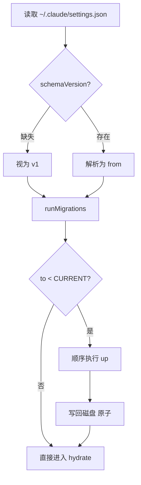
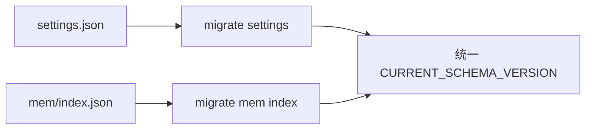

# 第13篇：状态管理 · 第6节 Migrations — 配置文件版本迁移

> 用户目录里的 `settings.json`、`feature` 清单、Memdir 索引会随 CLI 版本演进。**Migration** 在启动早期把旧格式抬升到当前 `schemaVersion`，避免「新代码读旧文件」静默出错。

---

## 学习目标

| 能力项 | 说明 |
|--------|------|
| **版本** | 在配置根上维护单调递增 `schemaVersion` |
| **管线** | 实现 `runMigrations(from, to)` 链式或阶梯式升级 |
| **幂等** | 同一版本重复运行不产生差异 |
| **回滚** | 区分「不可回滚」字段与用户显式备份 |
| **测试** | fixture 覆盖 v1→v2→v3 全路径 |

---

## 生活类比：户籍系统升级

一代身份证换二代，不是让办事员**脑内兼容**两种底卡，而是**集中换发**：旧数据读入 → 按规则补全字段 → 写入新卡 → 更新「档案版本号」。若某人已经二代证，窗口**不应再打孔换一遍**——对应迁移的**幂等**。若新系统发现字段非法，应**拒绝启动并提示备份路径**，而不是写半个文件。

---

## 迁移记录结构

```typescript
// migrations/types.ts — 教学示意
export type Migration = {
  /** 应用此迁移后应达到的版本 */
  version: number;
  /** 人类可读说明 */
  description: string;
  up: (raw: unknown) => unknown;
};

export const CURRENT_SCHEMA_VERSION = 7;

export const migrations: Migration[] = [
  {
    version: 2,
    description: "rename approvalMode -> approvalPolicy",
    up: (raw) => {
      const o = raw as Record<string, unknown>;
      if (typeof o.approvalMode === "string" && o.approvalPolicy == null) {
        o.approvalPolicy = o.approvalMode;
        delete o.approvalMode;
      }
      return o;
    },
  },
  {
    version: 3,
    description: "nest experimental flags under experimental{}",
    up: (raw) => {
      const o = raw as Record<string, unknown>;
      const legacy = o.experimental;
      if (legacy != null && typeof legacy === "object") return o;
      const flags = { ...o } as Record<string, unknown>;
      const experimental: Record<string, boolean> = {};
      for (const k of Object.keys(flags)) {
        if (k.startsWith("feat.")) {
          experimental[k.slice(5)] = Boolean(flags[k]);
          delete flags[k];
        }
      }
      flags.experimental = experimental;
      return flags;
    },
  },
  // ... 递增
];
```

---

## 运行器

```typescript
export function runMigrations(
  raw: unknown,
  migrationsSorted: Migration[],
  targetVersion: number
): { value: unknown; from: number; to: number } {
  const obj =
    raw && typeof raw === "object"
      ? (raw as Record<string, unknown>)
      : ({} as Record<string, unknown>);
  let from = Number(obj.schemaVersion ?? 1);
  if (!Number.isFinite(from)) from = 1;

  let cur = obj;
  for (const m of migrationsSorted) {
    if (m.version <= from) continue;
    if (m.version > targetVersion) break;
    cur = m.up(cur) as Record<string, unknown>;
    cur.schemaVersion = m.version;
    from = m.version;
  }
  return { value: cur, from, to: targetVersion };
}
```

---

## Mermaid：启动时迁移顺序



### 图2：多文件迁移（Memdir + settings）



---

## 表：迁移 vs 运行时 patch

| 维度 | Migration（启动） | dispatch `config/PATCH` |
|------|-------------------|-------------------------|
| 触发 | 进程启动一次 | 任意时刻 |
| 用户感知 | 可打日志「已升级配置」 | 即时 |
| 回滚 | 备份旧文件 | 内存级 undo 栈（可选） |
| 失败 | 阻断启动或降级默认 | 提示错误，保持旧 config |

---

## 备份策略

```typescript
export async function migrateWithBackup(
  filePath: string,
  targetVersion: number
): Promise<void> {
  const raw = JSON.parse(await fs.readFile(filePath, "utf8"));
  const backup = `${filePath}.bak.${Date.now()}`;
  await fs.copyFile(filePath, backup);
  const { value } = runMigrations(raw, migrations, targetVersion);
  await atomicWriteJson(filePath, value);
}
```

| 策略 | 说明 |
|------|------|
| 时间戳备份 | 简单；磁盘增长需轮转 |
| 单备份 `.bak` | 覆盖；节省空间 |
| 用户环境变量跳过 | `CLAUDE_NO_CONFIG_MIGRATION=1`（教学名） |

---

## 测试 fixture 示例

```typescript
describe("migrations", () => {
  it("v1 -> v2 renames approvalMode", () => {
    const raw = { approvalMode: "ask" };
    const { value } = runMigrations(raw, migrations, 2);
    expect((value as any).approvalPolicy).toBe("ask");
    expect((value as any).approvalMode).toBeUndefined();
  });
});
```

---

## 与 Feature Flags 的交界

| 情况 | 处理 |
|------|------|
| 旧文件含已删除 flag | 迁移 `up` 里 strip，并记录日志 |
| 新 flag 默认值 | 在 reducer `initialState` 合并，而非迁移硬编码业务默认值 |
| A/B 与 schema | schema 只描述**形状**；实验由 flags 层控制 |

---

## 小结

Migrations 是**时间旅行中的护栏**：通过 `schemaVersion` 与有序 `up` 函数，把「用户磁盘上的过去」安全映射到「当前代码的现在」。**备份 + 原子写 + 幂等**是生产三件套。

---

## 自测

1. 为何 `up` 不应依赖网络或读取全局单例？  
2. 若用户手动把 `schemaVersion` 改大，会发生什么？如何防御？  
3. 分支版本 hotfix 与 migration 版本号如何协调（git vs schema）？

---

**上一节**：[05-history.md](./05-history.md) · **下一节**：[07-persistence.md](./07-persistence.md)
