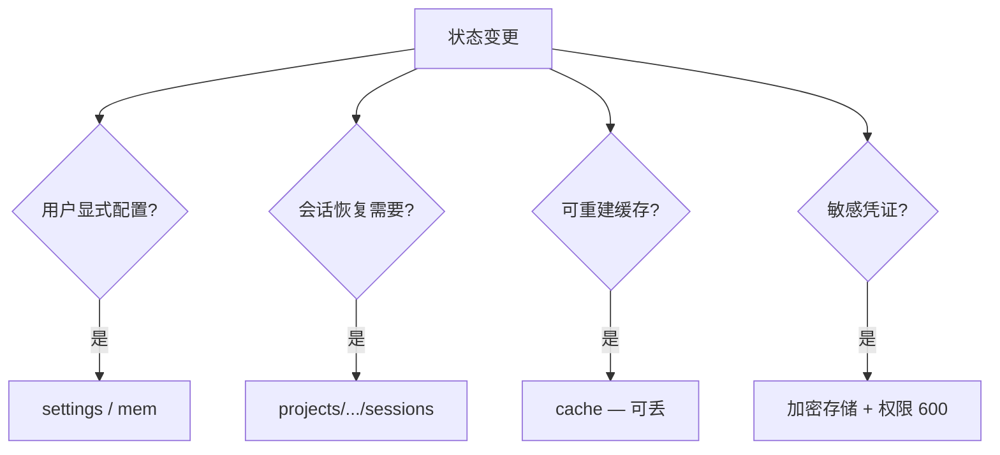
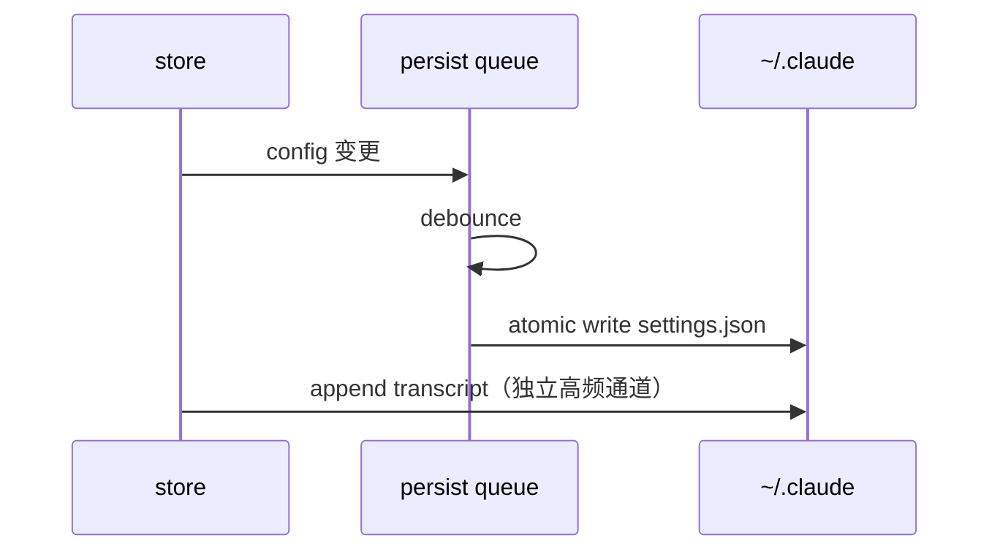

# 第13篇：状态管理 · 第7节 持久化策略 — 什么该留下、什么该随风

> 并非所有 `AppState` 都值得写入磁盘。**持久化策略**在隐私、性能与可恢复性之间划界：`~/.claude/` 是默认大本营，但子目录职责各不相同。

---

## 学习目标

| 能力项 | 说明 |
|--------|------|
| **分类** | 列举应持久化 / 会话级 / 纯内存三类状态 |
| **位置** | 默认识别 `~/.claude/` 下各子路径职责 |
| **粒度** | 决定同步写、debounce、退出时 flush |
| **清理** | 缓存与日志轮转策略 |
| **跨机** | 哪些目录可安全同步（Syncthing、dotfiles 仓库） |

---

## 生活类比：行李箱与酒店房卡

**托运大箱** = 持久化配置与长期记忆（回家还要用）。**随身小包** = 会话内临时状态（退房即弃）。**酒店房卡** = 纯内存 token（丢卡可补办，不应复印一份贴墙上）。错误地把房卡复印件存进托运箱，等于把**短期凭证长期化**——安全风险。持久化策略就是：**什么进托运、什么只揣兜里**。

---

## ~/.claude/ 布局总表

| 路径 | 内容类型 | 典型持久化 | 备注 |
|------|----------|------------|------|
| `settings.json` | 用户配置 | 是 | 经 migrations |
| `mem/**` | Memdir 偏好与笔记 | 是 | 用户可读 |
| `projects/**/sessions/**` | History | 是 | 可体积大 |
| `cache/**` | 嵌入、索引 | 可丢 | 可重建 |
| `logs/**` | 诊断日志 | 轮转 | 敏感需脱敏 |
| `plugins/**` | 扩展 | 视安装方式 | 版本化 |
| `.credentials` 类 | OAuth token | 是（加密最佳） | 权限严格 |

---

## AppState slice 持久化矩阵

| Slice | 持久化 | 理由 |
|-------|--------|------|
| `config` | 是 | 用户显式选择应跨会话保留 |
| `session` | 部分 | `sessionId`/cwd 写入 meta；瞬时指针不必 |
| `tools.active` | 否 | 进程内队列；续接时重建 |
| `tools.registryVersion` | 可写入 meta | 续接一致性 |
| `ui.theme` | 是 | 用户偏好 |
| `ui.modalStack` | 否 | 会话 UI 瞬态 |
| `tools.lastError` | 否 | 提示后即消 |

---

## 策略代码示意

```typescript
// persistence/policy.ts — 教学示意
export const PERSIST_DEBOUNCE_MS = 400;

export function shouldPersistConfig(prev: AppState, next: AppState): boolean {
  return prev.config !== next.config;
}

export function shouldTouchSessionMeta(prev: AppState, next: AppState): boolean {
  return (
    prev.session.sessionId !== next.session.sessionId ||
    prev.session.cwd !== next.session.cwd
  );
}

export function ephemeralSlices(): (keyof AppState)[] {
  return []; // 不持久化整 slice；仅持久化投影
}
```

---

## Mermaid：数据落盘决策树



### 图2：写入时序



---

## 丢弃策略

| 数据 | 丢弃时机 | 实现 |
|------|----------|------|
| 内存 tool 队列 | 进程退出 | 自然 GC |
| cache | 磁盘配额 / TTL | LRU |
| 旧 session | 用户 prune 命令 | 按日期归档 |
| 实验性 UI 状态 | 每次启动 | 不 hydrate |

---

## 环境变量与覆盖（教学名）

| 变量 | 作用 |
|------|------|
| `CLAUDE_CONFIG_DIR` | 替换 `~/.claude` 根 |
| `XDG_CONFIG_HOME` | 与 Linux FHS 对齐时的基路径 |
| `CLAUDE_NO_PERSIST` | 干跑模式，不写盘（测试） |

---

## 安全基线

```typescript
export async function ensurePrivateDir(dir: string) {
  await fs.mkdir(dir, { recursive: true, mode: 0o700 });
}
```

| 项 | 建议 |
|----|------|
| settings | `chmod 600` |
| token 文件 | 避免 world-readable |
| 日志 | 默认不含 API key；过滤 env |

---

## 与 History / Memdir 的协同

| 模块 | 持久化角色 |
|------|------------|
| History | 大块：transcript + checkpoint |
| Memdir | 中块：偏好与笔记 |
| settings | 小块：结构化配置 |
| 冲突 | Memdir 与 settings 勿重复存同一真相源 |

---

## 表：同步到多台机器

| 目录 | 适合 dotfiles | 风险 |
|------|---------------|------|
| `settings.json` | 高 | 模型默认值可能不同机不同 |
| `mem/` | 中 | 冲突需人工合并 |
| `cache/` | 否 | 体积与机器相关 |
| `sessions/` | 低-中 | 可同步但体积大 |

---

## 小结

持久化策略回答三个问题：**要不要存、存哪、何时写**。`config` 与 `ui` 偏好进 settings/Memdir；**会话真相**进 projects sessions；**工具运行时队列**留在内存；**缓存**随时可牺牲。统一根目录 `~/.claude/` 降低支持成本。

---

## 自测

1. 为何 transcript 适合 append，而 settings 适合全量原子写？  
2. debounce 与「进程被 kill -9」如何折中（退出钩子）？  
3. `CLAUDE_CONFIG_DIR` 改变后 History 旧路径如何迁移或提示？

---

## 退出钩子与 fsync 策略

| 信号 | 行为 |
|------|------|
| `SIGINT` / `SIGTERM` | 清空 debounce 队列并同步 flush |
| `uncaughtException` | 尽力写 `crash.json`；避免复杂逻辑 |
| `kill -9` | 无法捕获；依赖原子写与下次启动修复 |

```typescript
export function registerExitFlush(flush: () => Promise<void>) {
  const run = () => {
    void flush().finally(() => process.exit(0));
  };
  process.on("SIGINT", run);
  process.on("SIGTERM", run);
}
```

生产环境可酌情对关键文件 `fsync`，在**延迟**与**崩溃丢失窗口**之间取舍。

---

## 配额与轮转（日志 / cache）

| 类型 | 建议上限 | 动作 |
|------|----------|------|
| 单会话 transcript | 例如 512MB | 强制 checkpoint + 截断 |
| 全局 cache | 例如 2GB | LRU |
| 诊断日志 | 按日 + 总大小 | 压缩归档 |

---

**上一节**：[06-migrations.md](./06-migrations.md) · **下一节**：[08-overview.md](./08-overview.md)
