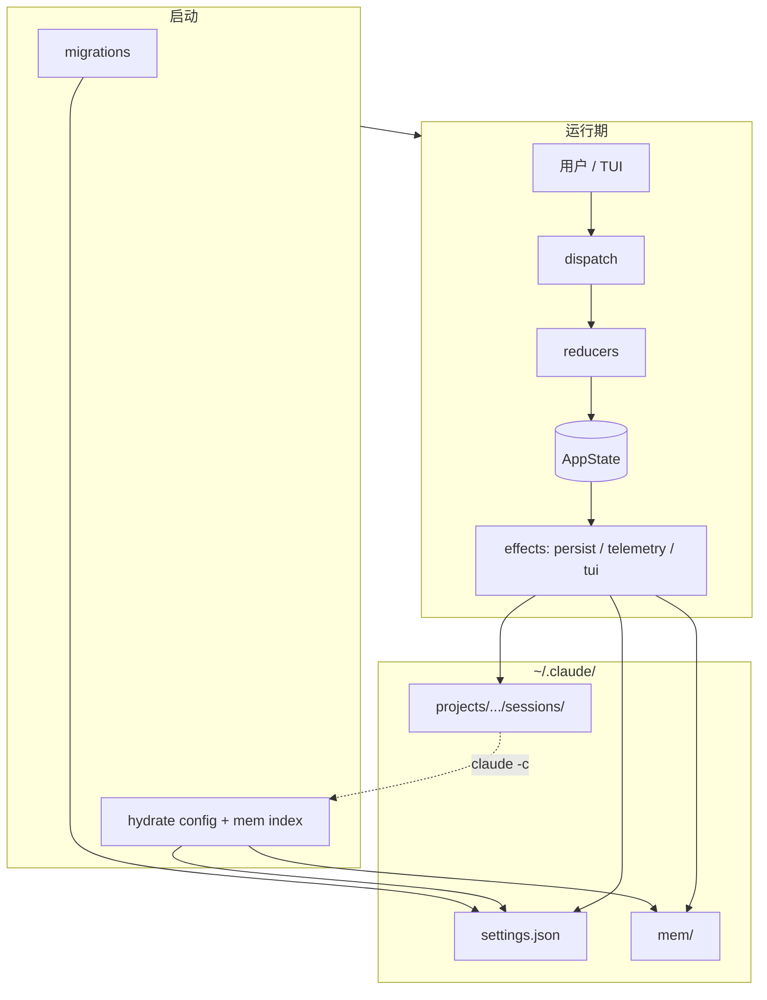
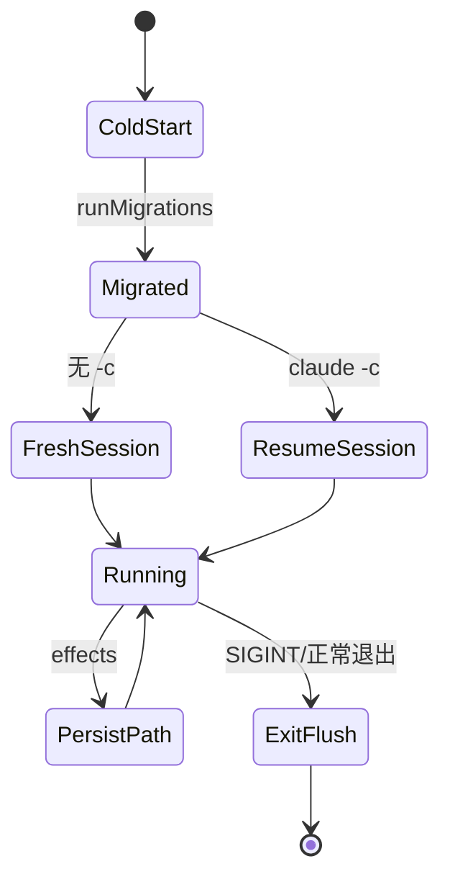

# 第13篇：状态管理 · 第8节 架构全景 — 状态流转总图

> 本节串联第1–7节：**createStore → AppState → 副作用 → Memdir / History → Migrations → 持久化**，形成一张可贴在墙上的**状态架构全景**。

---

## 学习目标

| 能力项 | 说明 |
|--------|------|
| **口述** | 三分钟讲清「一次用户输入到磁盘落点」全链路 |
| **绘图** | 独立画出主数据流与次要 I/O 流 |
| **权衡** | 解释为何 reducer 保持纯、副作用外置 |
| **运维** | 指出备份 `~/.claude` 时最小必要集 |
| **扩展** | 新增 slice 时检查清单 |

---

## 生活类比：城市供水排水一张图

**水厂**（配置与长期记忆）经**主干管**（`dispatch`）送到**小区水箱**（`AppState`）。住户开水龙头（UI）只是**末端读取**。用水后**污水**经另一套管网排出（副作用：日志、遥测、写盘）——**绝不能**让污水倒灌进水厂处理前的清水池（reducer）。全景图就是**清水系统与污水系统分色标注**，应急时知道关哪道阀。

---

## 一张总表：模块 × 职责

| 模块 | 职责 | 典型 I/O |
|------|------|----------|
| createStore | 状态容器 API | 无 |
| AppState | 四域结构 | 无 |
| 副作用同步 | 投影到世界 | FS、TUI、网络 |
| Memdir | 结构化用户记忆 | FS 目录树 |
| History | 会话续接 | jsonl、checkpoint |
| Migrations | 配置版本 | 读改写 settings |
| 持久化策略 | 决策何时写 | 调度 debounce |

---

## Mermaid：状态流转全景（主图）



---

## Mermaid：续接与日常双模式（辅图）



---

## 端到端序列：用户改主题

```typescript
// 仅叙事用伪代码串联
dispatch({ type: "ui/SET_THEME", payload: "dark" });
// 1) uiReducer 返回新 state
// 2) subscriber: repaintTUI
// 3) subscriber: persistConfig 若 theme 镜像在 config（依产品设计）
// 4) debounce 写 ~/.claude/settings.json
```

| 步骤 | 纯 / 副作用 |
|------|-------------|
| reducer 计算 | 纯 |
| TUI 绘制 | 副作用 |
| 写 settings | 副作用 |

---

## 扩展检查清单（新增 slice）

| # | 检查项 |
|---|--------|
| 1 | 是否属于 session/tools/ui/config 之一？否则新建顶层 key 需迁移 |
| 2 | reducer 是否纯？ |
| 3 | 是否需要 Memdir 投影？避免与 settings 双写 |
| 4 | 是否进入 transcript？工具类事件注意脱敏 |
| 5 | 默认持久化矩阵中打勾 |
| 6 | 增加 migration 若磁盘形状变化 |

---

## 备份最小集（用户视角）

| 包含 | 说明 |
|------|------|
| `settings.json` | 恢复偏好 |
| `mem/` | 恢复长期笔记 |
| `projects/**/sessions/` | 续接对话（可选，体积大） |
| 不含 `cache/` | 可重建 |

---

## 与第14篇的接口

| 本篇输出 | 第14篇消费 |
|----------|------------|
| 稳定 AppState 形状 | API 客户端错误态写入 `tools.lastError` |
| effect 管线 | 遥测 batch 发送 |
| config | OAuth token 路径、feature flags 默认值 |

---

## 表：读本篇各节顺序建议

| 读者背景 | 顺序 |
|----------|------|
| 前端 Redux 经验 | 1 → 2 → 3 → 8 → 4–7 |
| 运维 / 用户 | 7 → 5 → 4 → 8 |
| 贡献者 | 1 → 2 → 3 → 6 → 5 → 4 → 7 → 8 |

---

## 小结

Claude Code 风格应用的状态架构可概括为：**纯内核（store + reducer）+ 脏边缘（effects）+ 分层磁盘（settings / mem / sessions）+ 启动护栏（migrations）**。记住一句：**状态先真，世界后追**；全景图即是这句的工程展开。

---

## 自测

1. 画出「API 错误」从第14篇进入本篇 state 再反映到 UI 的路径。  
2. 若移除所有副作用，应用还能否「技术上运行」？缺什么？  
3. `claude -c` 在全景图中跨越了哪些子系统？

---

**上一节**：[07-persistence.md](./07-persistence.md) · **返回索引**：[index.md](./index.md)

---

## 第13篇附录：术语索引

| 术语 | 见节 |
|------|------|
| dispatch / reducer | 1 |
| session/tools/ui/config | 2 |
| subscribe / effect | 3 |
| Memdir 原子写 | 4 |
| transcript / checkpoint | 5 |
| schemaVersion / up | 6 |
| ~/.claude 布局 | 7 |
| 全景图 | 8 |

---

## 反模式速查（全景视角）

| 反模式 | 症状 | 修复方向 |
|--------|------|----------|
| reducer 写盘 | 测试 flaky、顺序依赖 | 迁至 effect |
| 双源真相（settings + mem 同字段） | 合并冲突、随机覆盖 | 单一主源 + 投影 |
| 无 schemaVersion | 升级后静默坏数据 | 引入 migrations |
| 全量 state 持久化 | 慢、泄露瞬态 | 按第7节矩阵裁剪 |
| 续接不校验工具版本 | 工具调用失败 | History meta 记录 registryVersion |

---

## 延伸阅读（概念对齐）

| 概念 | 经典参考 |
|------|----------|
| 单向数据流 | Flux / Redux 文档 |
| 事件溯源 | transcript ≈ event log；checkpoint ≈ snapshot |
| CQRS | 读模型（selector）与写模型（command/action）分离 |

本节不提供外部链接绑定到具体版本，避免链接失效；读者可按关键词检索官方文档。
