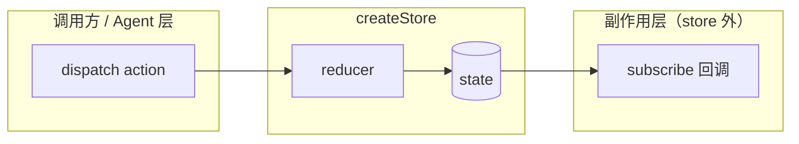
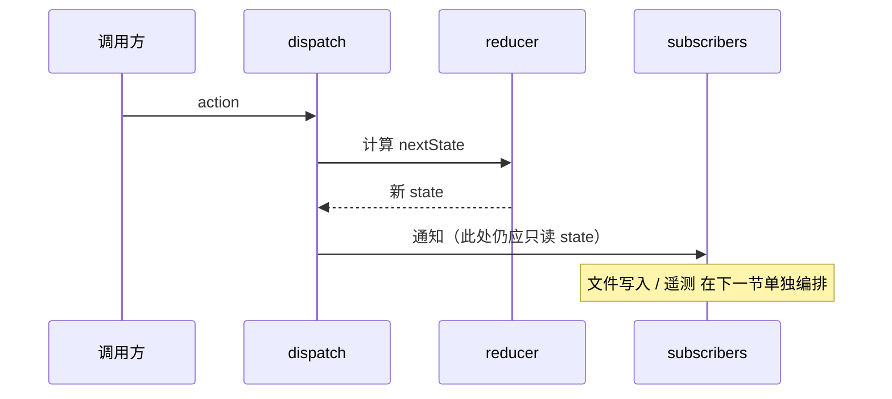

# 第13篇：状态管理 · 第1节 createStore — 极简状态内核

> **Claude Code 完全指南 V2** · 本篇共 8 节。本节讲解不依赖外部库的轻量状态容器，其设计思想与 Redux 一脉相承，但体积与心智负担远小于完整 Redux 生态。

---

## 学习目标

完成本节学习后，你应能够：

| 能力项 | 说明 |
|--------|------|
| **理解** | 说明「单一数据源 + 纯 reducer + 订阅通知」与大型状态库的差异与取舍 |
| **设计** | 手绘或口述 `createStore` 的最小 API 表面（`getState` / `dispatch` / `subscribe`） |
| **实现** | 在 TypeScript 中实现一个线程安全的简易 `createStore`，并处理 reducer 组合 |
| **迁移** | 将「组件内 useState 泛滥」重构为「模块级 store + 选择器」的可行路径 |
| **排错** | 识别「在 reducer 中写副作用」导致的不可复现 bug |

---

## 生活类比：社区公告栏

想象小区里只有**一块**电子公告栏（**单一 state 树**）。任何住户想贴通知，不能直接撕别人的纸，必须把诉求交给**物业值班室**（**dispatch(action)**）。值班室按**既定章程**（**reducer**）决定公告栏怎么改——章程里**只描述「若收到某类消息则新公告栏长什么样」**，不负责顺便去帮谁家通下水道（**无副作用**）。改完后，所有订阅了「公告变更」的住户（**subscribe**）会收到推送。  
Claude Code 里的 `createStore` 就像这块公告栏 + 章程：**状态可预测、变更有迹可循**，适合工具型 CLI / Agent 这种需要**可测试、可回放**心智模型的场景。

---

## 核心概念速览

```text
Action ──► dispatch ──► reducer(state, action) ──► nextState
                              │
                              ▼
                    notify 所有 subscriber
```

- **Store**：持有 `state` 引用，对外暴露最小 API。
- **Reducer**：`(state, action) => newState`，必须**纯函数**（同输入同输出，不碰 I/O）。
- **Subscriber**：`() => void`，在 `state` 引用替换后依次调用。

---

## 源码片段：极简 createStore（教学示意）

下列代码**为教学抽象**，与 Claude Code 仓库中具体文件名、导出方式可能不同，但**模式**一致：零第三方依赖、几十行量级可维护。

```typescript
// store/createStore.ts — 教学示意：mini Redux 风格
export type Action = { type: string; payload?: unknown };

export type Reducer<S> = (state: S | undefined, action: Action) => S;

export type Listener = () => void;

export interface Store<S> {
  getState: () => S;
  dispatch: (action: Action) => Action;
  subscribe: (listener: Listener) => () => void;
  replaceReducer: (next: Reducer<S>) => void;
}

export function createStore<S>(
  reducer: Reducer<S>,
  preloadedState?: S
): Store<S> {
  let state = preloadedState as S;
  let currentReducer = reducer;
  const listeners = new Set<Listener>();
  let isDispatching = false;

  function getState(): S {
    if (isDispatching) {
      throw new Error("Reducers may not dispatch.");
    }
    return state;
  }

  function subscribe(listener: Listener): () => void {
    listeners.add(listener);
    return () => listeners.delete(listener);
  }

  function dispatch(action: Action): Action {
    if (isDispatching) {
      throw new Error("Reducers may not dispatch.");
    }
    try {
      isDispatching = true;
      state = currentReducer(state, action);
    } finally {
      isDispatching = false;
    }
    listeners.forEach((l) => l());
    return action;
  }

  function replaceReducer(next: Reducer<S>): void {
    currentReducer = next;
    dispatch({ type: "@@/REPLACE" });
  }

  dispatch({ type: "@@/INIT" });
  return { getState, dispatch, subscribe, replaceReducer };
}
```

### combineReducers 示意

多模块状态常按 key 拆分 reducer，最后在根上合并：

```typescript
export function combineReducers<S extends Record<string, unknown>>(
  map: { [K in keyof S]: Reducer<S[K]> }
): Reducer<S> {
  return (state, action) => {
    const next = {} as S;
    let changed = false;
    (Object.keys(map) as (keyof S)[]).forEach((key) => {
      const prevSlice = state?.[key];
      const nextSlice = map[key](prevSlice, action);
      next[key] = nextSlice;
      if (nextSlice !== prevSlice) changed = true;
    });
    return changed ? next : (state as S);
  };
}
```

---

## Mermaid：数据流与订阅关系

### 图1：dispatch 闭环



### 图2：与「副作用同步」节的衔接（预告）



---

## 对比表：createStore vs 完整 Redux

| 维度 | 本教程 mini store | Redux + 中间件生态 |
|------|-------------------|---------------------|
| 依赖 | 0 | react-redux、redux-thunk 等 |
| 时间旅行 | 需自实现 | devtools 成熟 |
| 异步 | 放在 subscriber 或 saga 外层 | thunk / observable |
| 适用 | CLI、单进程工具内核 | 大型 Web 前端 |
| 测试 | reducer 单测极简单 | 需 mock 中间件链 |

---

## 在 Claude Code 语境中的落点

| 场景 | 建议 |
|------|------|
| 会话内工具开关 | action 粒度小、类型字符串集中管理 |
| 配置热更新 | `replaceReducer` 或整树替换需审慎，避免丢订阅 |
| 与文件系统 | **不要在 reducer 里读写磁盘**；见第3节「副作用同步」 |
| 与 UI 渲染 | TUI 层 subscribe 后 diff 再重绘，避免全屏闪烁 |

---

## 常见反模式

| 反模式 | 后果 | 修正 |
|--------|------|------|
| reducer 内 `fetch` / `fs.writeFile` | 状态不可预测、难测 | 纯 reducer + 外层 effect |
| 可变修改 `state.x = 1` | 订阅方无法感知引用变化 | 返回新对象或 Immer（若引入） |
| 巨型单一 reducer | 合并冲突、review 困难 | `combineReducers` 分域 |

---

## 小结

`createStore` 用**最小 API** 换来**可推理的数据流**：所有变更经 `dispatch`，经 `reducer` 折叠为下一状态，再通知监听者。它是 Claude Code 风格应用中**全局一致性与可测试性**的基石；**副作用**则刻意留在 store 边界之外，由第3节统一编排。

---

## 自测清单

1. 为什么 `dispatch` 过程中禁止嵌套 `dispatch`？  
2. `subscribe` 返回的函数是什么设计模式？  
3. 若要在测试中断言「某 action 后 state 形状」，应测 reducer 还是整 store？

---

**下一节**：[02-app-state.md](./02-app-state.md) — `AppState` 全局应用状态组织。
