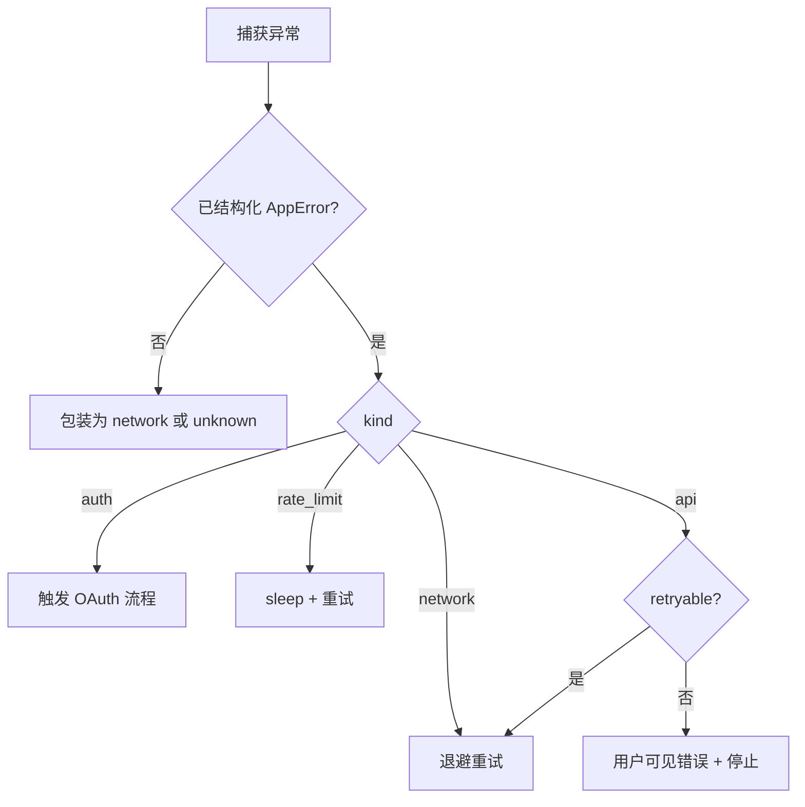
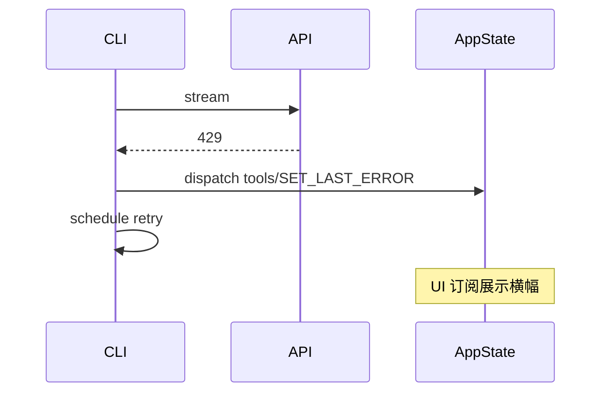

# 第14篇：服务与集成 · 第2节 错误分类 — API / 网络 / 认证 / 限流

> 统一 `try/catch` 往往掩盖**可恢复性**差异。本节建立四维错误taxonomy，并给出**策略表 + 状态机**，与第1节客户端、第13篇 `AppState` 对齐。

---

## 学习目标

| 能力项 | 说明 |
|--------|------|
| **分类** | 将异常映射到 API / 网络 / 认证 / 速率限制 |
| **策略** | 每类选择重试、刷新凭证、退避或用户介入 |
| **类型** | 用 TypeScript discriminated union 表达 `AppError` |
| **UX** | 文案分层：开发者详情 vs 用户一句话 |
| **观测** | 错误码、requestId、重试次数进入遥测（第8节） |

---

## 生活类比：快递异常编码

同一句「没收到货」背后可能是：**地址写错**（你的问题 = 4xx）、**分拣中心火灾**（对方问题 = 5xx）、**小区门禁不让进**（认证）、**双十一爆仓**（限流）。客服话术与是否**自动再投**完全不同。软件错误分类就是**先贴对标签再办事**，避免对「门禁问题」疯狂**重试撞门**。

---

## 统一错误类型（教学示意）

```typescript
// errors/AppError.ts — 教学示意
export type AppError =
  | {
      kind: "api";
      status: number;
      code?: string;
      message: string;
      requestId?: string;
      retryable: boolean;
    }
  | {
      kind: "network";
      code: "ECONNRESET" | "ETIMEDOUT" | "ENOTFOUND" | string;
      message: string;
      retryable: true;
    }
  | {
      kind: "auth";
      reason: "expired" | "invalid" | "missing";
      message: string;
      retryable: false;
    }
  | {
      kind: "rate_limit";
      retryAfterMs?: number;
      message: string;
      retryable: true;
    };

export function isRetryable(e: AppError): boolean {
  if (!e.retryable) return false;
  if (e.kind === "api" && e.status >= 400 && e.status < 500) return false;
  return true;
}
```

---

## 从 fetch Response 映射

```typescript
export async function toAppError(resp: Response, bodyText: string): Promise<AppError> {
  const requestId = resp.headers.get("request-id") ?? undefined;
  if (resp.status === 401)
    return { kind: "auth", reason: "invalid", message: bodyText, retryable: false };
  if (resp.status === 429) {
    const ra = resp.headers.get("retry-after");
    const retryAfterMs = ra ? Number(ra) * 1000 : undefined;
    return { kind: "rate_limit", retryAfterMs, message: bodyText, retryable: true };
  }
  if (resp.status >= 500)
    return {
      kind: "api",
      status: resp.status,
      message: bodyText,
      requestId,
      retryable: true,
    };
  return {
    kind: "api",
    status: resp.status,
    message: bodyText,
    requestId,
    retryable: false,
  };
}
```

---

## 处理策略表

| kind | 首选动作 | 次选 | 禁止 |
|------|----------|------|------|
| api (5xx) | 退避重试 | 换模型/缩短上下文 | 无限循环 |
| api (4xx 业务) | 展示具体原因 | 修正输入 | 盲重试 |
| network | 重试 + jitter | 检查代理 | 立即判定密钥错误 |
| auth | OAuth 刷新 / 重新登录 | 提示 settings | 重试同一 token |
| rate_limit | 等待 Retry-After | 降并发 | 忽略 header 狂刷 |

---

## Mermaid：错误处理决策树



### 图2：与状态管理联动



---

## 用户文案 vs 日志

| 层级 | 内容 |
|------|------|
| 用户 | 「请求过于频繁，将在几秒后重试」 |
| 日志 | `rate_limit requestId=... retryAfter=...` |
| 支持包 | 完整堆栈 + 脱敏配置快照 |

---

## 与 MCP / LSP 错误的关系

| 子系统 | 额外错误源 |
|--------|------------|
| MCP | 工具执行异常、协议版本不兼容 |
| LSP | `initialize` 失败、服务器崩溃 |

统一建议：**外层仍归并为上述四类之一**，并附加 `subsystem: "mcp" | "lsp"` 字段便于遥测切片。

---

## 源码片段：重试包装器

```typescript
export async function withRetries<T>(
  fn: () => Promise<T>,
  opts: { max: number; baseMs: number; classify: (e: unknown) => AppError }
): Promise<T> {
  let attempt = 0;
  // eslint-disable-next-line no-constant-condition
  while (true) {
    try {
      return await fn();
    } catch (e) {
      const err = opts.classify(e);
      attempt++;
      if (!isRetryable(err) || attempt > opts.max) throw err;
      const jitter = Math.random() * opts.baseMs;
      const wait = opts.baseMs * 2 ** (attempt - 1) + jitter;
      await new Promise((r) => setTimeout(r, wait));
    }
  }
}
```

---

## 表：HTTP 状态速查

| 状态 | 归类 | retryable |
|------|------|-----------|
| 400 | api 业务 | false |
| 401 | auth | false |
| 403 | api 业务/权限 | 视产品 |
| 404 | api 业务 | false |
| 408 | network/timeout | true |
| 429 | rate_limit | true |
| 500–504 | api 服务端 | true |

---

## 小结

**先分类、再策略**：认证与业务 4xx 不应重试；网络与 5xx、429 可退避。用 **discriminated union** 表达错误可在编译期穷尽处理分支，并与 **UI 状态**、**遥测**统一。

---

## 自测

1. 403 与 401 在产品上应如何区分提示？  
2. 若 `Retry-After` 为 HTTP-date 而非秒数，解析应注意什么？  
3. `unknown` 错误如何防止泄露敏感信息到用户界面？

---

**上一节**：[index.md](./index.md) · **下一节**：[03-mcp-protocol.md](./03-mcp-protocol.md)
