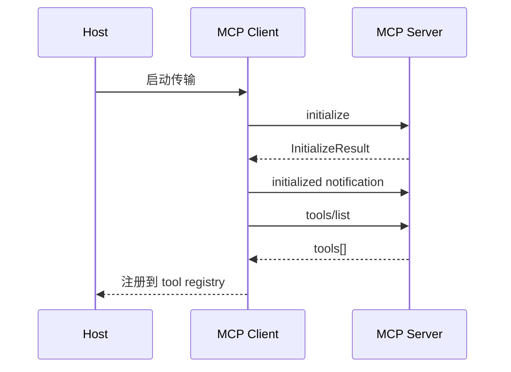
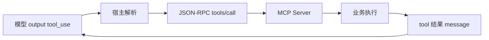

# 第14篇：服务与集成 · 第3节 MCP — Model Context Protocol 概览

> **MCP** 让模型以标准方式**发现**外部工具与资源：服务器**注册能力**，宿主**按名调用**。本节讲**消息形态、生命周期、动态发现**，与传输层（第4节）解耦。

---

## 学习目标

| 能力项 | 说明 |
|--------|------|
| **角色** | 区分 host / client / server 三角关系 |
| **方法** | 列举 `initialize`、`tools/list`、`tools/call` 等核心 JSON-RPC 意图 |
| **能力** | 解释 `capabilities` 协商与版本字段 |
| **安全** | 工具调用的权限、用户确认与审计 |
| **扩展** | resources / prompts 与 tools 的并列关系 |

---

## 生活类比：万能转接头上的设备枚举

你的笔记本是 **host**，USB 集线器是 **client**，插上移动硬盘、键盘、打印机是多个 **server**。插上后系统先**问：你是什么设备、支持哪些指令**（**list**）；你点打印时系统发**具体打印任务**（**call**）。MCP 就是这套**问能力再派发任务**的协议，只不过对话发生在 **LLM 宿主**与**外部世界**之间。

---

## JSON-RPC 消息壳（概念）

```json
{
  "jsonrpc": "2.0",
  "id": 1,
  "method": "tools/call",
  "params": {
    "name": "read_file",
    "arguments": { "path": "./README.md" }
  }
}
```

---

## TypeScript 类型骨架

```typescript
// mcp/types.ts — 教学示意
export interface McpTool {
  name: string;
  description?: string;
  inputSchema: Record<string, unknown>;
}

export interface InitializeParams {
  protocolVersion: string;
  capabilities: Record<string, unknown>;
  clientInfo: { name: string; version: string };
}

export interface InitializeResult {
  protocolVersion: string;
  capabilities: Record<string, unknown>;
  serverInfo: { name: string; version: string };
}
```

---

## 宿主侧：动态工具发现

```typescript
export async function refreshTools(conn: McpConnection): Promise<McpTool[]> {
  const res = await conn.request("tools/list", {});
  return (res as { tools: McpTool[] }).tools;
}
```

发现后的工具需合并进 **Agent 可用工具表**，并 bump `AppState.tools.registryVersion`（与第13篇 History 续接校验呼应）。

---

## Mermaid：初始化与 listing



### 图2：tools/call 与模型回合



---

## 能力协商表

| 能力键 | 含义 |
|--------|------|
| `tools` | 支持 list/call |
| `resources` | 可读资源 URI |
| `prompts` | 预置提示模板 |
| `logging` | 服务端日志通道 |

---

## 安全与权限

| 机制 | 说明 |
|------|------|
| 用户确认 | 高危工具需 TUI 二次确认 |
| 沙箱 | 限制可访问路径 / 网络 |
| 审计 | transcript 记录 tool name + digest |
| 版本锁 | 不兼容的 `protocolVersion` 拒绝连接 |

---

## 与 Anthropic tool_use 的映射

| 模型侧 | MCP 侧 |
|--------|--------|
| `tool_use.name` | `tools/call.params.name` |
| `tool_use.input` | `arguments` |
| `tool_result` | JSON-RPC 响应 → 消息块 |

---

## 源码片段：合并多服务器工具

```typescript
export function mergeToolNamespaces(
  servers: Array<{ prefix: string; tools: McpTool[] }>
): McpTool[] {
  const out: McpTool[] = [];
  for (const s of servers) {
    for (const t of s.tools) {
      out.push({
        ...t,
        name: `${s.prefix}__${t.name}`,
      });
    }
  }
  return out;
}
```

| 注意 | 说明 |
|------|------|
| 前缀 | 避免多 server 同名冲突 |
| schema | 合并后仍需满足 API tools 数组大小限制 |

---

## 故障模式

| 现象 | 可能原因 |
|------|----------|
| list 为空 | server 未实现或 capabilities 未声明 |
| call 超时 | 下游 I/O；应可取消 |
| schema 不匹配 | 模型幻觉参数；需校验后反馈 4xx 等价错误 |

---

## 小结

MCP 用 **JSON-RPC** 统一「发现 + 调用」：**initialize** 定调，**tools/list** 更新注册表，**tools/call** 执行。宿主负责 **合并命名空间、权限与审计**，传输细节交给第4节。

---

## 自测

1. `initialized` 通知与 `initialize` 请求响应的先后顺序为何重要？  
2. resources 与 tools 在模型上下文注入上有何不同？  
3. 多 server 同名工具不加前缀会发生什么？

---

## 调试清单（host 开发者）

| 步骤 | 检查 |
|------|------|
| 握手 | `protocolVersion` 双方兼容 |
| 列举 | `tools/list` 返回非空且 `inputSchema` 为合法 JSON Schema |
| 调用 | `tools/call` 的 `name` 与 list 完全一致（含前缀策略） |
| 并发 | 同一 `id` 不重复使用直至响应返回 |
| 日志 | JSON-RPC 与 stderr 分离 |

---

## JSON-RPC 通知与请求对照

| 类型 | 需 id | 需 response |
|------|-------|-------------|
| request | 是 | 是 |
| response | 是（与请求同 id） | — |
| notification | 否 | 否 |

宿主应对未知 `method` 返回规范错误，避免 server 悬挂。

---

**上一节**：[02-error-handling.md](./02-error-handling.md) · **下一节**：[04-mcp-transport.md](./04-mcp-transport.md)
