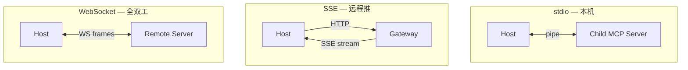
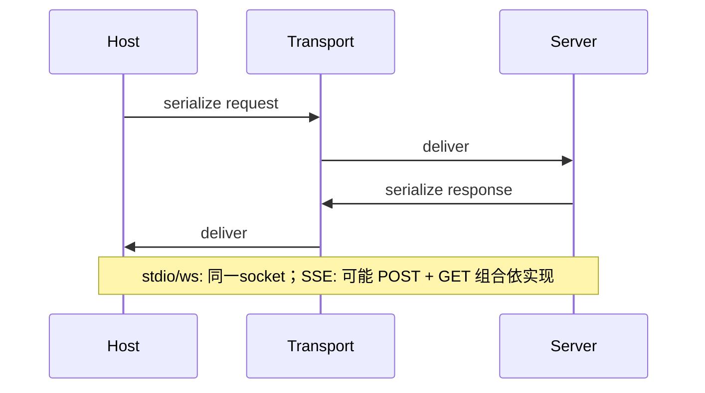

# 第14篇：服务与集成 · 第4节 MCP 传输 — stdio / SSE / WebSocket

> 同一套 MCP 语义可跑在多种**传输**上。本节对比 **stdio**、**SSE**、**WebSocket** 的适用场景、进程模型与安全边界。

---

## 学习目标

| 能力项 | 说明 |
|--------|------|
| **stdio** | 解释父子进程、行/帧分帧、生命周期与僵尸进程防护 |
| **SSE** | 理解 Server-Sent Events 单向流与 HTTP/2 注意点 |
| **WebSocket** | 全双工、心跳、重连与鉴权头 |
| **选型** | 本地插件 vs 远程服务 vs 浏览器环境的决策表 |
| **排错** | 日志分离 stderr、避免污染 JSON-RPC 流 |

---

## 生活类比：对讲机、广播与电话

- **stdio** 像**对讲机专线**：两人独占频道，简单可靠，但必须**站得近**（本机进程）。  
- **SSE** 像**电台广播**：主机只管播，听众单向接收；适合**服务器推事件**。  
- **WebSocket** 像**电话**：双方随时插话（全双工），适合**高频来回**与**长会话**。  

选错介质就会出现：**电话里听广播的杂音**（把日志打进协议流）或**对讲机跨城**（误把 stdio 当远程）。

---

## stdio 传输要点

```typescript
// transport/stdio.ts — 教学示意
import { spawn } from "node:child_process";

export function spawnMcpStdio(command: string, args: string[]) {
  const child = spawn(command, args, {
    stdio: ["pipe", "pipe", "pipe"],
  });
  child.stderr.on("data", (d) => {
    // 仅记录诊断，绝不混入 stdout 解析器
    console.error("[mcp stderr]", d.toString());
  });
  return {
    stdin: child.stdin,
    stdout: child.stdout,
    kill: () => child.kill("SIGTERM"),
  };
}
```

| 注意 | 说明 |
|------|------|
| 缓冲 | 使用流式解析器处理半包 JSON |
| 结束 | 子进程退出需清理挂起 promise |
| 并发 | 单连接多 in-flight 需 id 关联 |

---

## SSE 传输概念

| 项 | 说明 |
|----|------|
| 方向 | 服务器 → 客户端为主；请求仍用 HTTP POST |
| 帧 | `data:` 行承载事件负载 |
| 代理 | 某些反向代理缓冲 SSE，需 `X-Accel-Buffering: no` 等 |
| 鉴权 | Cookie / Bearer 与长连接并存 |

```typescript
// 伪代码：打开 SSE 端点并喂入解析器
export function openSseTransport(url: string, headers: Record<string, string>) {
  const es = new EventSource(url, { fetch: /* 自定义带 header 的 fetch */ } as any);
  es.onmessage = (ev) => handleJsonRpcLine(ev.data);
  return es;
}
```

> 浏览器原生 `EventSource` 不便带自定义 header；Node 环境常用 `fetch` 流式解析（见第1节 SSE）。

---

## WebSocket 传输概念

```typescript
export function openWsTransport(
  url: string,
  onFrame: (s: string) => void
): { send: (s: string) => void; close: () => void } {
  const ws = new WebSocket(url);
  ws.on("message", (data) => onFrame(String(data)));
  const send = (s: string) => ws.send(s);
  const close = () => ws.close();
  const ping = setInterval(() => {
    if (ws.readyState === WebSocket.OPEN) ws.ping();
  }, 20000);
  ws.on("close", () => clearInterval(ping));
  return { send, close };
}
```

| 项 | 说明 |
|----|------|
| 心跳 | 防止 NAT 超时 |
| 重连 | 指数退避 + 会话恢复（若协议支持） |
| TLS | `wss://` 与证书校验 |

---

## Mermaid：三种拓扑



### 图2：JSON-RPC 在双向通道上的复用



---

## 选型表

| 场景 | 推荐 | 原因 |
|------|------|------|
| 本地 CLI 插件 | stdio | 零端口暴露、简单 |
| 企业内远程工具 | WS 或 SSE+POST | 防火墙友好程度因环境而异 |
| 浏览器宿主 | WS / HTTP 封装 | SSE 受 header 限制 |
| 极高交互调试 | WS | 低延迟双向 |

---

## 安全对照

| 传输 | 风险 | 缓解 |
|------|------|------|
| stdio | 子进程命令注入 | 固定 allowlist、不用 shell 解析 |
| SSE | CSRF / 跨域 | Cookie SameSite、Token |
| WS | 中间人 | TLS、证书锁定（谨慎） |

---

## 与协议层（第3节）边界

传输只负责 **可靠送达字节**；**方法名、params、id** 由 MCP JSON-RPC 定义。换传输时不应改业务 `tools/call` 语义。

---

## 小结

**stdio** 最适合本地 **fork/exec** 模型；**SSE** 适合 **HTTP 生态下的单向推送**；**WebSocket** 适合 **长连接双向** 与**远程 MCP**。共性：**stderr 与协议流分离**、**半包解析**、**心跳/退避**（远程）。

---

## 自测

1. 为何 MCP stdio 服务器不应向 stdout 打印调试日志？  
2. SSE 在反向代理后「延迟很久才收到」可能是什么原因？  
3. WebSocket 重连后 JSON-RPC 的 `id` 应如何与宿主状态关联？

---

## 背压与流控（进阶）

| 传输 | 背压手段 |
|------|----------|
| stdio | `pause()` / 高水位标记，避免内存暴涨 |
| SSE | 客户端停止读触发 TCP 窗口 |
| WebSocket | `bufferedAmount` 监控 + 分片发送 |

当 MCP 响应体极大（例如嵌入资源）时，应在协议层支持**分块**或**引用**，而非一次塞满管道。

---

## 兼容性说明（教学）

不同宿主实现对「单连接多多路复用」支持程度不一：集成测试应覆盖 **串行请求** 与 **有限并行** 两种模式，防止对端 server 仅实现半双工假设。

本节强调：**传输只搬运帧，不解释业务**；协议语义始终以 MCP JSON-RPC 为准。

---

**上一节**：[03-mcp-protocol.md](./03-mcp-protocol.md) · **下一节**：[05-lsp.md](./05-lsp.md)
