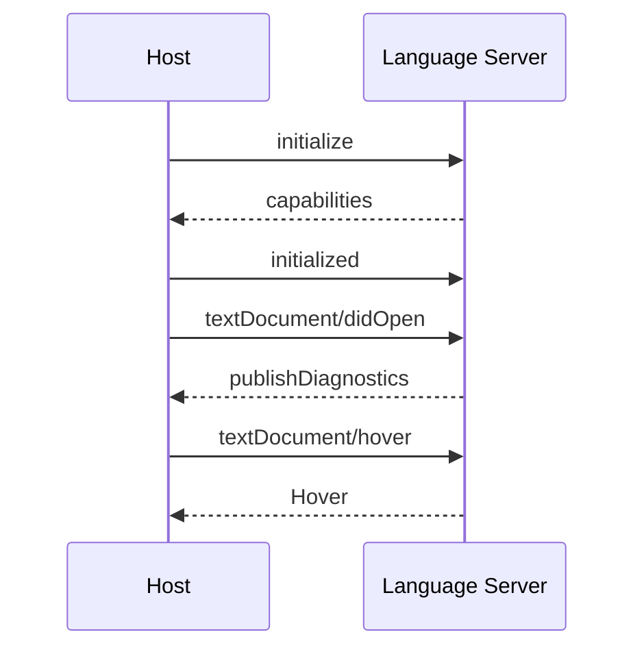

# 第14篇：服务与集成 · 第5节 LSP — Language Server Protocol 集成

> **LSP** 把「语法树、补全、诊断」从编辑器搬到独立进程。Claude Code 类工具可用 LSP **增强上下文精度**：跳转定义、引用、工作区符号，而不仅靠全文搜索。

---

## 学习目标

| 能力项 | 说明 |
|--------|------|
| **生命周期** | `initialize` → `initialized` → `textDocument/*` |
| **能力** | `textDocumentSync`、`completionProvider`、`publishDiagnostics` |
| **上下文** | 如何把 `hover`/`definition` 结果注入 prompt |
| **性能** | 按需启动语言服务器、项目根探测 |
| **容错** | 服务器崩溃重启、降级为纯文本工具 |

---

## 生活类比：专业翻译坐席

你是作家（**模型**），写外文小说时旁边有**专业翻译坐席**（**LSP**）：你问「这个词在合同里出现过吗」，翻译查**术语库**（**符号表**）再答。你不会自己背整本词典（**不解析全 AST 在宿主**）。LSP 就是**随叫随到的语言专家进程**。

---

## 初始化请求（概念 JSON-RPC）

```json
{
  "jsonrpc": "2.0",
  "id": 1,
  "method": "initialize",
  "params": {
    "processId": 12345,
    "rootUri": "file:///path/to/project",
    "capabilities": {
      "textDocument": {
        "completion": { "dynamicRegistration": false },
        "publishDiagnostics": {}
      }
    }
  }
}
```

---

## TypeScript 宿主封装骨架

```typescript
// lsp/client.ts — 教学示意
export class LspClient {
  private nextId = 1;
  private pending = new Map<number, (v: unknown) => void>();

  constructor(private send: (msg: unknown) => void) {}

  request(method: string, params: unknown): Promise<unknown> {
    const id = this.nextId++;
    const msg = { jsonrpc: "2.0", id, method, params };
    return new Promise((resolve) => {
      this.pending.set(id, resolve);
      this.send(msg);
    });
  }

  onMessage(raw: unknown) {
    const m = raw as { id?: number; method?: string; params?: unknown };
    if (m.id != null && this.pending.has(m.id)) {
      const cb = this.pending.get(m.id)!;
      this.pending.delete(m.id);
      cb(m);
      return;
    }
    if (m.method === "textDocument/publishDiagnostics") {
      this.onDiagnostics(m.params);
    }
  }

  onDiagnostics(_params: unknown) {
    /* 合并到 AppState 或本地缓存 */
  }
}
```

---

## 用于 Agent 的典型请求

| 方法 | 用途 |
|------|------|
| `textDocument/hover` | 类型/文档字符串 |
| `textDocument/definition` | 跳转定义 URI+range |
| `textDocument/references` | 引用列表 |
| `workspace/symbol` | 粗粒度符号搜索 |
| `textDocument/completion` | 与 IDE 类似，Agent 少用 |

---

## Mermaid：启动与诊断流



### 图2：与模型上下文拼接


---

## 文档同步策略

| 策略 | 说明 |
|------|------|
| Full | 每次全量发 `textDocument/didChange` |
| Incremental | 发变更 range；需与磁盘一致 |
| None | 仅打开/关闭事件；服务器自读盘 |

Agent 工具若已修改文件，宿主需 **didChange** 或 **didSave** 避免 LSP 与磁盘漂移。

---

## 表：LSP vs 朴素 grep

| 维度 | LSP | grep/ripgrep |
|------|-----|----------------|
| 语义 | 强 | 弱 |
| 启动成本 | 高 | 低 |
| 语言覆盖 | 需对应 server | 通用 |
| 实时诊断 | 有 | 无 |

---

## 进程管理

```typescript
export async function startServerForWorkspace(root: string): Promise<LspClient> {
  const proc = spawn("typescript-language-server", ["--stdio"], { cwd: root });
  const client = new LspClient((msg) => proc.stdin.write(JSON.stringify(msg) + "\n"));
  lineParser(proc.stdout, (obj) => client.onMessage(obj));
  proc.on("exit", (code) => {
    console.error("lsp exited", code);
  });
  await client.request("initialize", {
    processId: process.pid,
    rootUri: pathToUri(root),
    capabilities: minimalCaps,
  });
  await client.notify("initialized", {});
  return client;
}
```

---

## 容错与降级

| 故障 | 策略 |
|------|------|
| 启动失败 | 关闭 LSP 功能位，回退 ripgrep |
| 无 server | 按语言跳过 |
| 超时 | 取消请求，提示「语言服务无响应」 |

---

## 小结

LSP 为 Claude Code 提供**结构化代码理解**：初始化协商能力，**诊断**可反馈用户，**hover/definition** 可压缩进上下文。集成关键是 **同步模型** 与 **进程生命周期**，失败时**优雅降级**。

---

## 自测

1. `rootUri` 与单文件打开的关系？  
2. 为何增量同步对 Agent 自动改文件更危险？  
3. `publishDiagnostics` 是请求还是通知？

---

## 多工作区与多根（概念）

| 场景 | 策略 |
|------|------|
| monorepo | `workspaceFolders` 初始化 |
| 单根 | 传统 `rootUri` |
| Agent 切换 cwd | 重新 `didChangeWorkspaceFolders` 或重启 server |

语言服务器若不支持多根，宿主应**按主项目根**启动，避免符号解析漂移。

---

## 与 ripgrep 的协同

典型流水线：**rg 粗定位** → **LSP 精修**（hover/definition）。在超大仓库中可节省 LSP 负载，并减少无响应超时。

---

**上一节**：[04-mcp-transport.md](./04-mcp-transport.md) · **下一节**：[06-oauth.md](./06-oauth.md)
