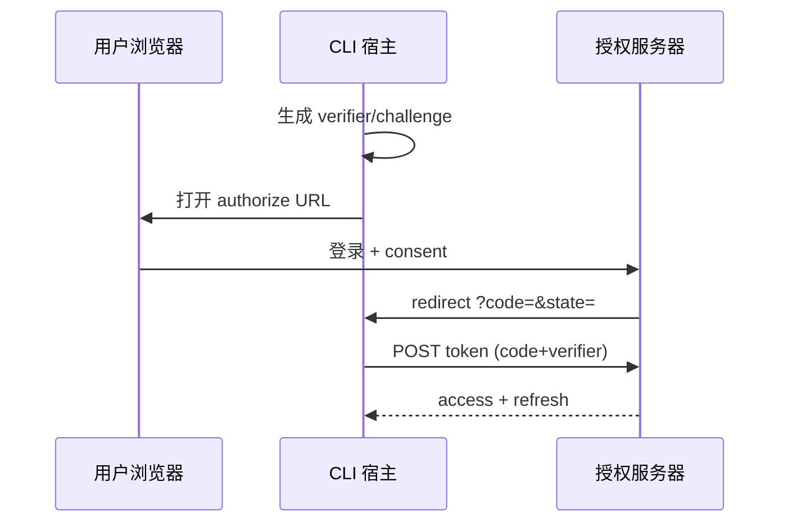
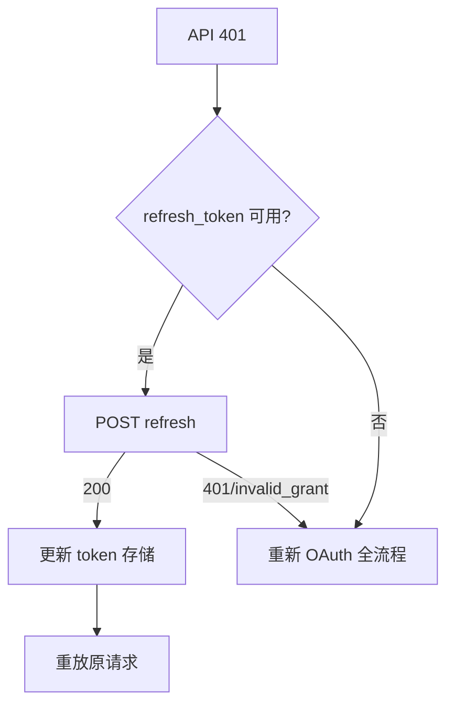

# 第14篇：服务与集成 · 第6节 OAuth 2.0 + PKCE — 认证与 Token 管理

> 控制台类应用常通过 **OAuth 2.0 授权码 + PKCE** 获取访问令牌，浏览器完成 **consent**（如 `consent.anthropic.com` 教学名），CLI 监听 **localhost 回调**或使用 **设备码流**（视产品）。本节讲流程、**Token 存储与刷新**。

---

## 学习目标

| 能力项 | 说明 |
|--------|------|
| **流程** | 描述授权码 + PKCE：code_verifier / code_challenge / redirect |
| **安全** | 为何 CLI 需要 PKCE；state 防 CSRF |
| **存储** | refresh token 加密-at-rest、文件权限 |
| **刷新** | 在 401 前 proactive refresh vs reactive |
| **撤销** | 登出与 token 作废的产品语义 |

---

## 生活类比：酒店前台临时房卡

办理入住（**授权**）时，前台给你一张**限时房卡**（**access token**），同时系统在后台给你**延期资格**（**refresh token**）。房卡丢了要**补办**（**刷新**），离店**注销**（**revoke**）。PKCE 像是**当场对暗号**：即使有人偷听对话，也拿不到能开门的完整密钥。

---

## PKCE 参数生成（示意）

```typescript
// oauth/pkce.ts — 教学示意
import crypto from "node:crypto";

export function generatePkcePair() {
  const verifier = base64Url(crypto.randomBytes(32));
  const challenge = base64Url(
    crypto.createHash("sha256").update(verifier).digest()
  );
  return { code_verifier: verifier, code_challenge: challenge };
}

function base64Url(buf: Buffer): string {
  return buf
    .toString("base64")
    .replace(/\+/g, "-")
    .replace(/\//g, "_")
    .replace(/=+$/, "");
}
```

---

## 授权 URL 组装

```typescript
export function buildAuthorizeUrl(opts: {
  base: string;
  clientId: string;
  redirectUri: string;
  scope: string;
  state: string;
  codeChallenge: string;
}) {
  const u = new URL("/oauth/authorize", opts.base);
  u.searchParams.set("response_type", "code");
  u.searchParams.set("client_id", opts.clientId);
  u.searchParams.set("redirect_uri", opts.redirectUri);
  u.searchParams.set("scope", opts.scope);
  u.searchParams.set("state", opts.state);
  u.searchParams.set("code_challenge", opts.codeChallenge);
  u.searchParams.set("code_challenge_method", "S256");
  return u.toString();
}
```

---

## 用 code 换 token

```typescript
export async function exchangeCode(params: {
  tokenEndpoint: string;
  clientId: string;
  code: string;
  redirectUri: string;
  codeVerifier: string;
}): Promise<{ access_token: string; refresh_token?: string; expires_in?: number }> {
  const body = new URLSearchParams({
    grant_type: "authorization_code",
    code: params.code,
    redirect_uri: params.redirectUri,
    client_id: params.clientId,
    code_verifier: params.codeVerifier,
  });
  const res = await fetch(params.tokenEndpoint, {
    method: "POST",
    headers: { "content-type": "application/x-www-form-urlencoded" },
    body,
  });
  if (!res.ok) throw new Error(`token ${res.status}`);
  return res.json();
}
```

---

## Mermaid：授权码 + PKCE



### 图2：401 时刷新



---

## Token 持久化

| 字段 | 存储建议 |
|------|----------|
| access_token | 内存优先；落盘则加密 |
| refresh_token | **必须**限制权限位；加密 |
| expires_at | 计算绝对时间，提前刷新 |

```typescript
export async function saveTokenBundle(
  filePath: string,
  bundle: object,
  key: Buffer
) {
  const iv = crypto.randomBytes(12);
  const cipher = crypto.createCipheriv("aes-256-gcm", key, iv);
  const pt = Buffer.from(JSON.stringify(bundle), "utf8");
  const enc = Buffer.concat([cipher.update(pt), cipher.final()]);
  const tag = cipher.getAuthTag();
  const payload = { iv: iv.toString("base64"), tag: tag.toString("base64"), enc: enc.toString("base64") };
  await fs.writeFile(filePath, JSON.stringify(payload), { mode: 0o600 });
}
```

---

## consent 与 scope

| 概念 | 说明 |
|------|------|
| consent UI | 用户显式同意 scope |
| scope 最小化 | 仅申请必要权限 |
| state | 随机串，回调时校验 |

---

## 与错误处理（第2节）衔接

| 事件 | 映射 |
|------|------|
| `invalid_grant` | `auth` + 重新登录 |
| token 刷新网络错误 | `network` + 退避 |

---

## 表：localhost 回调 vs 设备码

| 模式 | 优点 | 缺点 |
|------|------|------|
| localhost | UX 顺滑 | 端口冲突/无浏览器环境 |
| 设备码 | 适合 SSH 远程 | 步骤多 |

---

## 小结

OAuth 2.0 + PKCE 让 **CLI 安全代用户**调用 API：**code_verifier** 保密、**challenge** 公开；token **加密存储**、**刷新**与 **401** 路径打通 consent 与 API 客户端。

---

## 自测

1. 为何隐式流（implicit）不适合现代 CLI？  
2. `state` 若省略会怎样？  
3. refresh 成功后是否要重试**原请求**而非让用户重试？

---

**上一节**：[05-lsp.md](./05-lsp.md) · **下一节**：[07-feature-flags.md](./07-feature-flags.md)
