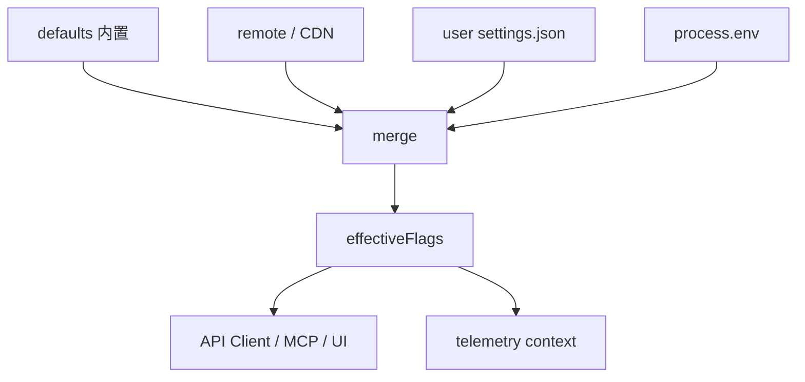
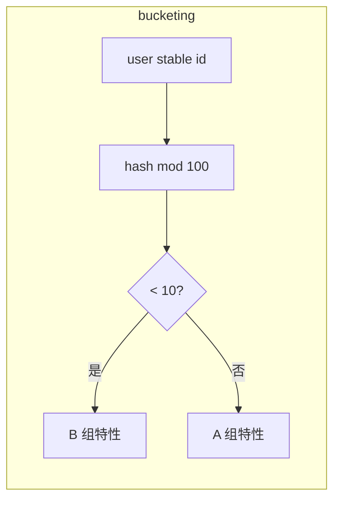

# 第14篇：服务与集成 · 第7节 特性标志 — 90+ Flags、渐进发布与实验

> 大型 CLI/Agent 产品常维护**数十至上百**个 **feature flags**：控制新工具、UI、模型路径的**灰度**。本节讲**分层来源、合并规则、遥测绑定**与 **A/B 测试**注意点。

---

## 学习目标

| 能力项 | 说明 |
|--------|------|
| **来源** | 区分默认值、远程配置、环境变量、本地 settings |
| **合并** | 定义优先级：例如 env > 用户设置 > 远程 > 默认 |
| **类型** | bool / 枚举 / 数值阈值（采样率） |
| **发布** | 渐进发布、kill switch、按用户哈希分桶 |
| **治理** | 命名规范、过期清理、与 migrations 关系 |

---

## 生活类比：游乐园快速通行证开关

游乐园有**总控台**（**远程配置**）：今天雷雨关掉过山车（**kill switch**），VIP 区试运行新项目（**10% 用户**）。你手里的**年卡权益**（**本地 settings**）可能覆盖普通规则；门口告示牌（**环境变量**）写着「今日检修」——**告示优先**。90+ 个开关就像**每个游乐设施独立闸机**，但**优先级**必须写清楚，否则员工与告示冲突时游客懵。

---

## Flag 定义表（示例）

| key | 类型 | 默认 | 说明 |
|-----|------|------|------|
| `tools.mcp.v2Transport` | bool | false | 启用新传输 |
| `ui.compactMode` | bool | false | TUI 密度 |
| `model.routing.variant` | enum | `A` | A/B 路径 |
| `telemetry.sampleRate` | number | 0.1 | 采样 |

---

## 合并优先级（教学实现）

```typescript
// flags/merge.ts — 教学示意
export type FlagMap = Record<string, boolean | string | number>;

export function mergeFlags(layers: FlagMap[]): FlagMap {
  const out: FlagMap = {};
  // 后者覆盖前者：默认 -> 远程 -> 用户 -> 环境
  for (const layer of layers) {
    for (const [k, v] of Object.entries(layer)) {
      if (v === undefined) continue;
      out[k] = v;
    }
  }
  return out;
}

export function envOverridePrefix(prefix = "CLAUDE_FLAG_"): FlagMap {
  const out: FlagMap = {};
  for (const [k, v] of Object.entries(process.env)) {
    if (!k.startsWith(prefix) || v == null) continue;
    const name = k.slice(prefix.length).replace(/__/g, ".");
    out[name] = parseEnvValue(v);
  }
  return out;
}

function parseEnvValue(v: string): boolean | string | number {
  if (v === "true" || v === "false") return v === "true";
  if (/^\d+$/.test(v)) return Number(v);
  return v;
}
```

---

## 远程获取与缓存

```typescript
export async function fetchRemoteFlags(url: string): Promise<FlagMap> {
  const res = await fetch(url, { headers: { "cache-control": "no-store" } });
  if (!res.ok) return {};
  return res.json() as Promise<FlagMap>;
}
```

| 策略 | 说明 |
|------|------|
| ETag | 减少带宽 |
| 失败降级 | 使用上次缓存 |
| TTL | 防止远程挂死启动 |

---

## Mermaid：合并管线



### 图2：分桶（A/B）



---

## 与 AppState.config.experimental 映射

| 层级 | 映射 |
|------|------|
| 用户显式 toggles | `config.experimental` |
| 远程实验 | hydrate 时写入只读投影，避免用户误改 |
| 冲突 | 以合并优先级为准，UI 显示「由组织策略锁定」 |

---

## 治理表

| 实践 | 说明 |
|------|------|
| 前缀 | `area.subarea.name` |
| 生命周期 | issue 关联移除日期 |
| 文档 | 自动生成 flags 目录页 |
| 测试 | 矩阵测 true/false 关键路径 |

---

## Kill switch 场景

| 场景 | flag 动作 |
|------|-----------|
| MCP 协议 bug | 关闭 `mcp.enabled` |
| 新模型事故 | 路由回旧模型 |
| 遥测风暴 | `telemetry.enabled=false` 远程 |

---

## 与遥测（第8节）

将 **effectiveFlags 子集**（非敏感）附在事件上下文，便于分析「B 组崩溃率」。注意 **GDPR/匿名化**：不传邮箱，仅哈希 user id。

---

## 表：90+ flags 管理

| 问题 | 对策 |
|------|------|
| 组合爆炸 | 分类 + 集成测分层 |
| 默认值漂移 | 单源 `defaults.json` |
| 远程与本地不一致 | UI 展示来源列 |
| 旧 flag 残留 | CI 检查无引用键 |

---

## 小结

特性标志把**发布**从「发版」解耦为「调参」：**多层合并**、**远程 kill**、**分桶实验**是三大支柱。务必维护**优先级文档**与**清理纪律**，否则 90+ 很快变债务。

---

## 自测

1. 若 env 与 settings 同时设置同一 bool，谁应胜出？理由？  
2. 分桶用的 user id 为何需要稳定哈希盐？  
3. 远程 flag 拉取失败时，静默用空对象还是旧缓存更安全？

---

## 渐进发布数值示例

| 阶段 | 受众 | 典型做法 |
|------|------|----------|
| dogfood | 内部员工 | `employee` 名单或 org id |
| canary | 1%–5% 用户 | 哈希分桶 |
| GA | 100% | 默认值改为 true，保留 kill switch |

每个阶段应配置**自动回滚**条件（错误率、延迟），与遥测第8节联动。

---

## 与 migrations 的边界

| 维度 | migrations | feature flags |
|------|------------|---------------|
| 改变 | 磁盘**形状** | 运行时**分支** |
| 时机 | 启动一次 | 运行中可刷新 |
| 回滚 | 备份文件 | 远程关开关 |

勿用 flag 修补**无效 JSON**——应走第13篇迁移管线。

---

**上一节**：[06-oauth.md](./06-oauth.md) · **下一节**：[08-summary.md](./08-summary.md)
