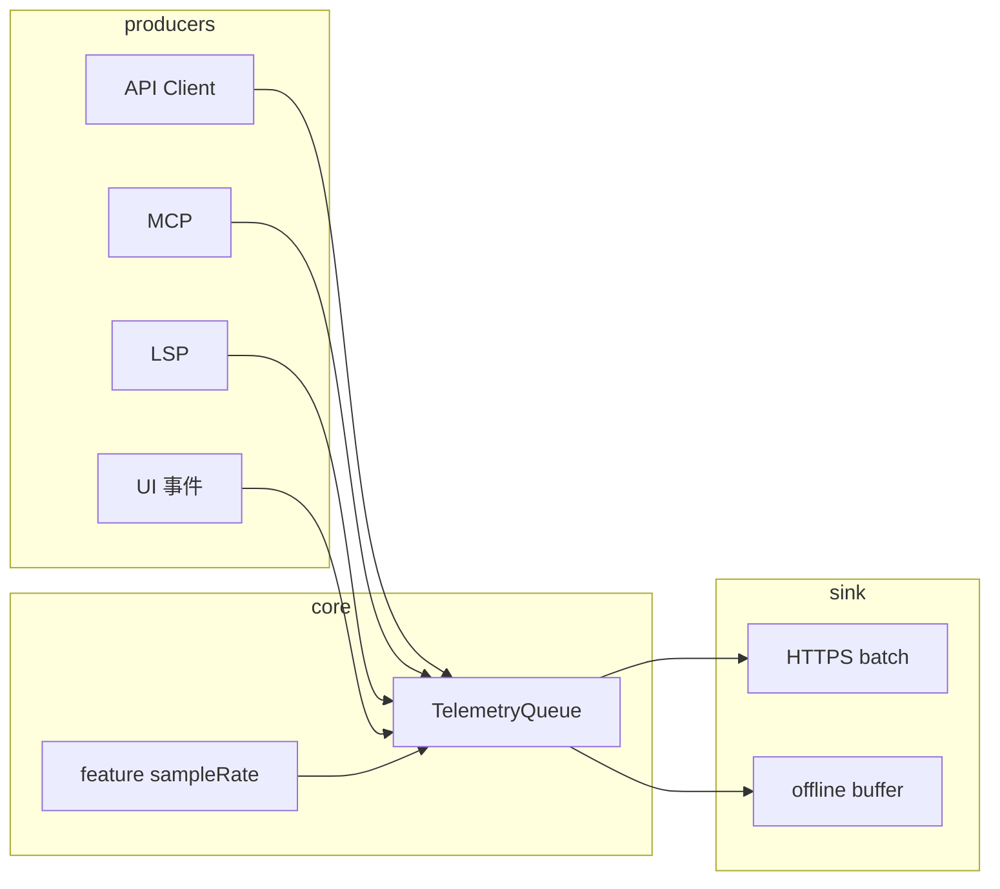
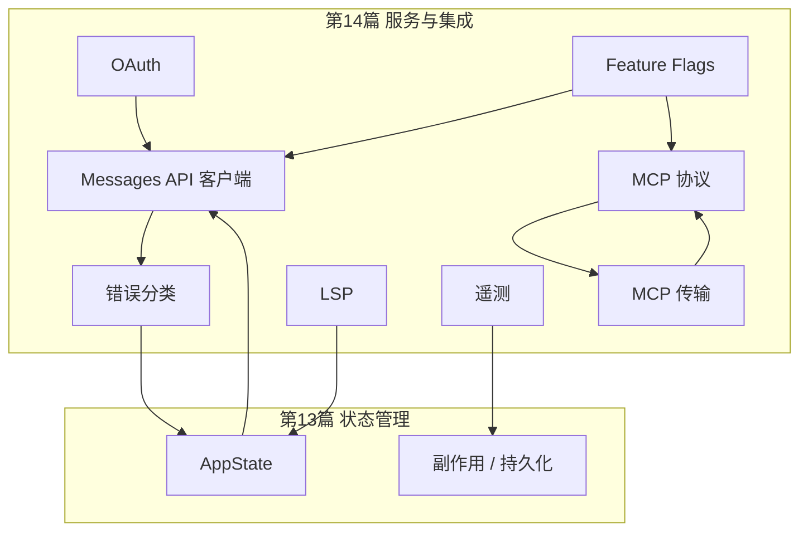

# 第14篇：服务与集成 · 第8节 遥测与全篇总结 — 观测、隐私与集成全景

> 最后一节聚焦**匿名遥测**、**性能指标**、**错误报告**的采集与隐私边界，并用一张**集成全景**回扣第1–7节。

---

## 学习目标

| 能力项 | 说明 |
|--------|------|
| **事件** | 设计 schema：name、timestamp、版本、会话哈希、属性 |
| **采样** | 与 feature flags 的 `sampleRate` 协同 |
| **PII** | 明确禁止字段与脱敏规则 |
| **性能** | latency histogram、冷启动分段 |
| **伦理** | 可选退出（opt-out）、本地预览队列 |

---

## 生活类比：城市公交刷卡统计

公交公司统计**哪条线路拥挤**（**性能与使用分布**），不需要知道**你是谁**——只需匿名卡号哈希、上下车站点。若有人要求**永不统计**，应提供**关闭刷卡分析**开关（**opt-out**）。遥测就是**城市交通大脑**：优化排班，但不把乘客日记公开。

---

## 事件 envelope（教学示意）

```typescript
// telemetry/event.ts — 教学示意
export interface TelemetryEvent {
  name: string;
  ts: string;
  cliVersion: string;
  os: string;
  /** 不可逆会话指纹 */
  sessionFingerprint: string;
  props?: Record<string, string | number | boolean>;
}

export interface ErrorReport extends TelemetryEvent {
  name: "error";
  props: {
    kind: "api" | "network" | "auth" | "rate_limit";
    code?: string;
    retryCount?: number;
  };
}
```

---

## 批处理与发送

```typescript
export class TelemetryQueue {
  private buf: TelemetryEvent[] = [];
  constructor(private max: number, private flushMs: number) {
    setInterval(() => void this.flush(), flushMs);
  }
  push(e: TelemetryEvent) {
    this.buf.push(e);
    if (this.buf.length >= this.max) void this.flush();
  }
  async flush() {
    if (!this.buf.length) return;
    const batch = this.buf.splice(0, this.buf.length);
    await fetch("https://telemetry.example/v1/batch", {
      method: "POST",
      body: JSON.stringify({ events: batch }),
      headers: { "content-type": "application/json" },
    }).catch(() => {
      // 失败：可落盘重试（与第13篇持久化呼应）
    });
  }
}
```

---

## 性能分段

| span | 说明 |
|------|------|
| `boot.migrate` | migrations 耗时 |
| `boot.hydrate` | 读配置与 mem |
| `api.first_token_ms` | 首 token 延迟 |
| `mcp.connect` | 各 server 握手 |
| `lsp.init` | 语言服务启动 |

```typescript
export function span<T>(name: string, fn: () => Promise<T>): Promise<T> {
  const t0 = performance.now();
  return fn().finally(() => {
    const dt = performance.now() - t0;
    queue.push({ name: `perf.${name}`, ts: new Date().toISOString(), /* ... */ props: { ms: dt } });
  });
}
```

---

## Mermaid：遥测管线



### 图2：第14篇集成全景



---

## 隐私清单

| 禁止 | 替代 |
|------|------|
| 完整 prompt | 长度 + 哈希 |
| API Key | 永不 |
| 绝对路径 | 哈希 basename |
| 邮箱 | 稳定匿名 id |

---

## Opt-out 实现表

| 层级 | 机制 |
|------|------|
| 环境变量 | `TELEMETRY_DISABLED=1` |
| settings | `telemetry.enabled: false` |
| 企业策略 | 远程 flags 强制关 |

---

## 与错误报告联动

| 数据 | 用途 |
|------|------|
| `requestId` | 与服务商日志关联（用户授权支持包时） |
| `retryCount` | 评估重试策略是否过激 |
| `subsystem` | MCP/LSP/API 切片 |

---

## 全篇回顾表

| 节 | 关键词 |
|----|--------|
| 1 | SSE、重试、降级 |
| 2 | API/网络/认证/限流 |
| 3 | MCP JSON-RPC、tools/list/call |
| 4 | stdio、SSE、WebSocket |
| 5 | LSP initialize、diagnostics |
| 6 | PKCE、token 存储 |
| 7 | flags 合并、分桶 |
| 8 | 遥测、隐私、全景 |

---

## 小结

**服务与集成层**把 Claude Code 连到外部世界：**API** 负责模型对话；**错误系统**统一韧性；**MCP** 扩展工具；**LSP** 深化代码理解；**OAuth** 保安全认证；**Feature Flags** 控发布；**遥测**在**隐私约束**下闭环改进。与**状态管理**结合，形成可观测、可恢复、可灰度的整体架构。

---

## 自测

1. 批处理失败落盘重试时，如何防止无限增长？  
2. perf span 与业务事件在 schema 上如何共用字段？  
3. 企业客户要求「零出站」，应关闭哪些子系统？

---

**上一节**：[07-feature-flags.md](./07-feature-flags.md) · **返回索引**：[index.md](./index.md)

---

## 第14篇术语索引

| 术语 | 节 |
|------|-----|
| SSE / stream | 1 |
| AppError | 2 |
| tools/list | 3 |
| stdio / WS | 4 |
| publishDiagnostics | 5 |
| PKCE | 6 |
| mergeFlags | 7 |
| TelemetryQueue | 8 |
