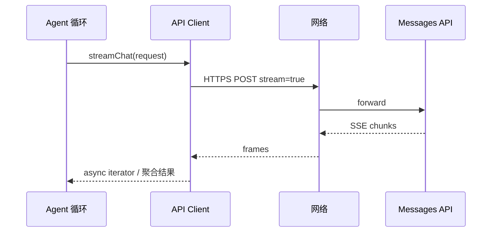
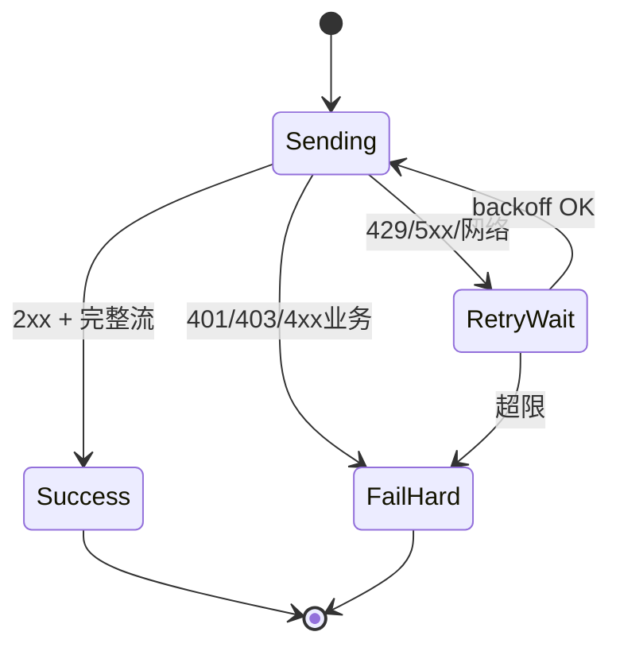

# 第14篇：服务与集成 · 第1节 API 客户端 — Anthropic Messages 与流式 SSE

> **Claude Code 完全指南 V2** · 本篇共 8 节。本节聚焦 **Messages API** 的封装：**流式 SSE**、超时、**重试与降级**，以及与上层 Agent 循环的边界。

---

## 学习目标

| 能力项 | 说明 |
|--------|------|
| **协议** | 描述 Messages API 请求/响应中 `messages`、`system`、`tools`、`stream` 等核心字段 |
| **SSE** | 解析 `event:` / `data:` 帧，增量拼出 assistant 消息与 tool_use |
| **韧性** | 设计指数退避、可重试状态码、熔断与降级（模型/上下文截断） |
| **边界** | 区分「传输层客户端」与「业务编排」（谁负责多轮 tool loop） |
| **观测** | 在日志中安全打点 requestId、latency，避免泄露正文 |

---

## 生活类比：挂号窗口与叫号屏

医院挂号（**发请求**）后，你不会堵在窗口等医生把病历全写完——而是去大厅看**叫号屏逐条刷新**（**SSE 流**）。若网络抖动叫号屏卡了，你会**过会儿抬头再看**（**重试**）；若全院系统挂了，护士可能给你**纸质临时号**（**降级**：换模型或缩短上下文）。API 客户端就是**窗口柜员 + 叫号屏协议解析器**：保证你拿到**有序、完整**的就诊序列，而不是一堆乱序纸条。

---

## 请求骨架（教学示意）

```typescript
// api/messagesTypes.ts — 教学示意，非官方 SDK 逐字段保证
export interface MessagesRequestBody {
  model: string;
  max_tokens: number;
  system?: unknown;
  messages: Array<{
    role: "user" | "assistant";
    content: unknown;
  }>;
  tools?: unknown[];
  tool_choice?: unknown;
  stream?: boolean;
  metadata?: Record<string, string>;
}
```

---

## 流式读取（fetch + ReadableStream）

```typescript
// api/streamingClient.ts — 教学示意
export async function* streamSSE(
  response: Response
): AsyncGenerator<{ event: string; data: string }> {
  const reader = response.body!.getReader();
  const dec = new TextDecoder();
  let buf = "";
  while (true) {
    const { value, done } = await reader.read();
    if (done) break;
    buf += dec.decode(value, { stream: true });
    let idx: number;
    while ((idx = buf.indexOf("\n\n")) >= 0) {
      const block = buf.slice(0, idx);
      buf = buf.slice(idx + 2);
      let event = "message";
      let data = "";
      for (const line of block.split("\n")) {
        if (line.startsWith("event:")) event = line.slice(6).trim();
        if (line.startsWith("data:")) data += line.slice(5).trim();
      }
      if (data === "[DONE]") return;
      yield { event, data };
    }
  }
}
```

---

## 聚合流为最终消息（简化）

```typescript
export async function collectStreamedMessage(
  resp: Response
): Promise<{ text: string; toolUses: unknown[] }> {
  let text = "";
  const toolUses: unknown[] = [];
  for await (const frame of streamSSE(resp)) {
    const chunk = JSON.parse(frame.data);
    // 伪代码：按 Anthropic SSE 事件类型分支 delta
    if (chunk.type === "content_block_delta") {
      if (chunk.delta?.type === "text_delta") text += chunk.delta.text;
    }
    if (chunk.type === "content_block_start" && chunk.content_block?.type === "tool_use") {
      toolUses.push(chunk.content_block);
    }
  }
  return { text, toolUses };
}
```

---

## 重试与降级策略表

| 场景 | 策略 | 注意 |
|------|------|------|
| 429 / Rate limit | Retry-After 或指数退避 | 尊重 header |
| 5xx | 有限次重试 + jitter | 避免惊群 |
| 网络 reset | 重试整请求 | 流式需从头或支持 resume（若 API 提供） |
| 上下文过长 | 降级：摘要、删旧轮、换小模型 | 产品提示用户 |
| 401 | **不重试** token | 刷新 OAuth（见第6节） |

---

## Mermaid：单次流式请求



### 图2：重试状态机



---

## 客户端配置表

| 参数 | 典型值 | 用途 |
|------|--------|------|
| `timeoutMs` | 120000 | 首字节超时 |
| `maxRetries` | 3 | 可恢复错误 |
| `baseUrl` | 官方或代理 | 企业网关 |
| `anthropic-version` header | API 版本 | 服务端路由 |

---

## 与错误分类（第2节）的衔接

传输层应抛出**结构化错误**（`kind`, `status`, `requestId`），由上层统一映射为用户可见文案与 `AppState.tools.lastError`。不要在底层 `console.error` 打印完整 prompt。

---

## 安全与合规

| 项 | 做法 |
|----|------|
| API Key | 环境变量或 keychain；禁止写入项目仓库 |
| 日志 | 哈希 message id；截断正文 |
| 代理 TLS | 企业根证书信任链校验 |

---

## 小结

API 客户端负责 **HTTP/SSE 细节 + 韧性策略**，把「一坨字节流」变成「结构化的 assistant 输出 + tool 调用」。**重试要分级**，**401 与 429 不同对待**；流式解析要保持**缓冲半包**与 **DONE** 语义。

---

## 自测

1. SSE 半包时为何不能按行 `split` 后立即丢弃 `buf`？  
2. 流式中途连接断开，若无 resume，业务层有哪些选择？  
3. `metadata` 适合传哪些可观测字段？

---

## 与 Agent 循环的边界

| 层次 | 职责 | 非职责 |
|------|------|--------|
| API Client | 单次 HTTP/SSE、重试、解析 | 不决定下一轮流是否调用 tool |
| Agent Loop | 多轮 messages、tool 结果回填 | 不直接操作 TLS socket |
| State | 记录 lastError、会话 id | 不实现指数退避细节 |

```typescript
// 边界示意：循环调用客户端，而非相反
export async function agentTurn(client: MessagesClient, state: ChatState) {
  const resp = await client.streamOnce(buildRequest(state));
  const parsed = await collectStreamedMessage(resp);
  return applyToolResultsToState(state, parsed);
}
```

---

## 参考阅读（关键词）

可在官方文档中检索：`Messages API`、`server-sent events`、`tool use`、`streaming`。具体 URL 以当前版本为准，避免教材链接失效。

---

**下一节**：[02-error-handling.md](./02-error-handling.md) — 错误分类与处理策略。
