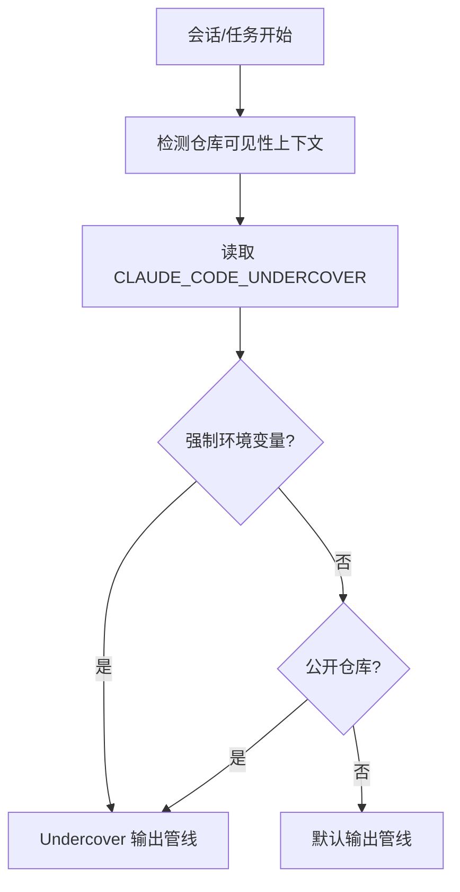
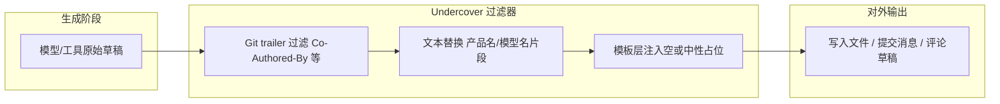

# 第十五部分 · 15.2 Undercover Mode — 公开仓库中的「去标识化」隐身系统

> **导航**：[← 15.1 Feature Flags](./index.md) · [15.3 Buddy 宠物 →](./03-buddy-pet.md)

---

## 学习目标

完成本节学习后，你应该能够：

1. **说明** Undercover Mode 的设计目标：Anthropic 员工向**公开仓库**贡献代码时，弱化或移除与雇主、产品与模型相关的可追溯痕迹。
2. **列举** 该模式典型处理的元数据类别：`Co-Authored-By` 头、模型名展示、文案中的「Claude Code」提及等（以具体实现为准）。
3. **区分** **自动激活**（公开仓库上下文）与 **强制开启**（`CLAUDE_CODE_UNDERCOVER=1`）两种入口，并理解文档所述「无 force-off」的合规含义。
4. **评估** 在开源协作中的利弊：降低品牌噪声 vs. 贡献者身份披露策略需在团队规范中另行约定。

---

## 生活类比：便衣采访 versus 正装发布会

想象技术团队有两套对外沟通礼仪：

- **正装发布会**（默认产品模式）：名牌、话筒、背景板上写满品牌与产品线——对应日常 Claude Code 体验中的**署名、模型名片段、产品文案**。
- **便衣采访**（Undercover）：记者只呈现事实与补丁，**不携带台标**，避免公众把「某公司背书」误读为「官方立场」。

Undercover Mode 就是给**公开 Git 历史**准备的「便衣规则」：代码与 Issue 讨论仍专业，但**自动剥离**容易触发「这是某模型代笔」联想的元数据层。

---

## 触发条件与优先级（概念表）

| 条件 | 行为倾向 | 备注 |
|------|----------|------|
| 当前工作区被判定为**公开仓库**（可见性信号） | **自动**进入 Undercover 等价策略 | 实现上可能组合远程 API、本地 git remote、缓存 |
| 环境变量 `CLAUDE_CODE_UNDERCOVER=1` | **强制**开启 Undercover | 用于本地复现或 CI 对齐 |
| 非公开 / 私有上下文且未设强制变量 | 通常走默认产品展示路径 | 具体以版本为准 |
| 「force-off」开关 | **文档口径：不提供** | 防止误关导致合规风险 |

> **教学提示**：「无 force-off」强调**安全默认**——宁可多隐藏，也不在公开场景误露标识。

---

## Mermaid：Undercover 决策管线



---

## Mermaid：元数据剥离的数据流



---

## 源码片段：环境变量守卫（示意）

```typescript
// undercover.ts（示意）
export function resolveUndercoverMode(ctx: {
  env: NodeJS.ProcessEnv;
  repository: { visibility: 'public' | 'private' | 'unknown' };
}): boolean {
  if (ctx.env.CLAUDE_CODE_UNDERCOVER === '1') {
    return true; // 强制开启，无对称的 "force off" 环境闸
  }
  if (ctx.repository.visibility === 'public') {
    return true;
  }
  return false;
}
```

```typescript
// commit-message-sanitizer.ts（示意）
export function sanitizeTrailers(
  message: string,
  undercover: boolean
): string {
  if (!undercover) return message;
  return message
    .split('\n')
    .filter((line) => !/^Co-Authored-By:/i.test(line))
    .join('\n');
}
```

```typescript
// branding-strip.ts（示意）
const PATTERNS = [/Claude Code/gi, /Anthropic/gi /* 版本相关 */];

export function stripBranding(text: string, undercover: boolean): string {
  if (!undercover) return text;
  let out = text;
  for (const re of PATTERNS) {
    out = out.replace(re, '');
  }
  return out.replace(/\n{3,}/g, '\n\n').trim();
}
```

---

## 与 Git / Code Hosting 的协作注意点

| 场景 | 建议 |
|------|------|
| **Squash merge** | trailer 可能在合并策略中丢失或重写；Undercover 仍应作用于最终消息模板。 |
| **Signed commits** | 签名证明密钥持有者，与 Undercover 的「品牌剥离」不同维度。 |
| **Bot 账户** | 组织可统一使用 `machine account`，与员工 Undercover 互补。 |
| **Issue / PR 模板** | 若模板含产品名，Undercover 可能只处理助手生成部分，不改动仓库静态文件。 |

---

## 合规与开源文化：不是「隐藏作者」

| 维度 | Undercover 通常做什么 | 通常不替代什么 |
|------|----------------------|----------------|
| **品牌与模型痕迹** | 弱化自动化生成标签 | 人工署名与法律要求的版权信息 |
| **公司政策** | 对齐雇主开源指南 | 各公司 CLA 与审批流 |
| **社区信任** | 减少「AI 公关」误解 | 技术审查与测试义务 |

---

## 调试与验证清单

| 步骤 | 操作 | 期望 |
|------|------|------|
| 1 | 在测试公开克隆上生成提交草稿 | 不出现指定 trailer |
| 2 | `export CLAUDE_CODE_UNDERCOVER=1` 后重复 | 行为与公开仓一致或更严格 |
| 3 | 检索输出中的模型名关键词 | 命中率为 0（在实现承诺范围内） |
| 4 | 对照发行说明变更 | 变量名与语义是否迁移 |

---

## 常见问题 FAQ

| 问题 | 回答方向 |
|------|----------|
| 为何不对私有仓默认开启？ | 私有协作常需完整遥测与产品内标识用于排障。 |
| 能否在公开仓「半开启」？ | 实现上多为布尔管线；半开需自定义 Hook（见第十六部分）。 |
| 会影响 Token 计费吗？ | 一般不影响；过滤在输出侧，输入系统提示可能仍含中性能力描述。 |

---

## 与本部分其他节的关系

| 关联 | 说明 |
|------|------|
| [15.1](./index.md) | Undercover 常作为 Feature Flag 矩阵中的一支高优先级分支。 |
| [15.6](./06-internal-easter-eggs.md) | 内部 `USER_TYPE` 分支与公开合规分支正交：前者偏能力，后者偏展示。 |

---

## 延伸思考

1. 若未来法规要求标注「AI 辅助」，Undercover 与披露义务如何共存？可能需要「技术性标注」与「品牌文案」分层。
2. 多语言提交信息中，正则剥离是否足够？可能需要 AST/模板级处理。

---

## 小结

- **Undercover Mode** = 面向**公开协作**的**输出消毒管线** + **`CLAUDE_CODE_UNDERCOVER=1` 强制入口**。
- **自动于公开仓库**减少人为遗忘；**无 force-off** 体现「默认安全」。
- 学习重点在**元数据层**与**模板层**，而非替代工程流程与社区规范。

---

## 课后自测

1. 画一张草图：从「模型生成」到 `git commit`，哪些环节应插入 sanitizer？
2. 解释为何「不提供 force-off」在合规叙事上成立。
3. 列举三种除 `Co-Authored-By` 外可能需要剥离的元数据类型。

---

**上一节**：[15.1 Feature Flags](./index.md)  
**下一节**：[15.3 Buddy 宠物系统](./03-buddy-pet.md)
