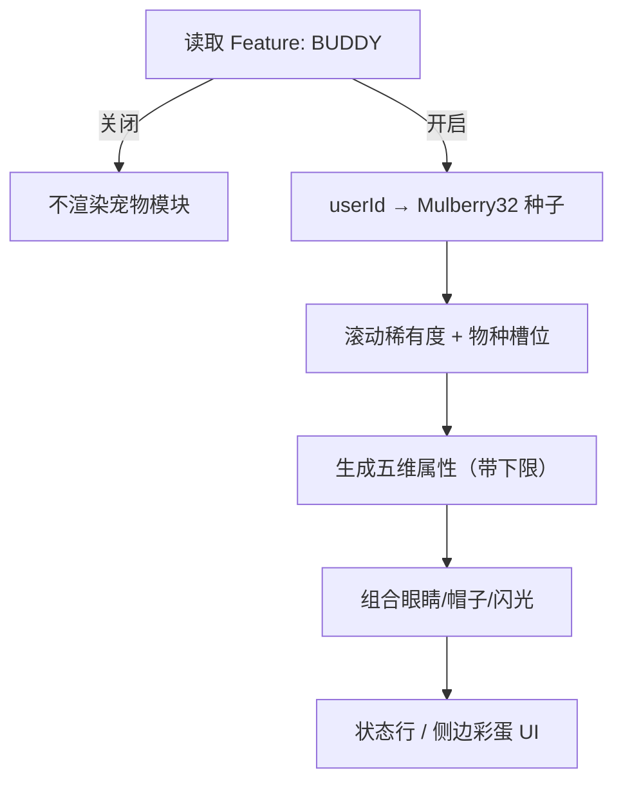
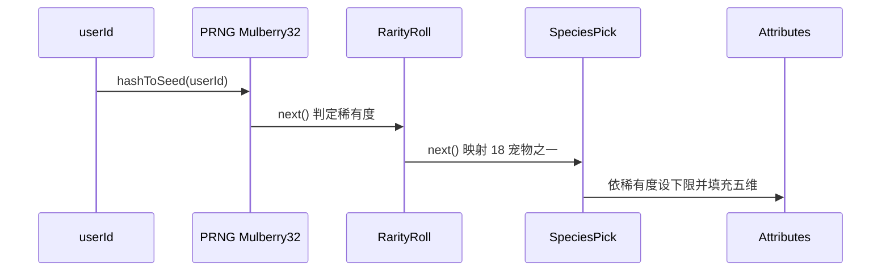

# 第十五部分 · 15.3 Buddy Pet System — BUDDY 旗标与 18 种宠物宇宙

> **导航**：[← 15.2 Undercover](./02-undercover-mode.md) · [15.4 反作弊 →](./04-anti-cheat.md)

---

## 学习目标

完成本节学习后，你应该能够：

1. **解释** `BUDDY` Feature Flag 如何门控整个宠物子系统，以及它在 UI/状态行中的典型呈现位置（版本相关）。
2. **枚举** 18 种宠物角色：`duck`、`goose`、`blob`、`cat`、`dragon`、`octopus`、`owl`、`penguin`、`turtle`、`snail`、`ghost`、`axolotl`、`capybara`、`cactus`、`robot`、`rabbit`、`mushroom`、`chonk`。
3. **复述** 五档稀有度及基准概率：**Common 60%**、**Uncommon 25%**、**Rare 10%**、**Epic 4%**、**Legendary 1%**，以及**独立 1%**「闪光」层。
4. **理解** 以 `userId` 为种子的 **Mulberry32** PRNG 如何实现**跨会话稳定**的宠物身份。
5. **描述** 五维属性 **DEBUGGING / PATIENCE / CHAOS / WISDOM / SNARK** 及稀有度对**属性下限**的约束意义。

---

## 生活类比：固定星座 versus 每日抽签

把 Buddy 系统想象成「**出生证上写死的守护动物**」：

- 不是你的心情每天抽一次盲盒，而是**身份证号（userId）决定**你终身对应的那个小生灵。
- **稀有度**像血统证书上的品级：传说级并不改变你写代码的能力，但影响**文案趣味与属性条起点**。
- **闪光**像 Pokémon 的异色：基础角色不变，多一层**极低概率的视觉/标签修饰**。

因此 Buddy 是**确定性娱乐系统**，不是竞技排行榜。

---

## 18 宠物角色速查表

| 英文名 | 中文昵称（教学） | 气质联想 |
|--------|------------------|----------|
| duck | 小鸭 | 划水但可爱 |
| goose | 大鹅 | 攻击性幽默 |
| blob | 软泥 | 情绪容器 |
| cat | 猫 | 高冷监工 |
| dragon | 龙 | 架构师脾气 |
| octopus | 章鱼 | 多线程触手 |
| owl | 猫头鹰 | 夜猫子 review |
| penguin | 企鹅 | 冷静排队 debug |
| turtle | 龟 | 慢速稳健 |
| snail | 蜗牛 | 渐进式交付 |
| ghost | 幽灵 | 隐式依赖猎手 |
| axolotl | 美西螈 | 再生力（重写模块） |
| capybara | 水豚 | 情绪稳定 |
| cactus | 仙人掌 | 扎人的直评 |
| robot | 机器人 | 规则至上 |
| rabbit | 兔子 | 快速迭代 |
| mushroom | 蘑菇 | 在阴暗角落找 bug |
| chonk | 圆滚滚 | 重量级 refactor |

---

## 稀有度与概率（教学口径）

| 稀有度 | 基准概率 | 属性下限倾向（概念） |
|--------|----------|----------------------|
| Common | 60% | 下限较低，方差小 |
| Uncommon | 25% | 略抬升 |
| Rare | 10% | 明显抬升 |
| Epic | 4% | 高起步 |
| Legendary | 1% | 顶配起点 |
| Shiny（闪光） | **独立 1%**（与上表正交叠加语义，教学模型） | 视觉层，不改变种子的主物种 |

> **说明**：「独立 1% 闪光」在实现上可建模为二次掷骰或高位掩码；本节强调**与主稀有度滚动分离**的趣味层。

---

## Mermaid：BUDDY 功能门控



---

## Mermaid：种子确定性管线



---

## 源码片段：Mulberry32 与滚动（示意）

```typescript
// mulberry32.ts（示意）
export function mulberry32(seed: number) {
  return function () {
    let t = (seed += 0x6d2b79f5);
    t = Math.imul(t ^ (t >>> 15), t | 1);
    t ^= t + Math.imul(t ^ (t >>> 7), t | 61);
    return ((t ^ (t >>> 14)) >>> 0) / 4294967296;
  };
}
```

```typescript
// buddy-roll.ts（示意）
import { hashUserIdToSeed } from './hash';
import { mulberry32 } from './mulberry32';

export type Rarity = 'common' | 'uncommon' | 'rare' | 'epic' | 'legendary';

const SPECIES = [
  'duck',
  'goose',
  'blob',
  'cat',
  'dragon',
  'octopus',
  'owl',
  'penguin',
  'turtle',
  'snail',
  'ghost',
  'axolotl',
  'capybara',
  'cactus',
  'robot',
  'rabbit',
  'mushroom',
  'chonk',
] as const;

export function rollBuddy(userId: string) {
  const rng = mulberry32(hashUserIdToSeed(userId));
  const rarity = rollRarity(rng); // 60/25/10/4/1
  const speciesIndex = Math.floor(rng() * SPECIES.length);
  const species = SPECIES[speciesIndex];
  const shiny = rng() < 0.01; // 独立 1% 闪光
  const attrs = rollAttributes(rng, rarity);
  return { species, rarity, shiny, attrs };
}
```

```typescript
// attributes.ts（示意）
export type BuddyAttrs = {
  debugging: number;
  patience: number;
  chaos: number;
  wisdom: number;
  snark: number;
};

const RARITY_FLOORS: Record<Rarity, number> = {
  common: 10,
  uncommon: 18,
  rare: 28,
  epic: 40,
  legendary: 55,
};

export function rollAttributes(
  rng: () => number,
  rarity: Rarity
): BuddyAttrs {
  const floor = RARITY_FLOORS[rarity];
  const pick = () => floor + Math.floor(rng() * (100 - floor));
  return {
    debugging: pick(),
    patience: pick(),
    chaos: pick(),
    wisdom: pick(),
    snark: pick(),
  };
}
```

---

## 五维属性与文案钩子

| 属性 | 含义（教学） | UI 可能用法 |
|------|--------------|-------------|
| DEBUGGING | 找 bug 积极性 | 失败重试提示语气 |
| PATIENCE | 对长任务的容忍 | 进度条旁白 |
| CHAOS | 随机玩梗频率 | 彩蛋密度 |
| WISDOM | 「架构师腔」浓度 | 建议条风格 |
| SNARK | 吐槽锋利度 | 代码 smell 评论 |

---

## 外观系统预告（与 15.4 联动）

| 组件 | 规模 | 备注 |
|------|------|------|
| 眼睛样式 | 6 种 | 与种子派生索引 |
| 帽子 | 8 种 | **Common 稀有度无帽**（教学口径） |
| 闪光 | 二元 | 独立 1% |

具体**会话级重算**防篡改逻辑见 [15.4](./04-anti-cheat.md)。

---

## 产品伦理与体验边界

| 话题 | 建议 |
|------|------|
| **儿童向？** | 默认终端受众为开发者；仍应避免过度干扰主任务流。 |
| **付费墙？** | 教学上视为纯客户端彩蛋，不与 API 配额挂钩。 |
| **隐私** | userId 仅客户端派生展示，不应上传敏感画像（以正式隐私政策为准）。 |

---

## 调试开关建议

| 操作 | 目的 |
|------|------|
| 固定测试 userId | 验证同一用户跨机器一致 |
| 切换 BUDDY off/on | 确认门控与降级路径 |
| 快照 UI | 回归眼睛/帽子贴图资源路径 |

---

## 常见问题 FAQ

| 问题 | 回答方向 |
|------|----------|
| 换账号会变吗？ | 会，种子来自 userId。 |
| 能「刷」传说宠吗？ | 确定性种子下不能靠重 Roll；除非换身份或实现变更。 |
| 宠物影响模型能力吗？ | **不应**影响；属娱乐与 UI。 |

---

## 小结

- **BUDDY** 门控一整个**确定性宠物宇宙**：18 物种 × 稀有度 × 独立闪光 × 外观组件。
- **Mulberry32(userId)** 保证「你是谁，就养哪只」。
- **五维属性**服务文案与个性，**稀有度**主要抬升**下限**，不是 PVP 数值。

---

## 课后自测

1. 手写伪代码：给定固定 seed，连续调用 `mulberry32` 10 次，输出应可复现。
2. 解释「闪光 1%」与「Legendary 1%」在概率论上的独立性含义。
3. 列出 Common 无帽对 UI 资源组织的两点工程影响（条件渲染、资产打包）。

---

**上一节**：[15.2 Undercover Mode](./02-undercover-mode.md)  
**下一节**：[15.4 外观反作弊与会话重算](./04-anti-cheat.md)
