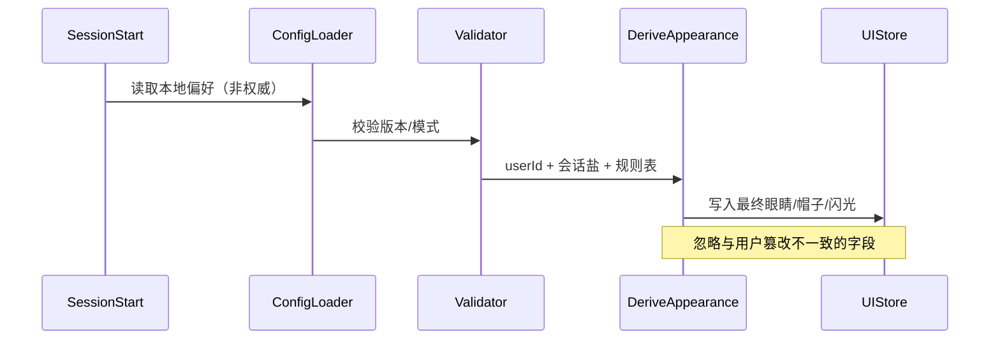
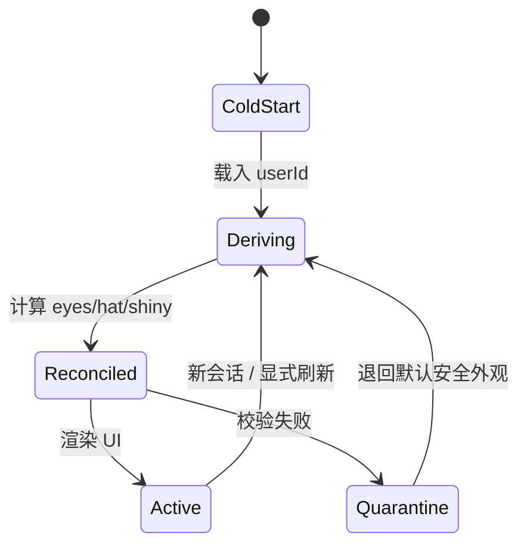

# 第十五部分 · 15.4 Buddy 外观反作弊 — 会话级重算与配置一致性

> **导航**：[← 15.3 Buddy](./03-buddy-pet.md) · [15.5 深度规划 →](./05-deep-planning.md)

---

## 学习目标

完成本节学习后，你应该能够：

1. **解释** 为何纯客户端彩蛋仍需要「反作弊」：防止用户通过编辑本地配置获得**非种子一致**的外观组合。
2. **描述** **每次会话重算外观**的策略：在会话初始化阶段基于权威输入（如 `userId`、服务端/密钥链、会话盐）重新派生眼睛/帽子/闪光位。
3. **关联** [15.3](./03-buddy-pet.md) 中的组件规模：**6 眼睛**、**8 帽子**（Common 无帽）、物种与稀有度。
4. **对比** 「持久化缓存」与「会话派生」在 UX 与完整性上的权衡。

---

## 生活类比：游乐园手环 versus 自制贴纸

把 Buddy 外观想象成游乐园入场**手环颜色**：

- 手环颜色由售票系统根据**身份证哈希**决定，不是你进场后自己贴一张彩色贴纸就算数。
- 每次入园（**新会话**），闸机重新验证并**重新发放**当日有效手环——防止你昨晚把贴纸撕下来换给别人用。
- **Common 无帽**像「基础票不发遮阳帽」：不是歧视，是**稀有度分层**的一部分。

---

## 威胁模型（教学简化）

| 攻击意图 | 手段示例 | 防御思路 |
|----------|----------|----------|
| 改本地 JSON | 手动把 `hat` 改成传奇款 | 会话重算覆盖 |
| 换皮资源 | 替换 png/svg 文件 | 哈希校验或打包签名（若实现） |
| 内存改值 | 运行时 patch 状态 | 周期性 reconcile 或只信派生函数 |
| 共享配置 | 拷贝「他人宠物档案」 | 种子绑定 userId，拷贝无效 |

---

## Mermaid：会话重算时序



---

## Mermaid：外观派生状态机



---

## 源码片段：派生与覆盖（示意）

```typescript
// appearance.ts（示意）
export type BuddyAppearance = {
  eyeVariant: number; // 0..5
  hatVariant: number | null; // 0..7 or null if common without hat
  shiny: boolean;
};

export function deriveAppearance(input: {
  userId: string;
  sessionId: string;
  rarity: Rarity;
  species: string;
}): BuddyAppearance {
  const rng = mulberry32(
    hashCompositeSeed(input.userId, input.sessionId, input.species)
  );
  const eyeVariant = Math.floor(rng() * 6);
  const shiny = rng() < 0.01;
  const hatVariant =
    input.rarity === 'common' ? null : Math.floor(rng() * 8);
  return { eyeVariant, hatVariant, shiny };
}
```

```typescript
// session-bootstrap.ts（示意）
export function bootstrapBuddyUiState(ctx: RuntimeContext) {
  const rolled = rollBuddy(ctx.userId); // 15.3
  const canonical = deriveAppearance({
    userId: ctx.userId,
    sessionId: ctx.sessionId,
    rarity: rolled.rarity,
    species: rolled.species,
  });
  // 本地文件若存在篡改字段，一律以 canonical 为准
  ctx.ui.buddy = { ...rolled, appearance: canonical };
}
```

```typescript
// integrity-check.ts（示意）
export function reconcileStoredBuddyPrefs(
  disk: Partial<BuddyAppearance> | undefined,
  canonical: BuddyAppearance
): BuddyAppearance {
  if (!disk) return canonical;
  const mismatch =
    disk.eyeVariant !== canonical.eyeVariant ||
    disk.hatVariant !== canonical.hatVariant ||
    disk.shiny !== canonical.shiny;
  if (mismatch) {
    telemetryDebug('buddy_prefs_reset', { reason: 'tamper' });
    return canonical;
  }
  return canonical;
}
```

---

## 眼睛 × 帽子 × 稀有度（约束表）

| 稀有度 | 帽子 | 眼睛 | 闪光 |
|--------|------|------|------|
| Common | **无**（`null`） | 6 选 1 | 独立 1% |
| Uncommon | 8 选 1 | 6 选 1 | 独立 1% |
| Rare | 8 选 1 | 6 选 1 | 独立 1% |
| Epic | 8 选 1 | 6 选 1 | 独立 1% |
| Legendary | 8 选 1 | 6 选 1 | 独立 1% |

---

## 与「仅种子_roll」方案的区别

| 方案 | 优点 | 缺点 |
|------|------|------|
| **仅 userId 种子** | 极简、可预测 | 换会话无法轮换会话盐；篡改本地更易「粘住」错误状态 |
| **userId + sessionId** | 防简单拷贝配置、鼓励每会话对齐 | 同用户每天外观可能变化（若实现如此） |
| **userId 唯一权威** | 最强「身份一致」 | 需在文档声明 session 盐是否参与 |

> **本指南教学口径**：强调「**每次会话重算**」——实现可选用 session 盐或仅校验和覆盖，但**核心**是**不以磁盘为最终真相源**。

---

## 遥测与隐私

| 事件 | 是否应含 PII | 说明 |
|------|----------------|------|
| `buddy_prefs_reset` | 否 | 用匿名会话 ID |
| 外观哈希 | 可 | 仅用于崩溃聚合 |

---

## 测试用例矩阵（节选）

| 用例 | 输入 | 期望 |
|------|------|------|
| T1 | 删配置文件 | 回退 canonical |
| T2 | hat 改非法索引 | 重置为派生值 |
| T3 | common + 非 null 帽 | 强制 `null` |
| T4 | 连续两次 SessionStart | 若含 session 盐则 eye/hat 可变；否则稳定 |

---

## 与 Feature Flag 的交互

| Flag | 影响 |
|------|------|
| `BUDDY` off | 跳过派生与 UI，防无谓计算 |
| 调试 Flag（若存在） | 可能固定 rng 种子便于截图 |

---

## 常见问题 FAQ

| 问题 | 回答方向 |
|------|----------|
| 这是安全机制吗？ | 主要是**体验一致性**，不是金融级安全。 |
| 会影响性能吗？ | 派生为 O(1) 计算，可忽略相对 LLM 延迟。 |
| mod 社区呢？ | 第三方皮肤与官方 integrity 可能冲突，属预期外。 |

---

## 小结

- **反作弊**在此语境 = **配置篡改无效化**，通过**会话级 canonical 重算**实现。
- **6 眼 / 8 帽 / Common 无帽** 必须在派生函数中**硬编码约束**，而非仅信 UI。
- 与 15.3 的 **PRNG** 配套：物种稀有可长期稳定，外观可会话刷新——二者并不矛盾，取决于**复合种子**设计。

---

## 课后自测

1. 写出一个「磁盘偏好」结构体，并标注哪些字段是「只读展示」、哪些是「可写用户设置」（如静音彩蛋）。
2. 解释为何「会话重算」能阻断「复制他人配置文件」攻击路径。
3. 绘制测试矩阵中 T3 的断言伪代码。

---

**上一节**：[15.3 Buddy 宠物](./03-buddy-pet.md)  
**下一节**：[15.5 Deep Planning Mode](./05-deep-planning.md)
