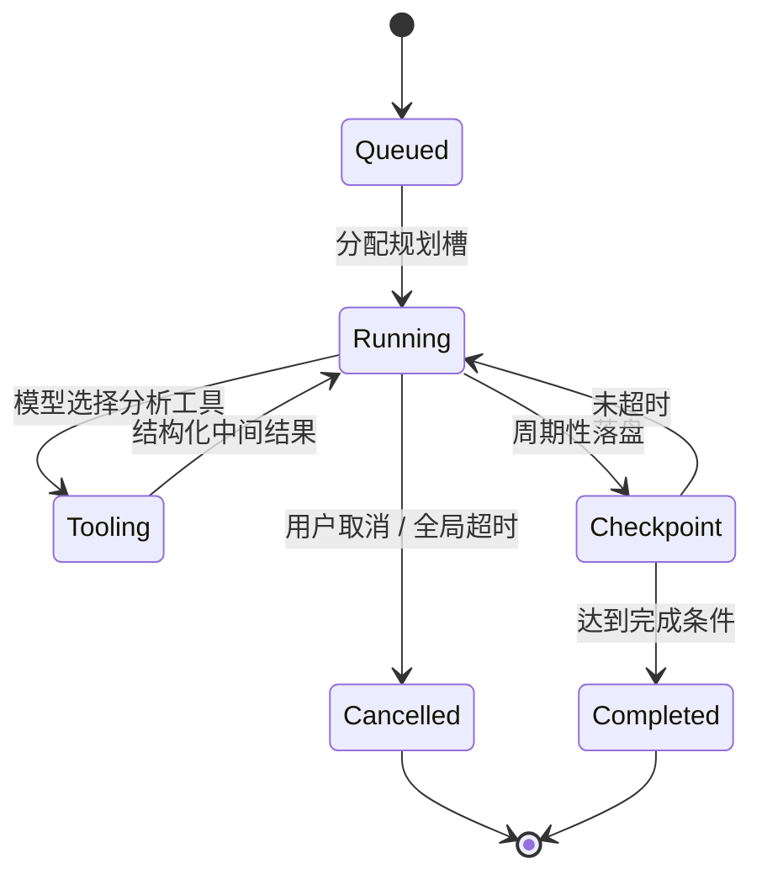
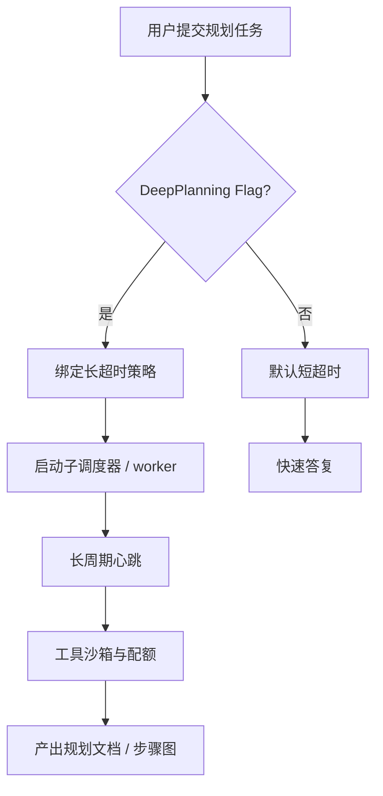

# 第十五部分 · 15.5 Deep Planning Mode — 长达 30 分钟的单任务深度规划

> **导航**：[← 15.4 反作弊](./04-anti-cheat.md) · [15.6 内部彩蛋 →](./06-internal-easter-eggs.md)

---

## 学习目标

完成本节学习后，你应该能够：

1. **定义** Deep Planning Mode：在**单一规划任务**上允许显著延长的思考/工具/子步骤预算（教学口径：**约 30 分钟**），用于复杂重构、迁移或跨模块设计。
2. **区分** 普通对话回合限制与「深度规划」在**超时、心跳、取消语义**上的差异。
3. **识别** 该模式在源码中可能与哪些 Flag、调度器、任务队列共同出现。
4. **评估** 成本与风险：Token、API 账单、用户等待体验、长时间占用的并发槽位。

---

## 生活类比：快餐套餐 versus 私房慢炖

- **普通模式**像写字楼下的**快餐套餐**：15 分钟内上菜，适合「改一个函数签名」。
- **Deep Planning Mode**像周末预约的**慢炖私房菜**：厨师（规划器）可以在厨房连续工作**半小时**，中间多道**备料步骤**（读文件、画依赖图、列风险清单），最后一次性呈上「完整菜单」（里程碑计划）。

关键不是「聊天更久」，而是**同一个规划任务**被系统识别为**允许长跑**的工作类型。

---

## 能力边界（概念表）

| 维度 | 普通规划 | Deep Planning（教学口径） |
|------|----------|---------------------------|
| 单任务时间上限 | 较短（分钟级） | **约 30 分钟** |
| 中断与恢复 | 依赖会话检查点 | 可能需要显式 checkpoint |
| 工具调用深度 | 受默认预算约束 | 放宽迭代轮次 |
| 适用输入 | 大多数用户提示 | 明确「规划类」意图或 Flag |
| 并发 | 与常规任务共用池 | 可能占用更长槽位 |

---

## Mermaid：深度规划作业生命周期



---

## Mermaid：调度与超时层级



---

## 源码片段：超时策略（示意）

```typescript
// planning-timeouts.ts（示意）
export const DEFAULT_PLANNING_BUDGET_MS = 3 * 60 * 1000; // 3 分钟
export const DEEP_PLANNING_BUDGET_MS = 30 * 60 * 1000; // 30 分钟

export function resolvePlanningBudget(
  flags: FeatureSet,
  taskKind: 'quick' | 'plan' | 'deep_plan'
): number {
  if (taskKind === 'deep_plan' && flags.deepPlanning) {
    return DEEP_PLANNING_BUDGET_MS;
  }
  if (taskKind === 'plan') {
    return DEFAULT_PLANNING_BUDGET_MS;
  }
  return 60 * 1000;
}
```

```typescript
// planning-runner.ts（示意）
export async function runPlanningJob(job: PlanningJob, budgetMs: number) {
  const controller = new AbortController();
  const timer = setTimeout(() => controller.abort(), budgetMs);
  try {
    await orchestrateTools(job, { signal: controller.signal });
  } finally {
    clearTimeout(timer);
  }
}
```

```typescript
// checkpoint.ts（示意）
export async function maybeCheckpoint(state: PlannerState) {
  if (state.elapsedMs > 5 * 60 * 1000) {
    await persistPlannerCheckpoint(state);
  }
}
```

---

## 何时应开启？（决策表）

| 场景 | 建议 | 原因 |
|------|------|------|
| 单体仓库跨 50+ 文件迁移 | 适合 | 需要广泛只读扫描与一致性计划 |
| 修复一个拼写错误 | 不适合 | 浪费长跑槽位与费用 |
| CI 中自动规划 | 谨慎 | 30 分钟作业可能阻塞流水线 |
| 安全相关渗透测试计划 | 视政策 | 可能需审计日志与人工门控 |

---

## 与其他子系统交互

| 子系统 | 交互点 |
|--------|--------|
| **工具系统** | 更多 `Grep`/`Glob`/`LSP` 轮次 |
| **上下文窗口** | 需要摘要与 checkpoint 防溢出 |
| **权限** | 长跑中多次触及敏感工具 → `PermissionRequest` Hook |
| **Hooks** | `PreToolUse` 可在深度任务中更严格拦截 |

---

## 可观测性

| 指标 | 说明 |
|------|------|
| `planning_wall_ms` | 墙钟时间 |
| `planning_tool_calls` | 工具次数 |
| `planning_tokens` | 估算 Token |
| `planning_aborted` | 取消率 |

---

## 用户体验建议

| 实践 | 说明 |
|------|------|
| **显式进度** | 每 N 分钟输出阶段标题 |
| **可取消** | Ctrl+C / Stop 必须可靠 |
| **结果结构化** | 强制 Markdown 章节：目标 / 风险 / 里程碑 / 回滚 |
| **费用提示** | 长跑前二次确认（若产品支持） |

---

## 风险与缓解

| 风险 | 缓解 |
|------|------|
| 模型陷入循环 | 最大轮次 + 重复检测 |
| 上下文爆炸 | 中间摘要压缩 |
| 误触发深度模式 | 意图分类 + Flag 双门槛 |
| 资源挤占 | 每用户并发上限 |

---

## 常见问题 FAQ

| 问题 | 回答方向 |
|------|----------|
| 是否等于「Thinking 更长」？ | 更接近「**规划作业**预算」，仍受工具与模型限制。 |
| 能否拆成多会话？ | 可以，但需 checkpoint 文件接力。 |
| 离线可用？ | 取决于本地模型与实现；通常仍受算力限制。 |

---

## 与 15.1 Flag 矩阵的映射

| Flag（示意名） | 作用 |
|----------------|------|
| `DEEP_PLANNING` | 打开门控 |
| `PLANNING_MAX_MINUTES` | 若存在可调优配置 |

---

## 延伸：与企业版 SLA

| 维度 | 个人 | 企业 |
|------|------|------|
| 最长规划 | 受账户策略 | 可能被管理员调低以控成本 |
| 审计 | 可选 | 常强制 |

---

## 小结

- **Deep Planning Mode** 把「规划」从**短跑**升级为**中长跑**（**~30 分钟**单任务预算的教学口径）。
- 工程关键是**超时策略 + checkpoint + 工具预算**三位一体。
- 使用上遵循「**大事慢炖，小事快餐**」，并与 Hooks、权限、遥测联动审视。

---

## 课后自测

1. 画一张时间轴：0–30 分钟内应至少出现几次 checkpoint 才合理？
2. 写伪代码：检测连续三次相同工具相同参数时中断循环。
3. 解释为何深度规划对「并发槽位」是产品级问题而非纯算法问题。

---

## 附录：伪 API（教学）

```typescript
interface DeepPlanningRequest {
  goal: string;
  constraints: string[];
  nonGoals: string[];
}

interface DeepPlanningResult {
  milestones: { title: string; acceptance: string }[];
  risks: { severity: 'low' | 'med' | 'high'; note: string }[];
  rollback: string;
}
```

---

**上一节**：[15.4 反作弊](./04-anti-cheat.md)  
**下一节**：[15.6 内部彩蛋与 USER_TYPE](./06-internal-easter-eggs.md)
