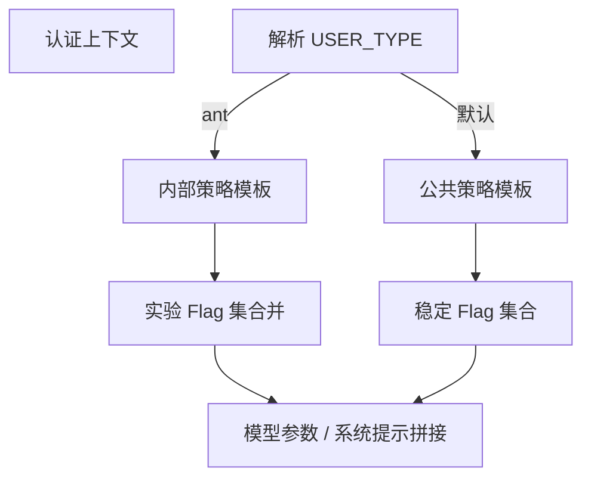
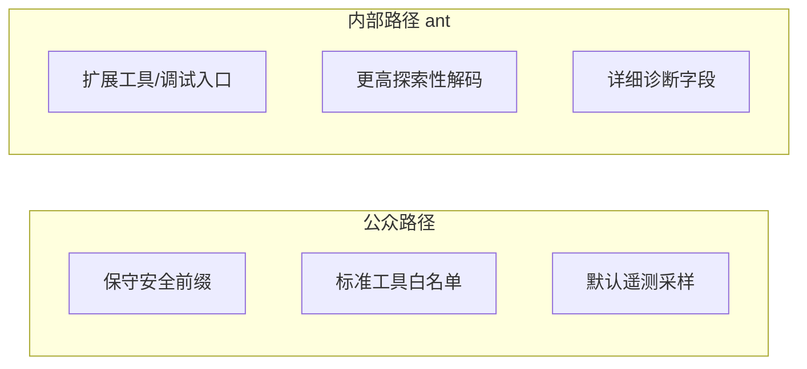

# 第十五部分 · 15.6 内部彩蛋 — `USER_TYPE === 'ant'` 与实验输出策略

> **导航**：[← 15.5 深度规划](./05-deep-planning.md) · [返回 15.1](./index.md)

---

## 学习目标

完成本节学习后，你应该能够：

1. **识别** 源码中可能存在的**内部用户类型**分支，例如 `USER_TYPE === 'ant'`（教学代号），用于区分**雇员/内测**与公众默认路径。
2. **解释** 「更激进输出策略」在工程上可能指：更高温度、更少保守拒答模板、启用实验工具、提前曝光未发布 Flag。
3. **论证** 为何此类分支**不应**被普通用户依赖：稳定性、合规、合同条款与随时下线。
4. **对照** [15.2 Undercover](./02-undercover-mode.md)：内部能力扩张 vs. 对外标识弱化是**不同维度**。

---

## 生活类比：试飞员 versus 民航乘客

- **民航乘客**（默认用户）：遵循保守操作规程，安全带演示、限流、延误以安全为先。
- **试飞员**（内部 `ant` 分支）：可以在**指定空域**测试更高推重比、触发更多传感器日志——数据用于改进下一版民航软件。

你在 GitHub 上读到的「`ant` 分支」不是让你**混进驾驶舱**的漏洞，而是提醒你：**存在一条为内部验证预留的跑道**。

---

## 概念要素表

| 要素 | 说明 |
|------|------|
| **判别信号** | 登录身份、组织租户、设备证书、构建变体等（实现相关） |
| **分支键** | `USER_TYPE` 枚举，教学示例值 `'ant'` |
| **行为差异** | 更激进输出、实验功能可见性、诊断日志级别 |
| **生命周期** | 可能随版本重构改名或移除 |

---

## Mermaid：用户类型路由



---

## Mermaid：策略差异（示意）



---

## 源码片段：分支守卫（示意）

```typescript
// user-profile.ts（示意）
export type UserType = 'default' | 'ant' | 'partner';

export function resolveUserType(ctx: AuthContext): UserType {
  if (ctx.claims.internalStaff) return 'ant';
  if (ctx.claims.partnerLab) return 'partner';
  return 'default';
}
```

```typescript
// model-policy.ts（示意）
export function buildOutputPolicy(userType: UserType): OutputPolicy {
  if (userType === 'ant') {
    return {
      temperatureBoost: 0.1,
      enableExperimentalTools: true,
      systemPromptSuffix: INTERNAL_LAB_SUFFIX,
    };
  }
  return DEFAULT_OUTPUT_POLICY;
}
```

```typescript
// feature-gates.ts（示意）
export function mergeFeatureFlags(
  base: FeatureSet,
  userType: UserType
): FeatureSet {
  if (userType === 'ant') {
    return {
      ...base,
      buddy: true,
      deepPlanning: true,
      undercover: false, // 内部调试可能关闭某些合规包装
    };
  }
  return base;
}
```

> **警告**：最后一段 `undercover: false` 仅为展示「内部矩阵可不同」的教学虚构；真实矩阵以合规为准，**切勿**据此推断可绕过公开仓策略。

---

## 「更激进输出」拆解

| 可能含义 | 工程实现线索 | 对终端用户影响 |
|----------|----------------|----------------|
| 解码参数 | `temperature`、`top_p` | 回答更多样 |
| 系统提示 | 附加「可推测未公开 API」条款（内部） | **不可依赖** |
| 工具可见性 | 暴露诊断类 tool | 安全风险上升 → 仅内部 |
| 拒答阈值 | 降低安全拦截敏感度 | **绝不**适用于对外默认 |

---

## 道德与合规边界

| 原则 | 说明 |
|------|------|
| **不冒充内部** | 伪造 `USER_TYPE` 可能违反服务条款。 |
| **不传播绕过技巧** | 本指南只讲**只读理解**源码结构。 |
| **数据最小化** | 内部分支常伴随更强日志，需员工培训。 |

---

## 与 Undercover 的对比表

| 维度 | Undercover（15.2） | `ant` 内部分支 |
|------|---------------------|----------------|
| 目标 | 对外弱化标识 | 对内增强能力 |
| 默认触发 | 公开仓 / 环境变量 | 内部认证 |
| 受众 | 开源贡献者 | 员工/实验室 |
| 可讨论性 | 可公开教学 | 以公司政策为准 |

---

## 源码考古建议

| 步骤 | 动作 |
|------|------|
| 1 | `rg "USER_TYPE|userType|internalStaff"` |
| 2 | 跟踪枚举到**策略合成**函数 |
| 3 | 对照 changelog 是否重命名 |
| 4 | 区分**客户端**与**网关**两侧判断 |

---

## 测试替身（工程视角）

| 场景 | 做法 |
|------|------|
| 单元测试 | 注入 `userType: 'ant'` 快照策略对象 |
| E2E | 勿在公共 CI 依赖真实内部账号 |
| 开源贡献 | 提交前确认不泄露内部 endpoint |

---

## 常见问题 FAQ

| 问题 | 回答方向 |
|------|----------|
| 我能改本地二进制打开 ant 吗？ | **不建议且可能违法/违约**；此处仅学术讨论分支存在性。 |
| ant 会进发行版吗？ | 代码可能在同一二进制，但**门控在服务端/证书**。 |
| 与 Buddy 有关吗？ | 可能独立；内部或默认全开做 dogfood。 |

---

## 与其他部分索引

| 章节 | 关联 |
|------|------|
| [15.1](./index.md) | Flag 总览 |
| [15.5](./05-deep-planning.md) | 内部或更早试用长跑规划 |
| 第十六部分 | Hooks 审计内部工具调用 |

---

## 小结

- **`USER_TYPE === 'ant'`** 代表一类**内部/实验室**策略模板，而非用户可投机开启的「隐藏菜单」。
- **更激进输出**与**实验功能**服务于迭代速度，伴随**合规与安全的额外义务**。
- 阅读源码的价值在于**理解产品线结构**，而非寻找捷径。

---

## 课后自测

1. 画一张表：列出三项「公众策略」与三项「内部策略」差异，并标注哪一侧更适合自动化测试覆盖。
2. 解释为何内部分支常与「更强遥测」共存。
3. 从开源伦理角度，讨论 Undercover 与内部激进策略同时存在是否合理。

---

## 本部分回顾（15.1–15.6）

| 节 | 关键词 |
|----|--------|
| 15.1 | 90+ Flags、registry、检索 |
| 15.2 | Undercover、公开仓、`CLAUDE_CODE_UNDERCOVER` |
| 15.3 | BUDDY、18 宠、Mulberry32、五维属性 |
| 15.4 | 会话重算、防篡改外观 |
| 15.5 | Deep Planning、~30 分钟 |
| 15.6 | `ant`、内部实验策略 |

---

**上一节**：[15.5 Deep Planning](./05-deep-planning.md)  
**返回**：[15.1 Feature Flags](./index.md)
