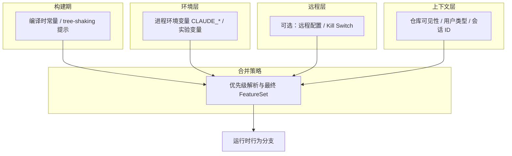
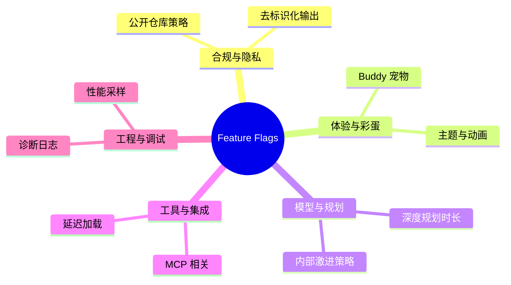

# 第十五部分 · 隐藏功能（15.1）— 源码中的 90+ Feature Flags 全景

> **导航**：本部分共 6 节。本节从**特性开关（Feature Flags）**总览入手；后续各节分别讲解 Undercover Mode、Buddy 宠物、反作弊、深度规划与内部彩蛋分支。

---

## 学习目标

完成本节学习后，你应该能够：

1. **理解** Feature Flag 在 Claude Code 类客户端中的角色：灰度发布、实验能力、合规与差异化构建。
2. **归类** 在源码审计中常见的 Flag 类型（环境变量覆盖、构建期常量、远程配置、用户/会话派生状态）。
3. **估算** 「90+」量级开关在工程上的含义：并非全部对用户可见，多数服务于内部实验、遥测采样与 UI 微功能。
4. **建立** 阅读源码时的检索习惯：`FEATURE_`、`ENABLE_`、`BUDDY`、`UNDERCOVER` 等关键词与集中注册表（registry）模式。

---

## 生活类比：大楼里的「配电盘」

把 **90+ Feature Flags** 想象成一栋智能写字楼地下室的**配电盘**：

- 每一格开关对应一条**电路**（某段逻辑、某块 UI、某种模型策略）。
- 物业（发布系统）可以**只给某几层通电**（灰度用户），而不必拆掉整栋楼重装。
- 有些开关连着**消防与合规**（例如公开场景下去标识化），平时你看不到灯亮，但一直在工作。
- 偶尔有一两路是**装饰灯带**（彩蛋、宠物、内部演示），不影响承重结构，但让体验更有趣。

学 Flag 不是背 90 个名字，而是学会**找到总闸、读懂标签、推断电流走向**。

---

## 为何源码里会有「90+」个开关？

| 动因 | 说明 | 对读者的启示 |
|------|------|----------------|
| **持续交付** | 主干开发 + 按需点亮功能，避免长期分支 | 同一版本二进制可能包含未启用路径 |
| **风险控制** | 高危能力默认关闭，事故时可快速切断 | 文档未写 ≠ 代码不存在 |
| **A/B 与实验** | 采样、对照组、内部员工差异 | 行为「不一致」有时是刻意的 |
| **合规与场景** | 公开仓库、企业租户、地域策略 | 环境变量可强制某些模式（见 15.2） |
| **性能与缓存** | 延迟加载、工具注册、索引构建 | 与 `defer_loading` 等机制联动（第十六部分） |

---

## Mermaid：Feature Flag 决策流（概念模型）

下列流程图展示**一次请求或会话初始化**时，典型客户端如何**叠加**多层 Flag 决策。节点 ID 使用英文字母与下划线，标签用中文引号。



---

## Mermaid：Flag 分类思维导图（教学用）



---

## 源码片段：集中注册与布尔判断（示意）

下列 TypeScript 片段为**教学示意**，展示工程中常见的「注册表 + 守卫函数」写法；真实仓库中的命名与文件路径以你本地检出为准。

```typescript
// feature-flags.ts（示意）
export const FeatureRegistry = {
  BUDDY: 'buddy_pet_system',
  DEEP_PLANNING: 'deep_planning_mode',
  UNDERCOVER_HINT: 'undercover_mode',
  // ... 数十至上百项，按域分组
} as const;

export type FeatureKey = (typeof FeatureRegistry)[keyof typeof FeatureRegistry];

export function isFeatureEnabled(
  key: FeatureKey,
  ctx: { env: NodeJS.ProcessEnv; session: SessionContext }
): boolean {
  // 1) 环境变量强制（高优先级）
  if (ctx.env.CLAUDE_CODE_FORCE_FEATURES?.includes(key)) return true;
  // 2) 远程配置 / 本地覆盖
  if (ctx.session.remoteFlags?.[key] !== undefined) {
    return Boolean(ctx.session.remoteFlags[key]);
  }
  // 3) 默认值 + 构建期注入
  return DEFAULT_FLAGS[key] ?? false;
}
```

```typescript
// usage-example.ts（示意）
if (isFeatureEnabled(FeatureRegistry.BUDDY, ctx)) {
  renderBuddyStatusLine(petRollup);
}
```

---

## 「90+」Flag 如何分组阅读？（速查表）

下表为**学习方法论**，不是完整清单。完整枚举应以你检出的版本 `git grep -i feature` 结果为准。

| 分组 | 检索关键词示例 | 典型文件/符号模式 | 本节关联 |
|------|----------------|-------------------|----------|
| **合规/隐私** | `undercover`, `public_repo`, `redact` | `*privacy*`, `*compliance*` | [15.2 Undercover](./02-undercover-mode.md) |
| **彩蛋/UX** | `buddy`, `pet`, `rarity` | `*easter*`, `*cosmetic*` | [15.3 Buddy](./03-buddy-pet.md) |
| **完整性** | `session`, `checksum`, `recompute` | `*anti*cheat*`, `*verify*` | [15.4 反作弊](./04-anti-cheat.md) |
| **规划/任务** | `deep_plan`, `planner`, `timeout` | `*planning*` | [15.5 深度规划](./05-deep-planning.md) |
| **内部差异** | `USER_TYPE`, `ant`, `internal` | `*employee*`, `*staff*` | [15.6 内部彩蛋](./06-internal-easter-eggs.md) |

---

## 审计清单：自己数一遍「是不是 90+」

| 步骤 | 命令/动作 | 目的 |
|------|-----------|------|
| 1 | `rg -n "feature.?flag|FeatureFlag|isFeature" src/` | 找集中判断入口 |
| 2 | `rg -n "process\\.env\\.CLAUDE_"` | 找环境变量型开关 |
| 3 | `rg -n "UNDERCOVER|BUDDY|DEEP_PLAN"` | 找本部分关键词 |
| 4 | 导出唯一键到文件 `sort -u` | 去重后统计数量级 |
| 5 | 对照发行说明 / 配置 schema | 区分「存在」与「对外承诺」 |

---

## 常见误解澄清

| 误解 | 实际情况 |
|------|----------|
| 「Flag 多 = 产品不稳定」 | 多数开关用于渐进发布与实验，主干保持可回滚。 |
| 「我关了某选项，源码路径就不存在」 | 可能只是默认 `false`，代码仍在二进制中。 |
| 「公开文档没写 = 没有」 | 隐藏功能可能**故意**不宣传（合规、趣味、内部）。 |
| 「环境变量万能」 | 变量名与语义随版本变化，需以源码/变更为准。 |

---

## 与本指南其他部分的衔接

| 概念 | 延伸阅读（第十六部分及他处） |
|------|------------------------------|
| 生命周期 Hook | `SessionStart` / `PreToolUse` 可在 Flag 变化时做审计 |
| Skills / Plugins | 重型扩展与轻量工作流对「工具可用性」另有约束 |
| MCP | 动态指令注入改变模型上下文，与 Flag 正交 |
| defer_loading | 工具延迟加载与特性开关共同影响首包时延 |

---

## 小结

- **90+ Feature Flags** 是工程现实：把复杂度从「分支爆炸」迁移到「可配置矩阵」。
- 学习顺序建议：**先找 registry → 再跟环境变量 → 最后读调用点**。
- 本部分后续章节挑选与**隐私、趣味、完整性、规划、内部差异**强相关的子集深入，避免把文档写成不可维护的「开关电话簿」。

---

## 课后自测

1. 说出至少三种 Flag 来源（构建期、环境、远程、上下文）及其典型优先级思路。
2. 解释为何「公开仓库」可能成为自动触发某类模式的信号。
3. 列出你将如何在团队中建立「Flag 变更审查」规范（命名、文档、回滚）。

---

## 附录：Feature Flag 命名反模式（避坑表）

| 反模式 | 症状 | 改进 |
|--------|------|------|
| `enableNewThing` 无域前缀 | 半年后无人敢删 | `ui_enable_new_sidebar` |
| 同一语义双开关 | `USE_V2` 与 `DISABLE_LEGACY` 并存 | 合并为单一枚举状态 |
| 远程与本地同名不同义 | 预发与生产行为漂移 | 配置 schema 版本化 |
| 字符串拼写敏感 | `true`/`1`/`on` 混用 | 统一解析层 |

---

## 附录：与本部分各节映射速查

| 节 | 文件 | 一句话 |
|----|------|--------|
| 15.2 | `02-undercover-mode.md` | 公开贡献去标识化 |
| 15.3 | `03-buddy-pet.md` | 确定性宠物宇宙 |
| 15.4 | `04-anti-cheat.md` | 会话级外观真相源 |
| 15.5 | `05-deep-planning.md` | 长跑规划预算 |
| 15.6 | `06-internal-easter-eggs.md` | 内部用户类型分支 |

---

**下一节**：[15.2 Undercover Mode — 公开贡献的「隐身斗篷」](./02-undercover-mode.md)
