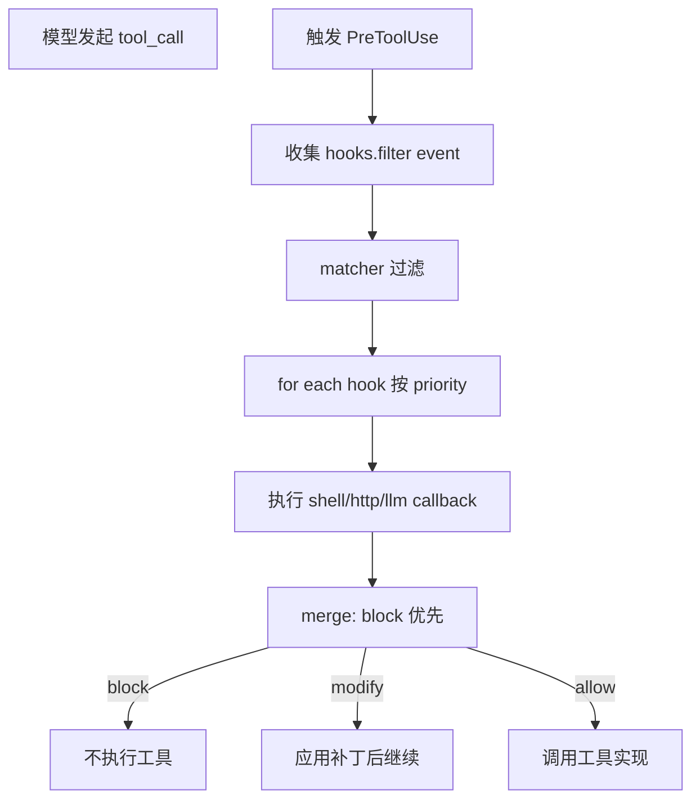
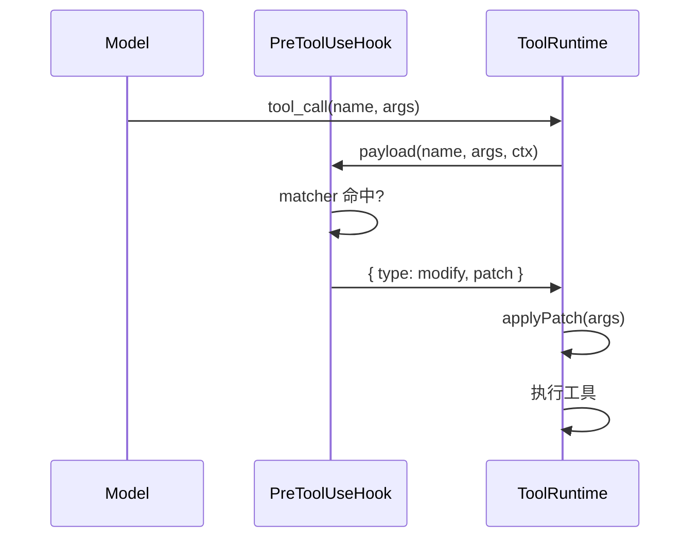

# 第十六部分 · 16.2 PreToolUse — 最强大的 Hook：block / allow / modify

> **导航**：[← 16.1 总览](./index.md) · [16.3 Skills →](./03-skills.md)

---

## 学习目标

完成本节学习后，你应该能够：

1. **解释** `PreToolUse` 在六事件中的特殊地位：唯一在**工具执行前**拥有对**调用图**的结构性影响力。
2. **使用** 三种决策语义：**`block`**（终止调用）、**`allow`**（原样通过）、**`modify`**（改写工具名与/或参数）。
3. **编写** matcher 规则以匹配 **MCP 工具名**形态：`mcp__server__tool`（双下划线分段，教学口径）。
4. **复述** 处理管线：**事件触发 → 收集 Hooks → matcher 过滤 → callback 执行 → 决策合并**。
5. **识别** 与权限系统、`PermissionRequest` 事件的协作与边界。

---

## 生活类比：海关开箱权

普通 Hooks 像「**监控摄像头**」——记录发生了什么。  
**PreToolUse** 像海关关员手里的「**退运章**」与「**改单笔**」：

- **block**：整箱货物不准入境（该次工具调用直接作废）。
- **allow**：单据齐全，放行（透传模型生成的调用）。
- **modify**：箱单写错了货值，关员**当场划线更正**再放行（改参数或替换为安全等价调用）。

没有这一环，事后审计只能「追责」，难以「止损」。

---

## 决策语义对照表

| 决策 | 对执行器影响 | 对模型可见性 | 典型场景 |
|------|----------------|----------------|----------|
| `allow` | 继续执行原调用 | 通常无额外消息 | 默认路径 |
| `block` | **不执行** | 返回结构化拒绝原因 | `rm -rf /`、未授权域名 |
| `modify` | 执行**被编辑后**的调用 | 可记录 diff | 将绝对路径改为沙箱路径 |

---

## MCP 工具名匹配

| 形式 | 示例 | 说明 |
|------|------|------|
| 内置工具 | `FileRead` | 单段 PascalCase（示意） |
| MCP 规范 | `mcp__github__create_issue` | `mcp__<server>__<tool>` |
| 正则要点 | `^mcp__` | 批量策略：所有 MCP 先审 |

---

## Mermaid：PreToolUse 决策流



---

## Mermaid：modify 决策与参数补丁



---

## 源码片段：matcher 与 MCP（示意）

```typescript
// tool-matcher.ts（示意）
export type ToolMatcher =
  | { type: 'exact'; name: string }
  | { type: 'prefix'; value: string }
  | { type: 'regex'; pattern: RegExp };

export function matchTool(m: ToolMatcher, name: string): boolean {
  switch (m.type) {
    case 'exact':
      return name === m.name;
    case 'prefix':
      return name.startsWith(m.value);
    case 'regex':
      return m.pattern.test(name);
  }
}

// MCP 工具名例：mcp__notion__search
export const MCP_TOOL_PATTERN = /^mcp__[^_]+__[^_]+$/;
```

```typescript
// pre-tool-use-decision.ts（示意）
export type HookDecision =
  | { type: 'allow' }
  | { type: 'block'; reason: string }
  | { type: 'modify'; name?: string; args?: Record<string, unknown> };

export function mergeDecisions(
  acc: HookDecision,
  next: HookDecision
): HookDecision {
  if (acc.type === 'block' || next.type === 'block') {
    return next.type === 'block' ? next : acc;
  }
  if (next.type === 'modify') {
    return {
      type: 'modify',
      name: next.name ?? (acc.type === 'modify' ? acc.name : undefined),
      args: {
        ...(acc.type === 'modify' ? acc.args : {}),
        ...next.args,
      },
    };
  }
  return acc;
}
```

```typescript
// example-hook.json（示意配置）
{
  "event": "PreToolUse",
  "matcher": { "type": "prefix", "value": "mcp__" },
  "callback": {
    "kind": "shell",
    "command": "./bin/audit-mcp.sh"
  },
  "priority": 10
}
```

---

## block vs PermissionRequest

| 维度 | PreToolUse block | PermissionRequest Hook |
|------|------------------|-------------------------|
| 时机 | 工具调用已生成 | UI/系统即将向用户要授权 |
| 用户感知 | 可能直接失败 | 可出现对话框 |
| 适合 | 硬规则（黑名单） | 策略引擎（风险评分） |

---

## Shell / HTTP / LLM 三种 callback 权衡

| 类型 | 优点 | 风险 |
|------|------|------|
| Shell | 与现有脚本生态集成 | 注入、超时、可移植性 |
| HTTP | 中心化策略服务 | 网络故障、SSRF 防护 |
| LLM | 灵活语义判断 | 成本、延迟、非确定性 |

---

## 合并策略与优先级

| 规则 | 说明 |
|------|------|
| `priority` 数值 | 通常**越小越先**或相反——以具体实现为准，本节强调**存在全序** |
| `block` 吞噬 | 一旦出现 block，后续 allow 无效 |
| `modify` 叠加 | 多 Hook 依次 patch，需注意键冲突 |

---

## 测试矩阵（节选）

| 用例 | 输入工具名 | 期望 |
|------|------------|------|
| A | `Bash` + `rm -rf` | block |
| B | `mcp__slack__post` | modify 去掉 channel id |
| C | `FileRead` 路径穿越 | block 或 modify 规范化 |
| D | 无 matcher Hook | 应跳过 callback |

---

## 性能与超时

| 实践 | 建议 |
|------|------|
| 回调超时 | 200–2000ms 分级 |
| 并发 | 同事件 Hook 可否并行？需读实现 |
| 缓存 | 对重复 `FileRead` 路径策略可做 LRU |

---

## 常见问题 FAQ

| 问题 | 回答方向 |
|------|----------|
| modify 能换工具名吗？ | 可以，相当于**重定向**；需防范循环。 |
| MCP 名大小写？ | 以注册为准；matcher 建议 case-sensitive。 |
| 与 Skills 冲突？ | Skills 偏提示；PreToolUse 硬治理。 |

---

## 小结

- **PreToolUse** 是 **block / allow / modify** 三态决策器，位于工具真正执行之前。
- **MCP** 工具名 **`mcp__server__tool`** 是编写跨服务器策略的关键把手。
- 管线记住八字：**收集 → 过滤 → 执行 → 合并**。

---

## 课后自测

1. 写一条正则：匹配任意 MCP 工具但排除 `mcp__internal__debug`。
2. 解释为何 `block` 应优先于 `modify` 合并。
3. 设计一个 HTTP callback 的 JSON schema（请求/响应字段）。

---

**上一节**：[16.1 总览](./index.md)  
**下一节**：[16.3 Skills](./03-skills.md)
